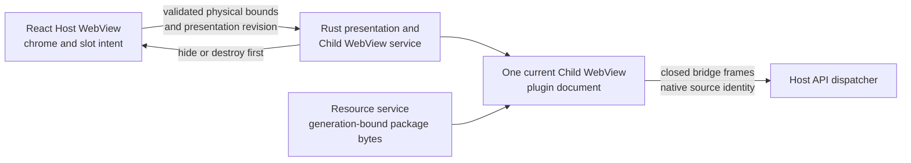
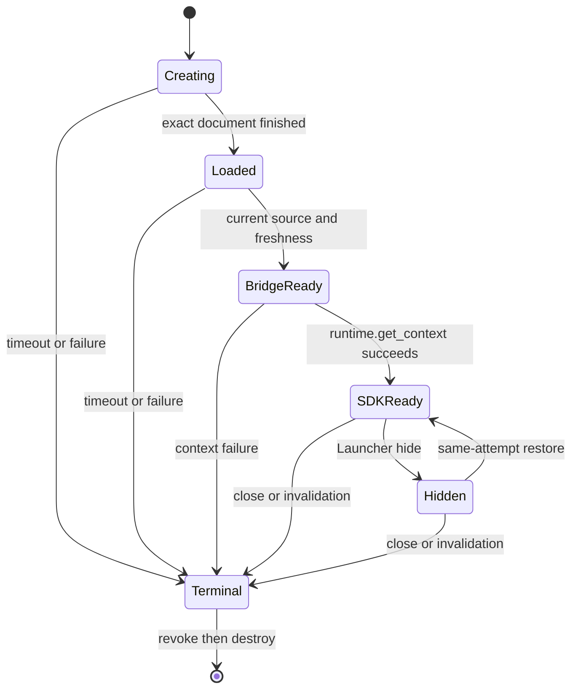

# Plugin Child WebView Runtime

## Shipped Surface Ownership

The Launcher keeps one trusted Host WebView and at most one current plugin
Child WebView in the same native window. React owns Page chrome, loading,
retry, errors, Settings, and the measured content slot. Rust owns native
creation, bounds, visibility, focus, navigation, bridge ingress, resource
authority, and destruction. A plugin cannot submit native bounds or obtain a
Tauri object.

When the trusted current Page resolution has `provider.kind: "plugin"`, React
selects one shared edge-to-edge Launcher body layout for external,
Development Mode, and official plugins. The Host keeps Page chrome outside the
plugin rectangle, removes body inline and bottom inset plus inter-region gap,
and adds no inner radius on the Runtime container. The outer Launcher surface
continues to own native-window clipping and radius. Home, Search, and
Host-owned Pages retain their existing layouts; plugin identity, Publisher,
repository location, provenance, and Runtime content do not select this state.



The Host and plugin documents are native siblings. Correctness does not assume
OS process isolation or that WebKit assigns them different processes.

The shared container has three distinct identities. `Window("main")` is the
complete native Launcher and owns size, visibility, show/hide, focus, window
events, and native-dialog parenting. The trusted `Webview("main")` is only the
Host document and is the sole target of `launcher://activated`. The current
plugin Child WebView has a separate generated identity and never receives that
Host event. Post-creation Launcher operations must not convert the native
Window back into a single `WebviewWindow`.

## Session And Lifecycle

One attempt advances through native load, bridge ready, and SDK context ready
as distinct states. The Child WebView stays hidden behind Host feedback until
all current checks pass. Close, another Page, disable, uninstall, replacement,
upgrade, development reload, retry, disconnect, fatal bridge failure, Host
reload, app teardown, and process exit use one compare-current terminal path.

Presentation uses one Host-private asynchronous readiness wait bound to the
opaque current attempt. It settles exactly once on bridge readiness, a closed
failure, timeout, destruction, replacement, or app teardown. React does not
poll at a fixed interval; the snapshot read remains diagnostic only, and a late
completion after unmount or replacement cannot reveal or revive the WebView.

The public WebView SDK transport waits for the plugin document load event and
crosses one task boundary before it discovers the bridge and reports ready.
This preserves the native `Finished` load event as the authoritative transition
to `Loaded` and prevents early module or React startup from racing that event.



Hide/restore preserves the same attempt only while plugin, Page, entry,
version, resource generation, and native source remain current. A real close
or generation change destroys it before a fresh reopen. There is no hidden
Runtime, preload pool, background Page, or second current plugin WebView.

Launcher actions resolve their required native Window and Host WebView targets
before changing Child presentation. Hide remains Child-first and native-parent
second to prevent overlay leakage. If native parent hide fails, Rust restores
and refocuses only the same compare-current Child; a failed rollback tears that
attempt down, while a stale rollback is inert. Restore shows and focuses the
native parent before the same Child and preserves its current user-resized
size. A plugin Page close submits fixed `home` immediately, so the native Window
can return to `650×320` and non-resizable while
Child teardown finishes asynchronously; resize never waits for a
single-WebviewWindow conversion.

Each normalized Page carries a bounded initial logical size and `resizable`
flag. The Host owns the complete native Window transition and current-monitor
constraints. Window and scale changes produce trusted slot revisions for the
same Child WebView without reloading its document, Session, model, or Worker.
The plugin observes its ordinary Web viewport but receives no native size,
position, monitor, constraint, maximize, fullscreen, or Window-handle method.
React still measures only `.plugin-runtime-slot`: its DOM rectangle,
`ResizeObserver`, scale conversion, and serialized latest-wins presentation
revision feed the existing Rust-validated physical-bounds path. The
edge-to-edge layout adds no payload field, Tauri command, native setter,
Runtime reload, or Session replacement path.

## Security And Web Capabilities

Each generation has an isolated origin, data-store identity, resource scope,
native label, and opaque attempt. Native ingress supplies the source identity;
plugin frames cannot choose it. The document receives only the frozen lensX
bridge carrier. Generic Tauri core/plugin/app commands, global events, window
and WebView control, Host DOM, other plugins, and old generations remain
unavailable. Top-level escape, popup/new-window, and download are denied.

The page may use ordinary Web features such as package modules, Dedicated
Workers, Fetch/HTTPS, WebSocket, WASM, and origin storage. These are browser
capabilities, not Host grants. SharedWorker, ServiceWorker, detached execution,
device access, and native APIs are not promised. Publisher, repository,
provenance, and CI evidence never add Runtime authority.

## Development And CI

External, development, and official plugins use Manifest `0.4.0`,
`runtime.kind: "webview"`, and `@lensx/plugin-sdk/webview`. Templates and the
CLI build only this path. Development reload stages the next generation before
destroying the old current attempt; rejected staging leaves the current attempt
unchanged. Direct plugins use the same public Runtime, bridge and SDK,
interaction, and zero-residual teardown boundaries as external plugins; CI
does not grant a different Host path.

Use these deterministic commands:

```bash
pnpm run gate -- plugin-child-webview-runtime
pnpm run gate -- plugin-child-webview-session
pnpm run gate -- open-isolated-plugin-runtime
```

These Gates validate contracts, state machines, source and generation binding,
resource policy, bridge adapters, lifecycle races, cleanup, and malicious
boundaries. They do not launch or claim proof from a real WebView or native
product environment.
## Deterministic Resource And Lifecycle Checks

Container startup latency and target-environment interaction timing are not
maintained validation outputs. ConfigLens bundle and initial-resource budgets
are checked from production build artifacts. Runtime deadlines, bounded frames,
single-instance ownership, cancellation, replacement, terminal cleanup, and
late-event suppression remain enforced by Rust, TypeScript, React, package, and
boundary tests.
## Troubleshooting

1. If the Host stays in loading, distinguish native load from bridge ready and
   SDK context ready; inspect the responsible state transition instead of
   treating them as one timeout.
2. If content is hidden or misaligned, run the slot/bounds gate and verify
   scale factor, presentation revision, and Host overlay ordering.
3. If `Cmd+W`, focus loss, or Page close leaves a blank or incorrectly sized
   Launcher, run `pnpm run gate -- plugin-child-webview-window-lifecycle`. Verify
   post-creation paths resolve `Window("main")`, Host activation resolves only
   `Webview("main")`, and inspect native-hide rollback before changing teardown
   timing.
4. If a Web feature fails, use browser feature detection and check plugin CSP;
   do not add a Host permission or native fallback.
5. If reload or replacement fails, verify staging before teardown and confirm
   the old generation cannot send a late callback.
6. If a deterministic assertion changes, review the product invariant and
   update the responsible unit, state, package, or boundary test.

The Resource Service keeps a process-local 32 MiB/256-entry verified byte cache
keyed by entry, installed/development payload variant, resource generation, and
normalized path. A miss publishes bytes only after the complete path/file/read
and final-currentness proof. A hit still checks scope, Manager projection,
payload ownership, generation, current attempt/source, and pre/post identity.
Development snapshots use a bounded metadata seal after the first complete tree
proof. Lifecycle generation changes revoke eligibility and evict stale entries.
`Cache-Control: no-store` remains unchanged: browser caching is not authority.

## Legacy Migration

Manifest `0.3.x` and older packages, including legacy iframe packages, are incompatible
migration inputs only. They are never executed, rewritten, or routed through a
fallback. Rebuild with a current template and the public WebView SDK transport.
