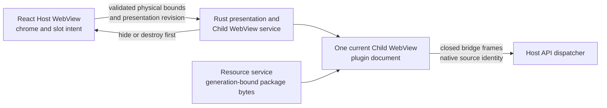
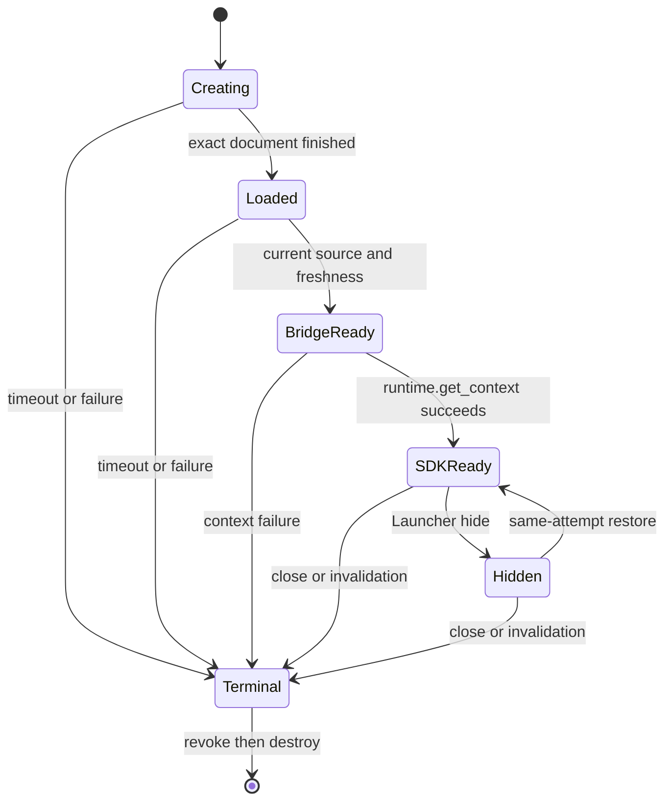

# Plugin Child WebView Runtime

## Shipped Surface Ownership

The Launcher keeps one trusted Host WebView and at most one current plugin
Child WebView in the same native window. React owns Page chrome, loading,
retry, errors, Settings, and the measured content slot. Rust owns native
creation, bounds, visibility, focus, navigation, bridge ingress, resource
authority, and destruction. A plugin cannot submit native bounds or obtain a
Tauri object.



The Host and plugin documents are native siblings. Correctness does not assume
OS process isolation or that WebKit assigns them different processes.

## Session And Lifecycle

One attempt advances through native load, bridge ready, and SDK context ready
as distinct states. The Child WebView stays hidden behind Host feedback until
all current checks pass. Close, another Page, disable, uninstall, replacement,
upgrade, development reload, retry, disconnect, fatal bridge failure, Host
reload, app teardown, and process exit use one compare-current terminal path.

Presentation uses one Host-private asynchronous readiness wait bound to the
opaque current attempt. It settles exactly once on bridge readiness, a closed
failure, timeout, destruction, replacement, or app teardown. React does not
poll at a fixed interval; the snapshot read remains diagnostic only, and a late
completion after unmount or replacement cannot reveal or revive the WebView.

The public WebView SDK transport waits for the plugin document load event and
crosses one task boundary before it discovers the bridge and reports ready.
This preserves the native `Finished` load event as the authoritative transition
to `Loaded` and prevents early module or React startup from racing that event.



Hide/restore preserves the same attempt only while plugin, Page, entry,
version, resource generation, and native source remain current. A real close
or generation change destroys it before a fresh reopen. There is no hidden
Runtime, preload pool, background Page, or second current plugin WebView.

## Security And Web Capabilities

Each generation has an isolated origin, data-store identity, resource scope,
native label, and opaque attempt. Native ingress supplies the source identity;
plugin frames cannot choose it. The document receives only the frozen lensX
bridge carrier. Generic Tauri core/plugin/app commands, global events, window
and WebView control, Host DOM, other plugins, and old generations remain
unavailable. Top-level escape, popup/new-window, and download are denied.

The page may use ordinary Web features such as package modules, Dedicated
Workers, Fetch/HTTPS, WebSocket, WASM, and origin storage. These are browser
capabilities, not Host grants. SharedWorker, ServiceWorker, detached execution,
device access, and native APIs are not promised. Publisher, repository,
provenance, and CI evidence never add Runtime authority.

## Development And CI

External, development, and official plugins use Manifest `0.3.0`,
`runtime.kind: "webview"`, and `@lensx/plugin-sdk/webview`. Templates and the
CLI build only this path. Development reload stages the next generation before
destroying the old current attempt; rejected staging leaves the current attempt
unchanged. Direct plugins use the same public Runtime, bridge/SDK, interaction,
and zero-residual teardown boundaries as external plugins; CI does not grant a
different Host path.

Use these maintained commands:

```bash
pnpm run check:plugin-child-webview-macos-evidence
pnpm run evidence:plugin-child-webview-macos
pnpm run check:open-isolated-plugin-runtime
```

The `evidence:` command opens temporary macOS WKWebView harness windows. The
ordinary `check:` command validates the committed bounded evidence and is safe
for non-interactive aggregate validation. A normal evidence run never rewrites
positive records. After reviewing a fresh passing result, maintainers explicitly
run `node --experimental-strip-types scripts/plugin-child-webview-macos-evidence.ts --run --update-cold-open`.

## Performance Budgets And Evidence Schema

Cold create and same-attempt restore are measured separately. ConfigLens warm
format is also independent of container startup.

| Measurement | Maintained budget | Method |
| --- | ---: | --- |
| Release-like Host loading to bridge ready p95 | 250 ms | At least twenty fresh opens through normal registration, Resource Service, presentation, bridge, and SDK paths. |
| Release-like first interactive p95 | 500 ms | At least twenty fresh opens ending only after current Monaco model/layout, package-owned editor Worker, and native keyboard input are confirmed. |
| Development snapshot first interactive p95 | 1000 ms | At least twenty fresh Development generation opens through the same product Runtime path. |
| Same-attempt hide/restore p95 | 100 ms | At least forty native hide/show/focus samples with unchanged attempt, document, Session, model, and Worker. |
| ConfigLens warm small-JSON format p95 | 100 ms | Forty action-to-model-update samples over the maintained four-case corpus. |
| Host heartbeat p95 gap | 50 ms | A Host timer while plugin startup or work runs. |

The closed stage catalog is `resolve`, `create`, `navigation`, `load`, `bridge`,
`sdk`, `ui_bundle`, `editor`, `worker`, `host_loading`, `first_interactive`, and
`restore`. Each layer reports only monotonic durations; evidence never compares
or exports cross-layer absolute timestamps. The committed cold-open summary uses
schema version `0.2.0`, separate `release_like`, `development_snapshot`, and
`same_attempt_restore` profiles, nearest-rank p50/p95/max, sample counts, bounded
asset sizes, Host heartbeat, terminal cleanup, and explicit privacy flags.
Evidence records no user content, raw payload/error,
complete URL, origin, path, nonce, native label, data-store identifier, or
Host-private token. Memory/resource release is established by registry absence,
destroyed WebViews, inert late callbacks, terminated Workers/connections, and
zero remaining bridge/resource authority; process separation is not measured
or assumed.

## Troubleshooting

1. If the Host stays in loading, distinguish native load from bridge ready and
   SDK context ready; inspect the responsible stage instead of treating them as
   one timeout. A high `load` stage points to Resource proof or native loading;
   high `ui_bundle`/`worker` stages point to plugin bootstrap.
2. If content is hidden or misaligned, run the slot/bounds gate and verify
   scale factor, presentation revision, and Host overlay ordering.
3. If a Web feature fails, use browser feature detection and check plugin CSP;
   do not add a Host permission or native fallback.
4. If reload or replacement fails, verify staging before teardown and confirm
   the old generation cannot send a late callback.
5. If evidence changes, rerun the real macOS matrix and review the bounded
   result. Never edit a positive boolean to bypass a failed harness.

The Resource Service keeps a process-local 32 MiB/256-entry verified byte cache
keyed by entry, installed/development payload variant, resource generation, and
normalized path. A miss publishes bytes only after the complete path/file/read
and final-currentness proof. A hit still checks scope, Manager projection,
payload ownership, generation, current attempt/source, and pre/post identity.
Development snapshots use a bounded metadata seal after the first complete tree
proof. Lifecycle generation changes revoke eligibility and evict stale entries.
`Cache-Control: no-store` remains unchanged: browser caching is not authority.

## Legacy Migration

Legacy Manifest `0.2.x` packages using the iframe Runtime are incompatible
migration inputs only. They are never executed, rewritten, or routed through a
fallback. Rebuild with a current template and the public WebView SDK transport.
