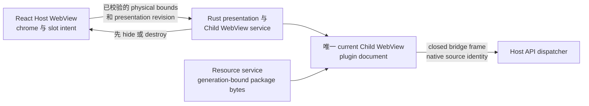
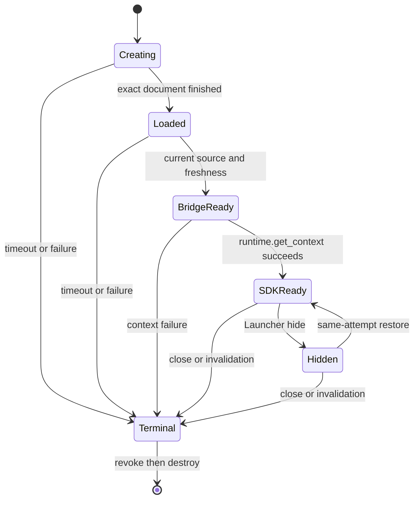

# Plugin Child WebView Runtime

## 已交付的 Surface Ownership

Launcher 在同一 native window 中保留一个可信 Host WebView，以及至多一个 current plugin
Child WebView。React 拥有 Page chrome、loading、retry、error、Settings 与测量后的内容 slot；
Rust 拥有 native create、bounds、visibility、focus、navigation、bridge ingress、resource
authority 与 destroy。插件不能提交 native bounds，也不能获取 Tauri object。



Host 与插件 document 是 native sibling。正确性不假设 WebKit 将它们分配到不同 OS process。

共享 container 包含三个彼此不同的 identity。`Window("main")` 表示完整 native Launcher，拥有
size、visibility、show/hide、focus、window event 与 native-dialog parent；可信
`Webview("main")` 只表示 Host document，并且是 `launcher://activated` 的唯一目标。current plugin
Child WebView 使用独立的 generated identity，绝不会收到该 Host event。post-creation Launcher
操作不得把 native Window 重新转换成 single `WebviewWindow`。

## Session 与 Lifecycle

同一 attempt 将 native load、bridge ready 与 SDK Context ready 作为不同状态推进。所有 current
检查通过前，Child WebView 保持隐藏，由 Host 展示反馈。close、切换 Page、disable、uninstall、
replacement、upgrade、development reload、retry、disconnect、fatal bridge failure、Host reload、
app teardown 与 process exit 都进入同一 compare-current terminal path。

presentation 使用绑定 opaque current attempt 的一次 Host-private async readiness wait。它会在 bridge
ready、closed failure、timeout、destroy、replacement 或 app teardown 时 exactly-once settle。React
不再按固定间隔 polling；snapshot read 仅保留为 diagnostic，unmount 或 replacement 后的 late
completion 不能显示或复活 WebView。

公共 WebView SDK transport 会等待插件 document 的 load event，并跨过一个 task boundary 后才
发现 bridge 和报告 ready。这样由 native `Finished` load event 权威地推进到 `Loaded`，避免
module 或 React 提前启动并与该事件形成竞态。



只有 plugin、Page、entry、version、resource generation 与 native source 仍为 current 时，
hide/restore 才保留同一 attempt。真实 close 或 generation 变化会先 destroy，再 fresh reopen。
不存在 hidden Runtime、preload pool、background Page 或第二个 current plugin WebView。

Launcher action 会先解析所需的 native Window 与 Host WebView target，再改变 Child
presentation。hide 保持 Child-first、native-parent-second，避免 overlay 泄漏。如果 native parent
hide 失败，Rust 只恢复并重新聚焦同一个 compare-current Child；rollback 失败会 teardown 该
attempt，stale rollback 保持 inert。restore 会先 show/focus native parent，再恢复同一个 Child，
并保留当前用户调整后的尺寸。plugin Page close 会立即提交固定 `home`，因此 Child
teardown 异步完成期间 native Window 仍会返回 `650×320` 且不可调整；resize 不等待
single-WebviewWindow conversion。

每个规范化 Page 都携带有界初始逻辑尺寸和 `resizable`。Host 拥有完整原生 Window
转换与当前 monitor 约束。Window 和 scale 变化只为同一 Child WebView 生成可信 slot revision，
不会重载 document、Session、model 或 Worker。插件只能观察普通 Web viewport，不会获得
原生 size、position、monitor、constraint、maximize、fullscreen 或 Window handle method。

## 安全与 Web 能力

每个 generation 都有隔离的 origin、data-store identity、resource scope、native label 与 opaque
attempt。native ingress 提供 source identity；插件 frame 不能选择它。document 只获得冻结的
lensX bridge carrier。generic Tauri core/plugin/app command、global event、window/WebView 控制、
Host DOM、其他插件与旧 generation 都不可用。top-level escape、popup/new-window 与 download
全部拒绝。

页面可使用 package module、Dedicated Worker、Fetch/HTTPS、WebSocket、WASM 与 origin storage
等普通 Web 能力；它们是 browser capability，不是 Host grant。SharedWorker、ServiceWorker、
detached execution、device access 与 native API 不在承诺范围内。Publisher、repository、
provenance 与 CI 证据都不会增加 Runtime authority。

## 开发与 CI

external、development 与 official 插件都使用 Manifest `0.4.0`、`runtime.kind: "webview"` 与
`@lensx/plugin-sdk/webview`。template 与 CLI 只构建这一路径。Development reload 在销毁旧 current
attempt 前 staging 下一 generation；被拒绝的 staging 不改变 current attempt。直接插件与 external
插件使用相同的公共 Runtime、bridge/SDK、interaction 与 zero-residual teardown 边界；CI 不会赋予
不同的 Host 路径。

使用以下维护命令：

```bash
pnpm run check:plugin-child-webview-macos-evidence
pnpm run evidence:plugin-child-webview-macos
pnpm run check:open-isolated-plugin-runtime
```

`evidence:` 命令会打开临时 macOS WKWebView harness window。普通 `check:` 命令验证已提交的
bounded evidence，适合 non-interactive aggregate validation。普通 evidence run 不会改写 positive
record。审查新鲜且通过的结果后，维护者才显式运行
`node --experimental-strip-types scripts/plugin-child-webview-macos-evidence.ts --run --update-cold-open`。
bounded multi-WebView Launcher record 使用单独的审查后更新路径：
`node --experimental-strip-types scripts/plugin-child-webview-macos-evidence.ts --run --update-launcher-lifecycle`。

## 性能预算与 Evidence Schema

cold create 与 same-attempt restore 分开测量；ConfigLens warm format 也与 container startup 独立。

| 测量项 | 维护预算 | 方法 |
| --- | ---: | --- |
| Release-like Host loading 到 bridge ready p95 | 250 ms | 至少二十次 fresh open，经过普通 registration、Resource Service、presentation、bridge 与 SDK path。 |
| Release-like first interactive p95 | 500 ms | 至少二十次 fresh open；只有 current Monaco model/layout、包内 editor Worker 与 native keyboard input 都确认后才结束。 |
| Development snapshot first interactive p95 | 1000 ms | 至少二十次 fresh Development generation open，复用相同 product Runtime path。 |
| Same-attempt hide/restore p95 | 100 ms | 至少四十次 native hide/show/focus sample，并确认 attempt、document、Session、model 与 Worker 不变。 |
| ConfigLens warm small-JSON format p95 | 100 ms | 对维护的四 case corpus 采集四十次 action-to-model-update sample。 |
| Host heartbeat p95 gap | 50 ms | plugin startup 或工作期间运行 Host timer。 |

closed stage catalog 为 `resolve`、`create`、`navigation`、`load`、`bridge`、`sdk`、`ui_bundle`、
`editor`、`worker`、`host_loading`、`first_interactive` 与 `restore`。每层只报告 monotonic
duration；evidence 不比较或导出跨层 absolute timestamp。已提交 cold-open summary 使用 schema
version `0.2.0`，分为 `release_like`、`development_snapshot` 与 `same_attempt_restore` profile，
保存 nearest-rank p50/p95/max、sample count、bounded asset size、Host heartbeat、terminal cleanup
与显式 privacy flag。evidence 不记录 user content、
raw payload/error、complete URL、origin、path、nonce、native label、data-store identifier 或
Host-private token。memory/resource release 通过 registry absence、destroyed WebView、inert late
callback、terminated Worker/connection 与零残留 bridge/resource authority 证明；不测量或假设
process separation。

ConfigLens Launcher lifecycle record 只包含审查后的 boolean。它证明 Home/Page/close geometry、
application-local `Cmd+W` 与 focus-loss hide、global-shortcut same-attempt restore 且没有新的
editor/Worker load、Page close destroy，以及 native/bridge/resource authority 零残留。

## 故障排查

1. Host 一直停留在 loading 时，区分 native load、bridge ready 与 SDK Context ready；按负责 stage
   排查而不是视为一个 timeout。`load` 偏高指向 Resource proof 或 native loading；`ui_bundle`/`worker`
   偏高指向插件 bootstrap。
2. 内容隐藏或错位时，运行 slot/bounds gate，并校验 scale factor、presentation revision 与 Host
   overlay 顺序。
3. 如果 `Cmd+W`、focus loss 或 Page close 留下空白或尺寸错误的 Launcher，运行
   `pnpm run check:plugin-child-webview-window-lifecycle`。确认 post-creation path 解析
   `Window("main")`、Host activation 只解析 `Webview("main")`，并在改变 teardown timing 前检查
   native-hide rollback。
4. Web 能力失败时，使用 browser feature detection 并检查插件 CSP；不要增加 Host permission 或
   native fallback。
5. reload 或 replacement 失败时，验证 teardown 前的 staging，并确认旧 generation 不能发送 late
   callback。
6. evidence 变化时重跑真实 macOS matrix 并审查 bounded result。不得手改 positive boolean 来绕过
   失败 harness。

Resource Service 保留 process-local、32 MiB/256-entry 的 verified byte cache，key 包含 entry、
installed/development payload variant、resource generation 与 normalized path。miss 只有在完整
path/file/read 与 final-currentness proof 后才 publish；hit 仍检查 scope、Manager projection、payload
ownership、generation、current attempt/source 与前后 identity。Development snapshot 在首次完整 tree
proof 后使用 bounded metadata seal。lifecycle generation 变化会撤销 eligibility 并淘汰 stale entry。
`Cache-Control: no-store` 保持不变：browser cache 不是 authority。

## 旧协议迁移

Manifest `0.3.x` 与更早 package（包括旧 iframe package）仅作为不兼容迁移输入。它们不会执行、重写或
进入 fallback。请使用当前 template 与公共 WebView SDK transport 重新构建。
