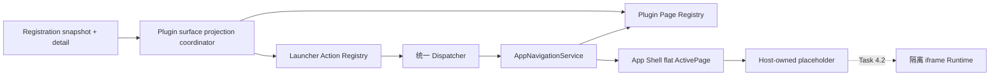

## Context

当前 production `AppNavigationService` 只通过静态 `HostPageCatalog` 预检 `lensx.core/settings`，并把扁平 `{ owner_id, page_id, opened_by_action_id }` 交给 App Shell 注册的唯一 handler。React 在本地保存 `activePage`，由此派生 `home`、`search`、`page` 三种 presentation；关闭页面会返回 Home 并恢复输入焦点。

Task 2.3 已交付 Host-private Plugin Action mapper、revision-aware projection core 和 provider-scoped Action Registry replacement。每个 Host 合成的 executor 只捕获 `{ owner_id: plugin_id, page_id: local_page_id }` 与 opening Action ID，但 production composition 在真实 Plugin Page 可以预检前不会启动该投影。Registration detail 已提供规范化 Manifest、Host-owned enabled/compatibility/grant facts 和 revision，因此 Task 2.4 不需要改变 Rust wire contract。

本 change 横跨 Registration adapter、Plugin Page/Action projection、application navigation、App Shell presentation 和双语文档。安全约束是：插件只能贡献声明式 Page 元数据，不能提供 React 组件、setter、handler、route executor、Tauri 对象或任意 URL；资源与插件代码必须继续等待 Task 4.1/4.2。

## Goals / Non-Goals

**Goals:**

- 建立可验证、不可变、provider-scoped 的 Plugin Page descriptor 与 Registry。
- 使用 `(owner_id, page_id)` 统一 Host 和插件 Page identity，并保留插件本地父子关系。
- 从同一 Registration revision 安全协调 Page 与 Action publication，避免可搜索 Action 指向不可用 Page。
- 复用现有 framework-neutral navigation service 和单窗口 App Shell，不把 React setter 暴露给插件或 projection 层。
- 机械检查 Page 所需权限是否包含在当前 Host grant snapshot 中，同时保持完整权限策略属于 Task 5.5。
- 为插件 Owner、Page 与 opening Action 提供 locale-aware、fail-safe 的展示解析；Runtime 前提供 Host-owned placeholder。
- 页面在 Registry 更新后失效时自动退出 page presentation，并保持现有手动关闭与焦点恢复行为。

**Non-Goals:**

- 不安装、启用、禁用、升级或卸载插件，也不增加 Plugin Manager 写边界或管理 UI。
- 不建立安全资源 origin、自定义协议、iframe、Runtime session、Host API、RPC transport 或执行插件代码。
- 不定义 permission catalog、风险等级、用户授权提示、grant 写入或 session 有效权限。
- 不引入 React Router、breadcrumb、插件内部导航 UI、多窗口页面或并行 Shell store。
- 不解析或展示 package-local Page/Owner icon；Task 4.1 前统一使用现有 generic provider fallback。
- 不改变 Launcher 搜索评分、provider 分区、recent/pinned 持久化或 Dispatcher typed result。

## Decisions

### 1. 使用 `(owner_id, page_id)` 作为唯一全局 Page identity

插件 Page 的 `owner_id` 固定为规范化 `manifest.plugin_id`，`page_id` 保持插件本地 Page ID。Registry 内部可以用不对外暴露的复合 key 索引，但不会再生成 `<plugin_id>.<page_id>` 字符串字段。`parent_page_id` 映射为同一 owner 下的 parent target，因此父子关系保持全局无歧义。

沿用现有 `HostPageTarget` 可以让 Task 2.3 executor、Host Settings 与未来 Host API `actions.open` 共用一个窄目标类型，并避免两套 Page identity drift。另一方案是像 Action 一样拼接全局字符串，但这会重复 owner 信息并要求定义转义/拆分语义，予以拒绝。

### 2. Registry 保存 Host-owned provider descriptor 和完整 Page descriptor

每个插件 provider batch 包含一个不可变 Owner presentation descriptor，以及 Manifest 中完整 Page 集合。Page descriptor 至少保留 target、本地化 title、内部 route、同 owner parent target、排序去重的 required permission IDs 和 Host-derived availability。route 只留在 Host-private Registry，不能进入 `ActivePage`、Launcher Action descriptor、page context view props、错误或诊断。

Registry 提供可信 provider complete-batch replacement/unregistration、按 target lookup 和排序 snapshot。replacement 必须验证 owner、Page identity、父子 owner、重复 target、字段不可变性和 protected `lensx.core` 边界；任一 Page 无效时整批拒绝并保留调用前状态。Host Settings 继续作为受保护 Host provider 存在，插件不能替换或注销它。

选择 provider batch 而不是逐 Page mutation，是为了与一个 Manifest/Registration detail 的完整事实保持一致，并避免 UI 观察到半个插件的 Page graph。

### 3. eligibility 与 Page authorization 分层计算

只有 snapshot/detail identity 与 revision 一致、Registration 可用、插件 enabled 且 lensX/Host API 均 compatible 时，provider 才能进入 Page Registry；quarantine、degraded、missing、disabled 或 incompatible 会撤下整个 provider。

对合格 provider，projection 仍保留 Manifest 的全部 Page descriptor，但逐 Page 计算 `available`：当且仅当该 Page 的每个 `required_permission_id` 都存在于 detail 的 Host-owned `granted_permission_ids` 时为 true。空 requirements 自然可用。Action publication 只包含目标 Page 当前可用的 Action，从而不把已知会被拒绝的结果放进搜索。

这只是当前事实的集合包含检查，不判断权限是否受 Host 支持、不创建 grant、不提示用户，也不把 builtin provenance 当作授权。完整 permission decision 和 session enforcement 继续属于 Task 5.5。另一方案是完全忽略 grants，无法满足路线图的“未授权 Page 拒绝”；在本 change 提前建立 permission catalog 又会越界，均予以拒绝。

### 4. production 使用一个 surface projection coordinator

production composition 创建一个 coordinator，作为 Plugin Registration Desktop Adapter 的唯一 surface projection 消费者。它对每个当前 revision 的合格 provider 读取一次 detail，先纯映射并验证 Page/Action 两批数据，再按安全顺序提交：

- 新增或替换：先 replace Page batch，再 replace 仅指向 available Page 的 Action batch。
- 失效、移除或销毁：先 unregister Action batch，再 unregister Page batch。
- Page commit 失败：先撤下该 provider 的 Action，再清空 Page，报告安全诊断。
- Action commit 失败：撤下 Action 和刚提交的 Page，令该 provider fail closed。
- detail failure、identity/revision mismatch、过期异步结果或 degraded snapshot：不得发布部分状态。

coordinator 串行 drain revision、丢弃 stale detail、合并快速刷新并提供 `whenIdle`/`destroy` 测试边界。它复用现有纯 Action mapper 和 Registry，不改变搜索或 Dispatcher。现有可注入 Action projection core 可以保留用于 focused 测试，但 production 不再让独立 Page/Action subscriber 竞争 revision。

跨两个 Registry 不引入通用事务平台。同步 commit 顺序、provider fail-closed rollback 和 JavaScript 单线程边界已经足以保证任何可执行 Action 在观察时都拥有可预检目标；为了理论上的多 Registry transaction 新建通用状态框架会超出当前 change。

### 5. navigation service 只接收 identity 并返回解析后的 Host 页面事实

`AppNavigationService.openPage(target, openingActionId)` 先通过统一 Page lookup 取得当前 available descriptor，再检查唯一 App Shell handler，最后发出保持扁平 identity 的 `ActivePage`。handler 和 React setter 仍只在 App Shell 内注册；projection 和插件只获得 `openPage` 窄接口。

未知、已移除或 unavailable target 对 Action executor 统一抛出安全 `page_unavailable`，Dispatcher 继续收敛为 `action_execution_failed`。内部 Registry/projection diagnostics 可以区分 detail、mapping、permission snapshot、replacement 等阶段，但不得包含 route、安装路径、raw error、stack、Tauri 或 Rust 值。

Registry replacement 产生 availability change 后，Host navigation 边界检查当前 active target。若它已不存在或不可用，navigation service 向已注册 App Shell handler 发出 Host-owned close/invalidation transition；插件无权主动获取 handler。App Shell 仍是 React presentation state 的唯一所有者。

### 6. 展示信息按 identity 动态解析，不复制进 `ActivePage`

Page context resolver 组合当前 Page resolution、当前 locale 和 Launcher Registry snapshot：

1. Owner name 使用 Registration display name 的当前 locale，缺失 `zh-CN` 时回退 `en-US`；Host owner 保持应用 i18n 文案。
2. Owner icon 在插件安全资源 resolver 交付前不读取 Manifest path，交给现有 generic provider fallback；`lensx.core` 继续使用 Host token。
3. opening Action 仍存在时显示其当前 locale title；Action 已注销或 lookup 失败时回退当前 Page title。
4. Page descriptor 无法解析时不显示 stale identity 文本，而是触发 invalidation 返回 Home。

Owner、Action 段继续是非交互、非 breadcrumb 的 segmented capsule，关闭按钮仍是唯一可聚焦操作。字符串不会复制到 `ActivePage`，因此切换 locale 会即时更新。route、permission 和 author Publisher 不进入展示 props。

### 7. Runtime 前只渲染 Host-owned plugin placeholder

App Shell 根据 resolved Page owner 选择 Host Settings 或插件 placeholder；不再对任意非 Host `ActivePage` 默认渲染 Settings。placeholder 使用 Semi Design 与应用 i18n，显示 Page title 和简短的 Runtime 尚未可用说明，支持英文、简体中文、light/dark 与既有 `PageErrorBoundary`，但不创建 iframe、不加载 route/entry/assets、不调用 Tauri，也不提供重试、管理或权限按钮。

这使 Task 2.4 可以真实验证导航和关闭行为，又不会虚假宣称插件 UI 已执行。选择继续隐藏所有 Plugin Actions 直到 Task 4.2 会让 Task 2.4 无法完成生产 Action-to-Page 闭环；选择空白页面或误用 Settings 则会造成错误产品语义，均予以拒绝。

### 8. 父子关系只作为受验证元数据保留

Registry snapshot 保留每个 descriptor 的 parent target，供 Task 4.2 Runtime context 或未来受控导航使用。本 change 不从该图派生 breadcrumb、侧栏、返回栈或路由层级；App Shell 继续只有一个扁平 active Page。Manifest Contract 已验证 parent 存在、同插件且无环，Page mapper 仍重新验证 owner/identity 以防跨边界 drift。

## Risks / Trade-offs

- **[grant snapshot 不是完整 permission decision]** → 明确仅执行集合包含检查，并在文档/spec 中声明 Task 5.5 仍负责支持度、用户决策和 session enforcement。
- **[两个 Registry 无数据库式原子事务]** → 单一 coordinator、同步安全顺序、失败时双批次撤下和 focused interleaving 测试保证 Action 不会稳定指向缺失 Page。
- **[Page 已可导航但插件 UI 尚不可运行]** → 显示明确的 Host-owned placeholder，并在文档中区分 navigation delivery 与 Local Plugin Preview。
- **[active Page 在刷新时突然关闭]** → 仅当 identity 消失或 available 变 false 时关闭；保持相同 identity 的 metadata/locale 更新不关闭页面。
- **[插件资源 icon 暂时不可见]** → 复用 generic provider fallback，等 Task 4.1 的 scoped resource resolver 后再扩展 descriptor presentation。
- **[Registration 快速更新导致 stale commit]** → coordinator 在每个异步 detail 和 commit 前后比较 latest revision，destroy 后禁止新提交。
- **[新增 placeholder 形成误导性管理入口]** → 页面只说明 Runtime 状态并允许关闭，不提供安装、权限、重试或管理操作。

## Migration Plan

1. 在不改变现有 Host Settings 行为的前提下，将静态 catalog 能力演进为受保护 Host provider 加可信 plugin provider batch 的统一 Page Registry，并补齐不可变性/原子性测试。
2. 增加纯 Plugin Page mapper、locale-aware Page resolution、grant subset availability 和 provider fail-closed 测试。
3. 扩展 framework-neutral navigation close/invalidation 边界与 App Shell handler，确认插件无法接触 React setter，Host Settings 回归保持通过。
4. 增加 Host-owned plugin placeholder、Page context fallback 与 English/简体中文、light/dark、键盘关闭测试。
5. 引入 production surface projection coordinator，复用 Task 2.3 Action mapper，验证 Page-before-Action、Action-before-Page removal、revision recovery、degraded 和 destroy。
6. 启动 production Plugin Action publication，更新英文文档及中文镜像，并运行完整前端、workspace、Rust validation。

Rollback 时先停止/destroy coordinator，按 Action 后 Page 的顺序注销所有 plugin provider batch，再恢复只包含 `lensx.core/settings` 的 production composition。Registry 与 projection 均为瞬时内存状态，没有持久化或 wire migration；Rust Plugin Manager records、recent/pinned Action IDs 和 Host preferences 不需要回滚。

## Open Questions

无。全局 identity、权限 snapshot 语义、Runtime 前 placeholder、projection 顺序、活跃页面失效和父子关系边界已在本 design 中确定；安全资源、iframe Runtime、生命周期写操作与完整 permission decision 明确保留给后续 Task。
