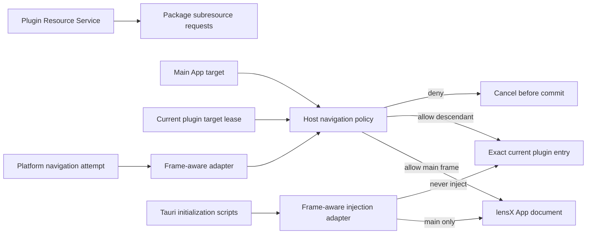

## Context

当前项目只以 macOS 为产品目标，使用 Tauri `2.11.5`、`tauri-runtime 2.11.3`、`tauri-runtime-wry 2.11.4` 与 Wry `0.55.1`。Tauri 把 WebView navigation handler 传递给 Wry；实施前 WKWebView adapter 的 native policy callback 能观察 main 与 descendant navigation，但 Wry/Tauri 抽象只向应用提供 URL，不携带 main/descendant frame 分类。真实 macOS spike 中，Host main document 与 descendant plugin document 共触发两次 URL-only callback；恶意 descendant self-navigation 触发第三次 callback 并被同步拒绝，原 document 保留，证明 callback 时机早于 commit，但补丁前 evidence 只能诚实记录 native frame class 为 `unknown`，无法应用 disjoint allowlist。

Tauri 同时把 App bootstrap 封装为 `for_main_frame_only: true` 的 initialization scripts，其中包含 `isTauri`、`__TAURI_INTERNALS__`、metadata、invoke initialization 和 IPC bootstrap。真实 macOS WKWebView spike 已证明 Host main frame 保留完整 bootstrap，descendant 中这些 surface 均缺失且 invoke handler hit 为零；native custom protocol shape 也保持可用。popup 进入既有 new-window callback 并被拒绝，blob attachment 进入 download callback 并被拒绝。因此 macOS initialization isolation、new-window 与 download hooks 当前不是依赖补丁阻塞点，但必须继续作为真实 WebView 回归门禁，防止依赖或 adapter 漂移。

现有 Plugin Resource Service 已经拥有 package scope/generation、路径、MIME、payload ownership 与 lifecycle 授权。它只处理资源请求，无法判断一次 navigation 的 source frame，也不应被扩展成通用浏览器策略。现有 Plugin Page navigation 仍渲染 Host-owned placeholder；`add-isolated-plugin-iframe-runtime` 因无法证明 nested iframe self-navigation fail closed 而阻塞。

如果改用 Tauri-managed child WebView，插件文档会成为该 WebView 的 main frame，并按设计接收 Tauri main-frame initialization scripts；这与隔离目标直接冲突。当前 macOS HTML iframe 路线则已经证明 descendant bootstrap 缺失。独立 resource origin 仍只能降低同源风险，不能阻止外部文档被加载并显示为可信插件内容。因此本设计保留后续 HTML iframe 路线，先补齐 WKWebView navigation frame context，并把 initialization isolation 固定为回归保证。

目标数据流如下：



## Goals / Non-Goals

**Goals:**

- 在 macOS WKWebView 上，把 main-frame 和 descendant-frame navigation attempt 在提交前交给同一 Host-owned policy。
- 在 macOS WKWebView 上回归验证 main-frame-only initialization：Host App 保留 Tauri bootstrap，descendant frame 不执行、不观察且不能调用该 bootstrap。
- main frame 只允许配置中的 lensX App document；descendant frame 在无 active target 时全部拒绝，有 target 时只允许当前精确插件 entry 与 Host-derived fragment。
- 通过原子、带 epoch 的 Host-private target lease 处理 activate、replace、dispose 与 late disposal，避免旧 Page 清理撤销新 target。
- 对 macOS native custom-protocol URL 做严格、无歧义的规范化和精确比较；非法或无法分类的输入 fail closed。
- 保持 Resource Service 独立负责普通包资源请求，不复制或放宽其 scope/generation、path、MIME 与 lifecycle contract。
- 用正常与恶意文档在真实 WKWebView 上证明 initial navigation、self-navigation、Host/external/cross-plugin/dangerous-scheme、popup 和 download 的允许/拒绝矩阵。
- 用相同真实 harness 证明 Host main frame bootstrap 可用，而 descendant 中 `isTauri`、`__TAURI_INTERNALS__`、invoke metadata/key 与 IPC bootstrap 不存在，代表性 invoke 不会到达 Rust handler。
- 将依赖修改控制为可审查、可回滚、固定版本且 upstream-compatible 的最小补丁。

**Non-Goals:**

- 创建插件 iframe、修改 `App.tsx`、替换 Plugin Page placeholder 或执行任何插件 UI。
- 解析 Registration/Page/Resource Runtime descriptor，或决定哪个插件 Page 应成为 active target。
- Runtime Session、SDK iframe transport、消息身份、nonce/MessagePort、JSON-RPC、Host API、权限、pending call 或完整 CSP。
- child WebView、独立插件窗口、后台 Runtime、iframe pool、Router/history、外部链接 opener 或通用下载能力。
- Windows WebView2、Linux WebKitGTK、跨平台 adapter 抽象或非 macOS 平台完成声明。
- 修改 Manifest schema、Plugin Resource Service 稳定 contract、public plugin packages 或 Launcher/Page 公共 descriptor。
- 新增或重命名插件可调用 Tauri command、把 Tauri bridge 暴露给插件、或用运行时 monkey patch 伪装 bootstrap 缺失。
- 依靠 DOM listener、作者脚本、自报身份、scope 随机性或单一 CSP directive 代替 native navigation enforcement。

## Decisions

### 1. 导航策略以 frame class 和精确 target 为唯一输入

新增 framework-neutral Rust policy，输入为已经解析的 navigation attempt：

```text
NavigationAttempt {
  frame_class: main | descendant,
  target: normalized target,
}
```

输出为有限的 `allow_main_app | allow_active_plugin_document | deny` decision。policy 不接收 author/plugin identity，不调用 React，不执行 Resource Service request，也不根据 URL 中自报的 plugin ID 授权。

main frame 只匹配构建/运行模式已经配置的精确 lensX App target。descendant frame 不继承这条 allowlist，因此插件不能把自身导航到 Host origin。无 active plugin lease 时 descendant navigation 全部拒绝；有 lease 时仅匹配 lease 保存的精确 document target，包括 Host 已派生的 fragment。query、userinfo、port、额外/不同 fragment、不同 scheme/host/path 或任何解码后不一致都拒绝。

普通 HTML/CSS/JavaScript/image/font/JSON/Wasm 请求不是 document navigation，不进入这条 allowlist，仍由 Plugin Resource Service 逐请求授权。若平台把无法识别的请求错误报告为 navigation，policy 拒绝并由真实 harness 暴露兼容性问题，而不是扩大 allowlist。

**Alternatives considered:**

- 只按 URL scheme/origin allow：拒绝，因为会允许插件导航到 Host 页面或另一个仍有效的插件 scope。
- 只依赖 128-bit scope 不可猜测：拒绝，因为 capability URL 泄露后仍必须保持 identity boundary。
- 允许同 scope 任意 HTML navigation：首版拒绝；后续 Runtime 的 Page route 使用精确 Host-derived fragment，不需要作者控制的 document 跳转。

### 2. active plugin target 使用原子 epoch lease

Rust policy state最多保存一个 immutable `ActivePluginNavigationTarget`。激活返回 opaque process-local lease/epoch；replacement 原子替换 target 并使旧 epoch 失效；dispose 只有在 lease 仍为 current 时才能清空 target。这样旧 resolve、旧 Page cleanup 或晚到的 dispose 不能撤销新 Page 的 policy。

target 至少绑定 canonical entry document URL 与精确 Host-derived fragment；实现可以保留 Host-private identity fingerprint 用于等值、日志去重和测试，但不得把 entry ID、revision、scope、digest、URL 或 Host object写入公共 contract、事件或诊断。

本 change 只交付 Rust 内部 activation interface，并在 production WebView 上以 idle 状态安装 policy。真实 `.lxp` Runtime 尚未交付，因此 production 不激活 target，也不新增 Tauri command。后续 `add-isolated-plugin-iframe-runtime` 必须通过受验证的 Resource/Registration facts构造 target，并可在独立审查下增加最小 Host-private adapter；它不得绕过或复制 policy。

**Alternatives considered:**

- 让 Resource Service 的每个已发行 scope 都可导航：拒绝，因为历史或其他插件 scope 不能成为当前 Page document。
- 让 React 保存 allowlist：拒绝，因为 native callback 必须在前端脚本执行之前独立决策。
- 无条件 dispose：拒绝，因为 late cleanup 会错误清除 replacement target。

### 3. 平台适配必须在 native commit 前提供 frame class

macOS adapter contract 必须把每次 main/descendant document navigation 映射为同一 Rust decision。接入点从 `WKNavigationAction` 的 `targetFrame.isMainFrame` 派生可信分类，并在 WKNavigationDelegate decision handler 提交前同步拒绝。Wry/Tauri 上层 callback payload 只增加本 capability 必需的 frame class，不提前设计通用 navigation metadata。

最小 callback payload 固定为 `NavigationFrame::{Main, Descendant, Unknown}`。Wry macOS delegate 将 `targetFrame == nil` 映射为 `Unknown`，否则只读取 `isMainFrame`；Host policy 对 `Unknown` fail closed。既有 new-window callback 继续处理无 target frame 的新 browsing context，不把 popup 伪装成 main 或 descendant navigation。

锁定版本的最小 patch surface 必须贯穿四个现有层级：Wry 定义有限 frame enum 并在 WKNavigationDelegate 中派生；`tauri-runtime` 的 navigation handler 类型携带该 enum；`tauri-runtime-wry` 在 URL 解析时保留它；Tauri `WebviewBuilder` / `WebviewWindowBuilder` 与 manager wiring 将它交给应用 callback。只修改 Wry 或应用层都无法穿过现有 URL-only 边界。该补丁只实现 macOS adapter；不增加 Windows/Linux adapter、通用 metadata、第二套 WebView runtime 或公开插件 API。

若目标 WKWebView 不能可靠提供分类或拒绝时机，实施必须停止并记录证据。依赖修改优先提交为 Wry/Tauri 可接受的最小 macOS frame-aware callback；若上游发布节奏阻塞本项目，可临时使用固定 commit/revision 的最小 patch，但必须包含来源、差异范围、license、更新/撤销条件和 drift gate，且不得引入第二套 WebView runtime 或 Windows/Linux adapter 工作。

**Alternatives considered:**

- application-side DOM `beforeunload`/MutationObserver：拒绝，插件可覆盖且调用发生在不可信脚本层。
- Tauri-managed child WebView：拒绝，因为 Tauri main-frame bootstrap 会进入插件文档，并显著改变布局、焦点、透明窗口与生命周期边界。
- 永久维护宽泛 Wry fork：拒绝；补丁必须最小、可上游化且有退出条件。

### 4. Tauri initialization script 必须由原生 adapter 强制仅进入 main frame

Tauri 继续负责生成 Host bootstrap，并继续把可信脚本标记为 `for_main_frame_only: true`；macOS WKWebView adapter 必须真实执行该语义。当前 spike 已确认这条行为，无需为 initialization injection 单独修改依赖；后续 patch 和升级仍必须通过相同 negative evidence，不能只依据 flag 或源码存在。

统一 harness 为 Host bootstrap 增加不可伪造的测试侧 sentinel，并在 descendant 文档最早可执行阶段检查 `isTauri`、`__TAURI_INTERNALS__`、metadata、invoke key/IPC surface。它还使用仅在 harness 注册、只记录 bounded hit count 的 representative invoke handler，证明 descendant attempt 在到达 Rust handler 前失败。证据不得保存 key、payload、raw script、URL 或本机路径。每次 Wry/Tauri revision 变化都必须在真实 macOS WKWebView 重跑该 matrix。

初始化隔离与 navigation policy 共享依赖 revision、drift checker 和 macOS 完成门禁，但职责保持分离：navigation policy 决定 document 是否提交；initialization adapter 决定 Host bootstrap 是否注入。任一保证失败都阻止本 capability 和下游 iframe Runtime 完成。

**Alternatives considered:**

- 假定 sandbox/opaque origin 会隐藏 Tauri globals：拒绝，因为 initialization script 在 frame 自身 global 中执行，与父子同源无关。
- 只让插件避免 import `@tauri-apps/api`：拒绝，因为隔离不能依赖作者自律，且 bootstrap surface 本身已经越界。
- 把 Tauri bootstrap 从整个 WebView 删除：拒绝，因为 Host App main frame 的现有 native 能力必须保持。
- 额外以 `window.top === window` 包裹所有脚本：当前 macOS 不需要，且不能替代真实 WKWebView initialization evidence。

### 5. popup、new-window 与 download 使用独立 deny hook

navigation handler 不被假设覆盖 `window.open`、targeted new browsing context 或 download。production WebView 额外安装 Host-owned new-window 与 download deny hook，并输出相同 bounded decision code。当前应用的外部打开行为继续通过受信任的 Tauri opener 路径，不通过 WebView popup。

这项 policy 不宣称阻止 iframe 内所有浏览器 API；camera、microphone、clipboard 等 Permissions Policy 属于后续 iframe container。它只保证 document navigation、new window 和 download 在 native 边界 fail closed。

### 6. 规范化只比较结构化 URL，不重写或猜测

URL parser 必须接受项目已支持的 native `lensx-plugin://localhost/...` 与平台 translated `http(s)://lensx-plugin.localhost/...` 形态，并转换为一个内部 resource target tuple；它不得 percent-decode 后再拼接路径、容忍 backslash、默认端口、userinfo、query、双重编码或大小写碰撞。fragment 作为单独字段精确匹配，不进入 Resource Service 请求。

真实 WKWebView 矩阵进一步证明：Host/external/cross-plugin/stale/data document attempts 会进入 frame-aware callback 并由 policy 拒绝；`file:`、no-op `javascript:` 与同 document 创建的 `blob:` 在 WKWebView 内部 preflight 阶段不会形成 navigation callback，原 descendant document 保留且没有 new-window/download/external handoff。evidence 对后一类只能记录有限的 `blocked_by_webview`，不得伪装成 policy `deny`。production normalization 仍拒绝这些 scheme（若未来 WKWebView 开始上报 callback 即 fail closed），dependency drift gate 也必须要求重新运行矩阵。

App dev URL 与 production App URL分别来自 Tauri 当前配置/构建 facts，不允许插件 target 借用。解析失败、平台给出空 URL、未知 frame class 或 callback 异常都返回 deny。诊断只包含固定 code、frame class 与 operation，不包含 raw URL、scope、路径、plugin identity、系统错误或 stack。

### 7. 真实 WebView harness 是交付条件，不由 DOM 模拟替代

专用 harness 使用项目正式测试资源生成正常/恶意 documents，并在目标 macOS WKWebView 中记录：OS、WebView engine/version、Tauri/Wry bundle revision、URL shape、frame classification、policy allow/deny 或 WKWebView preflight block、Host bootstrap availability、descendant bootstrap absence 和 bounded invoke handler hit count。证据使用项目维护的结构化格式并由 gate 校验；它不记录 capability URL、invoke key、raw bootstrap、payload 或本机路径。

DOM/Rust 单元测试覆盖纯 policy、normalization、epoch、initialization script selection 与错误去敏，但不能替代真实 macOS WKWebView 对 descendant callback、commit-before-deny 和 bootstrap absence 的证据。macOS matrix 全部通过前，capability 不得完成，`add-isolated-plugin-iframe-runtime` 也不得恢复 production implementation。Windows/Linux 没有证据要求，也不获得支持声明。

## Risks / Trade-offs

- **[上游 API 需要同时修改 Wry 与 Tauri runtime 类型]** → 先完成最小 spike，保持 callback payload 小且通用；优先 upstream，临时 patch 固定 revision 并加入 drift gate。
- **[WKNavigationAction frame metadata 与 Wry 暴露语义不一致]** → 用统一黑盒矩阵验证实际 allow/deny，不只依据类型或文档；无法分类时 fail closed 并阻止完成。
- **[全局 policy 误伤 Host main frame 或开发 HMR]** → main/descendant allowlist 完全分离，为 dev/prod App target 建立 focused tests；不为便利添加通用 HTTP(S) allow。
- **[late dispose 清除新 target]** → 使用 epoch lease 和 compare-current disposal，覆盖并发 replacement 测试。
- **[依赖 fork 增加维护成本]** → 限制 diff、记录 license/upstream 状态与退出条件，禁止无固定 revision 或长期漂移。
- **[依赖升级让 bootstrap 在 descendant 中短暂可见]** → harness 在 descendant 最早 author script 时读取 surface 并用 bounded handler 观测 invoke；任何可见窗口或 handler hit 都视为失败。
- **[初始化隔离误删 Host bridge]** → 同一平台矩阵要求 main frame sentinel、现有 Tauri invoke 和 App lifecycle 回归继续通过，不能通过全局禁用 bootstrap 获得 negative result。
- **[未来恢复 Windows/Linux 时错误复用 macOS 完成声明]** → 文档和 capability 明确标记 macOS-only；其他平台必须用独立 OpenSpec change 和真实平台证据重新设计。
- **[policy 与 Resource Service 职责重叠]** → policy 只决定 document navigation；所有 subresource authorization 继续由现有服务处理并运行完整回归。

## Migration Plan

1. 先建立不接入 production 的 navigation/bootstrap 正常与恶意 documents、去敏 evidence schema 和最小真实 WebView harness。
2. 对锁定版本完成 macOS WKWebView frame callback 与 main-only initialization spike，确定最小 upstream/patch surface；macOS 不满足时更新设计并暂停。
3. 实现纯 target normalization、decision matrix、epoch lease、安全诊断与 initialization selection，并接入固定依赖、production idle policy 和 new-window/download deny hook。
4. 用同一 harness 在 macOS 证明 navigation enforcement、Host bootstrap 保留和 descendant bootstrap/invoke absence，随后运行 focused 和完整 frontend/Rust validation。
5. 更新英中文档并把本 capability 记录为 iframe Runtime 的已交付前置；不在本 change 中启用插件 iframe。

回滚时移除 production policy hook 与固定 dependency patch，恢复上游锁定版本；由于本 change 不创建 plugin Runtime、不持久化 target、不修改安装或 Registration 数据，回滚不需要数据迁移。若只撤销临时 patch，必须同时撤销依赖该 frame context 的 production hook，不能退回 URL-only enforcement 后继续声称 capability 已交付。

## Resolved Questions

- callback 使用 `main | descendant | unknown` 有限 enum，而不是裸 `is_main_frame`；这能无歧义保留 `WKNavigationAction.targetFrame == nil`，并让 Host 对缺失事实 fail closed。
- patch 同时覆盖 Wry、`tauri-runtime`、`tauri-runtime-wry` 与 Tauri builder/manager wiring，因为锁定版本在每一层都使用 URL-only navigation handler。补丁仍以 upstream 可接受的小 diff 为目标；若尚无含该能力的 release，则固定项目审查过的 revision/patch 并配置 drift gate。
