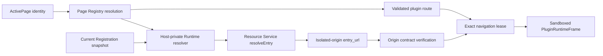
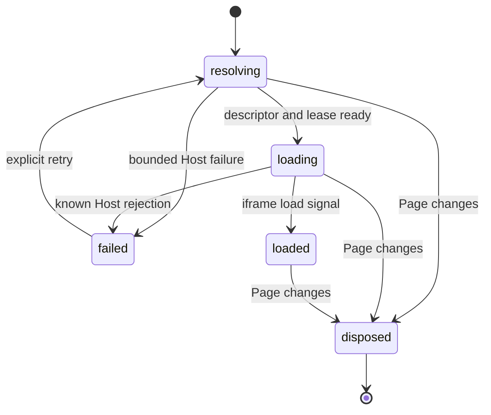

## Context

当前实现已经具备 Plugin surface projection、Host-private Plugin Resource Service，以及 macOS frame-aware WebView navigation policy。外部插件 Page 仍在 `App.tsx` 中渲染 `PluginPagePlaceholder`，不会读取 route、Runtime entry 或 package resource，也不会执行插件代码。

本 change 的第一次真实 macOS WKWebView 探针给出了新的约束：`sandbox="allow-scripts"` 下 document 保持 opaque origin，HTML、CSS、图片和 classic script 可以加载，Tauri surface 不存在且 privileged handler 零命中；但代表性 ES Module 入口失败，module dependency 甚至没有形成资源请求。继续依赖 opaque origin 会把正式插件限制到 classic-only/inlined bundle，而在当前共享 `lensx-plugin://localhost` origin 上直接加入 `allow-same-origin` 又会放大跨插件 storage 与同源访问风险。

因此 `add-isolated-plugin-runtime-origin` 成为本 change 的新前置：它必须把 current resource scope/generation 映射到与 Host、其他插件和旧 generation 不同的浏览器 origin，并在真实 WKWebView 中证明 ES Module 图、storage partition、Tauri absence 与 frame-aware exact-target policy。当前 change 不再拥有 origin URL 设计，只消费前置能力返回的已验证 `entry_url`。

## Goals / Non-Goals

**Goals:**

- 只在当前可用外部插件 Page 活跃时创建一个 Host-owned iframe，并在现有单窗口 Page surface 中显示真实插件 UI。
- 只消费前置 capability 交付的独立-origin入口，从当前 Host facts 派生 Runtime target，不把敏感事实加入 `ActivePage`、Page Registry 公共快照或插件输入。
- 固定 `sandbox="allow-scripts allow-same-origin"`、deny-by-default Permissions Policy、`no-referrer` 和精确导航 lease；`allow-same-origin` 仅因每个 current scope/generation 已具备独立 browser origin 才成立。
- 证明插件不能访问父 Host DOM/React/Tauri、其他插件 origin/storage/resource 或旧 generation，并能加载代表性 ES Module 图。
- 将 iframe `loaded` 与后续 Session/SDK `ready` 分离，提供可访问、双语、主题一致的加载、已知失败和显式重试反馈。
- 复用现有 Page close/invalidation 行为，保证没有后台、隐藏或跨 Page 复用的插件 iframe。

**Non-Goals:**

- 选择或实现独立 Runtime origin 的 URL、Resource Service、CORS 或 platform translation 机制；这些属于 `add-isolated-plugin-runtime-origin`。
- Runtime Session、消息 source/identity、nonce、MessagePort、SDK iframe transport、JSON-RPC、Host API 或 permission dispatcher。
- 完整 Host/iframe CSP、通用 load timeout、重复崩溃治理、pending RPC 清理或 Host reload 状态机。
- 多标签、历史路由、后台/保活 Runtime、多实例池、跨 Page Runtime 复用或独立插件窗口。
- 外部链接、任意网络、文件系统、Shell、进程、Tauri command 或插件间通信。
- wildcard/null CORS、共享-origin `allow-same-origin`、classic-only/inlined 公共 bundle 约束或正式插件项目模板。
- Windows/Linux iframe Runtime、adapter、evidence 或完成声明。

## Decisions

### 1. 两个安全前置必须先完成，当前 change 只消费稳定输出

实施恢复前必须同时满足：

1. `add-frame-aware-webview-navigation-policy` 的 macOS gate 通过，能够在 commit 前区分 main/descendant frame，并以单 active-target epoch lease 精确允许当前 document；
2. `add-isolated-plugin-runtime-origin` 的 gate 通过，Resource Service 返回当前 scope/generation 独占的 browser origin，frame-aware normalization 接受该形态，且真实 WKWebView 证明模块图和 origin/storage isolation。

当前 change 不复制这两项能力，也不保留共享 `lensx-plugin://localhost` fallback。任一 dedicated gate 缺失、origin descriptor 无法验证、shared host 被返回或 evidence drift 时，Runtime resolver 返回 bounded failure，production iframe 不挂载。

**Alternatives considered:**

- 在当前 change 中顺手修改 Resource Service origin：拒绝，因为会混合资源授权、原生 URL normalization 和 React Runtime 三个安全审查边界。
- 继续使用 classic script：拒绝，因为探针 fixture 不是公共插件模板，且会把现代模块图问题隐藏到后续。
- wildcard/null CORS 让 opaque document 加载 module：拒绝，因为会放宽跨 origin 读取，且不能提供独立 storage/identity boundary。

### 2. Runtime target 由 Host-private resolver 从当前 facts 派生

`PluginPageRuntimeResolver` 输入只接受当前 `{owner_id, page_id}` 与 Page Registry 已解析 Page。生产实现从 `PluginSurfaceProjectionService.currentSnapshot()` 找到同 owner 的当前 eligible registered entry，使用 snapshot revision 和 `entry_id` 调用现有 Plugin Resource Desktop Adapter，再交叉验证 revision、entry ID、plugin ID 与独立-origin URL contract。

resolver 返回只供 React container 消费的 immutable descriptor，例如 `{runtime_key, iframe_src, plugin_id, version}`。Page route 只能来自 Registry，并作为 Host-derived fragment 附加到已验证 entry document；插件不能提交完整 URL、origin、sandbox 或 allow policy。`runtime_key` 至少绑定 entry ID、Registration revision、entry URL、owner ID、Page ID 与 retry attempt，任一事实变化都重建 iframe。

共享 host、未知/旧 origin 形态、origin/path scope 不一致、stale revision、degraded snapshot 或 identity mismatch 均 fail closed；不得回退到 Manifest entry、旧 URL 或作者路径。

### 3. `allow-same-origin` 是隔离 origin 的受限消费者，不是普遍放宽

目标 iframe 固定使用 Host 常量：

- `sandbox="allow-scripts allow-same-origin"`，不包含 forms、popups、downloads、modals、pointer lock、presentation、storage access 或任何 top-navigation token；
- `referrerPolicy="no-referrer"`；
- Host-fixed Permissions Policy 将 camera、microphone、geolocation、fullscreen、clipboard read/write 及目标 WKWebView 暴露的其他敏感能力设为 `none`；
- 不使用 `srcdoc`，不接受 Manifest/plugin override，不注入 Tauri invoke key、Host bridge 或 React internals。

`allow-same-origin` 只恢复插件 document 对自身独立 origin 的正常模块与 storage 语义。由于父 Host document 与插件不同源，插件仍不能读取或修改 `window.parent`、`frameElement` 或 Host storage；不同插件、不同 current scope/generation 和失效 URL 也必须不同源。前置 gate 若不能证明这些事实，本 change 不得启用该 token。

**Alternatives considered:**

- 保持 `allow-scripts` opaque origin：拒绝，真实 WKWebView 已证明代表性 ES Module 图失败。
- 在共享 `lensx-plugin://localhost` 上加入 `allow-same-origin`：拒绝，会把 path scope误当作 browser-origin boundary。
- 仅依赖 Tauri capability：拒绝，HTML iframe 仍需 browser sandbox、origin、Permissions Policy 和 negative evidence。

### 4. 容器状态与可信 Runtime `ready` 完全分层

`loaded` 只代表 iframe 发出 navigation/load completion，不证明资源全部成功、JavaScript 健康、SDK 初始化或可信 Session。`failed` 只覆盖 Host 已知的 snapshot/resource/origin validation、typed boundary、navigation lease 或 React container error。通用 timeout、crash、disconnect 和自动恢复留给 Task 4.4。重试显式刷新当前 snapshot、重新 resolve entry、获取 current origin/lease 并以新 attempt key 挂载，不复用旧 promise、URL、lease 或 iframe。

### 5. 导航复用精确 frame-aware lease

Host main-frame Runtime adapter 必须在挂载 iframe 前，用 resolver 的独立-origin entry document 和 Host-derived fragment 激活 current epoch lease；activation 成功后才设置 `iframe_src`。旧 Page、late resolve、replacement、retry 或 uninstall cleanup 使用 compare-current disposal，不能撤销更新 lease。关闭后 policy 回到 descendant-deny idle。

document navigation 只允许 current exact entry document/fragment。普通 CSS、JavaScript、image、font、JSON 和 Wasm 不获得 document authorization，继续由 Resource Service 对 current origin/scope/generation/identity/path/MIME 授权。Host、外部、其他插件、旧 generation、危险 scheme、popup、新窗口、download、form 与 top navigation 全部 fail closed。

### 6. 单窗口只保留一个活跃 iframe

Host Page 继续直接渲染受信任 React；仅当 `pageResolution.provider.kind === "plugin"` 时渲染 `PluginRuntimeFrame`。组件以 Runtime descriptor 和 attempt key 为 identity。手动关闭、Registry invalidation、provider quiesce、disable/uninstall/replacement、revision/origin URL 变化、切回 home/search 或 App unmount 都移除旧 iframe。系统不缓存隐藏 iframe、不增加 Router/history/tab，也不跨 Page 复用 Runtime。

### 7. Host-owned feedback 复用现有 UI、i18n 与主题

`PluginRuntimeFrame` 使用应用 i18n 和 Semi Design 表达 resolving/loading、known failure 与 retry；英文 canonical、`zh-CN` 语义镜像。loading 提供 busy/polite status，failure 使用 alert/error semantics，retry 支持键盘与可见焦点。iframe 使用本地化 Page title，填满现有 Page content slot；插件内部主题传递仍由后续 Runtime context 定义。

## Risks / Trade-offs

- **[前置 origin 在目标 WKWebView 上仍不能形成预期 tuple origin]** → dedicated gate 必须先失败并更新前置设计；当前 change 不增加 fallback。
- **[`allow-same-origin` 扩大 iframe 自身浏览器能力]** → origin 必须 per-current-scope/generation 隔离，父 Host 与其他插件跨源，并用 parent/frameElement/storage/Tauri negative matrix 验证。
- **[Runtime lifecycle 与 origin/navigation lease 失配]** → iframe 只在 current activation 成功后挂载，cleanup 使用 compare-current；replacement、retry 与 invalidation 做端到端回归。
- **[iframe `load` 误报]** → 状态固定为 `loaded` 而非 `ready`；Session/timeout/crash 属于后续 capability。
- **[Registration 在 resolve 期间变化]** → 用 snapshot revision 调用 Resource Service并交叉验证；stale/mismatch fail closed。
- **[完整 CSP 尚未交付]** → 不宣称完整 CSP；当前只组合 sandbox、Permissions Policy、isolated origin、Resource scope 与 navigation gate。

## Migration Plan

1. 先完成并验证 `add-frame-aware-webview-navigation-policy` 与 `add-isolated-plugin-runtime-origin`，确认独立-origin entry contract、module/storage/Tauri evidence 和 drift gates。
2. 增加 Host-private resolver、descriptor 和 origin-contract verification，并将 exact navigation lease activation/disposal 接入 main-frame adapter。
3. 以新 origin 路径重跑正常/恶意 `.lxp`，确认 exact sandbox、ES Module 图、storage isolation、parent/Tauri absence 与 lifecycle revocation。
4. 增加 `PluginRuntimeFrame` 和 production composition，随后补齐 lifecycle、i18n、theme、accessibility 与 security regressions。
5. 更新英中文档并运行专用 gate 与完整 frontend/Rust validation。

回滚时恢复 `PluginPagePlaceholder` production composition，并移除 Runtime resolver/iframe component；Resource Service 的独立 origin 和 frame-aware policy 仍是可独立保留的 Host-private基础，不需要回滚安装数据或公共 contract。

## Open Questions

- 无。opaque-origin ES Module 问题已经由真实 WKWebView 探针回答；独立 origin 的具体 URL/translation 形态和平台可行性由 `add-isolated-plugin-runtime-origin` 在本 change 恢复实施前关闭。
