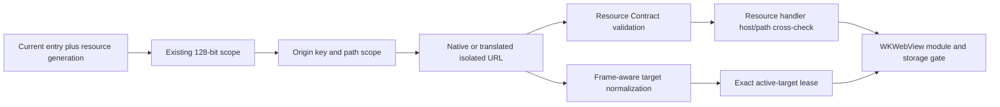

## Context

Plugin Resource Service 当前为每个 `(entry_id, resource_generation)` 生成 128-bit process-local scope，并返回形如 `lensx-plugin://localhost/v1/<scope>/<plugin-key>/<version>/<path>` 的 opaque `entry_url`。Resource handler 每次请求都会重新验证 scope、identity、generation、payload ownership、path 和 MIME；disable/re-enable、replacement、uninstall 与 restart 会撤销旧 scope。macOS frame-aware policy 也已把 native `lensx-plugin://localhost/...` 与 supported translated `http(s)://lensx-plugin.localhost/...` 规范化为 exact document target。

这些边界保护了文件读取和 document navigation，却没有建立 browser same-origin isolation：scope 位于 path，所有 plugin documents 的 authority 相同。Task 4.2 的真实 WKWebView探针在 `sandbox="allow-scripts"` 下证明 classic resource graph 与 Tauri absence 成立，但 ES Module dependency graph失败；而在共享 authority 上加入 `allow-same-origin` 会让多个插件获得同源 DOM/storage能力。

本 change 只建立 Host-private Runtime origin prerequisite。production `App.tsx` 仍显示 `PluginPagePlaceholder`，不创建 iframe。它依赖已完成的 macOS frame-aware policy，并为后续 `add-isolated-plugin-iframe-runtime` 提供一个已经过真实 WebView验证的 isolated-origin `entry_url` contract。



## Goals / Non-Goals

**Goals:**

- 使每个 current `(entry_id, resource_generation)` 的 package document 拥有与 Host、其他插件和旧 generation 不同的 browser origin。
- 复用现有 128-bit scope 作为单一 process-local authorization/origin key，保持同 generation重复 resolve 幂等，不增加可漂移的第二 token。
- 在 URL authority 与 path 中携带同一 scope，并由 Resource Contract、handler 和 frame-aware normalizer 做 strict host/path cross-check。
- 在真实 macOS WKWebView 中证明 `sandbox="allow-scripts allow-same-origin"` 可以加载代表性 ES Module graph，同时仍隔离 Host/other-plugin/old-generation DOM/storage/Tauri。
- 保持 no-store、no wildcard/null CORS、bounded diagnostics、lifecycle revocation、public package boundary 和 main-only Tauri bootstrap。
- 为下游 iframe Runtime 提供最小、typed、opaque的 `entry_url`，不暴露 standalone origin descriptor。

**Non-Goals:**

- 创建 production iframe、修改 `App.tsx` 或替换 Runtime-unavailable placeholder。
- Runtime Session、SDK transport、Host API、permission、完整 CSP、network proxy、remote origin broker 或 public origin API。
- 将 origin/scope持久化到 Manager Store、Registration Contract、Manifest、public packages、events 或 logs。
- Windows/Linux Runtime implementation、WebView evidence 或完成声明；translated URL 只保持 parser/contract可演进，不构成平台支持声明。
- 通过 wildcard/null CORS、共享 authority、classic-only/inlined bundle 或 child WebView规避 gate。

## Decisions

### 1. 同一个 128-bit scope 同时绑定 browser origin 与 resource authorization

每个 current `(entry_id, resource_generation)` 已经最多映射一个 OS-CSPRNG 128-bit lowercase hex scope。本 change 不创建第二个 origin token，而是把该 scope 同时放入独立 authority 与既有 path envelope。概念形态为：

```text
lensx-plugin://<scope>.runtime.localhost/v1/<scope>/<plugin-key>/<version>/<path>
```

`<scope>` 必须是精确 32 位 lowercase hex；authority 不接受 Unicode、punycode、uppercase、短写、额外 label、port 或 userinfo。supported platform adapter 若需要 translated URL，必须保留相同 origin key 并产生独立 authority；不能把所有 scope折叠回共享 `lensx-plugin.localhost`。native 与 translated URL 规范化为同一内部 tuple：

```text
{ scheme_class, origin_scope, path_scope, plugin_key, version, resource_path }
```

`origin_scope` 与 `path_scope` 必须 byte-for-byte相等。重复 resolve 同 generation 返回同 URL；replacement、disable/re-enable、uninstall、restart 等新 generation 使用新 scope，也自然获得新 origin/storage partition。

第一实现任务必须在目标 WKWebView验证该 authority 形态确实形成 stable non-opaque browser origin并支持 module graph。若 WKWebView/Wry 会忽略 authority、折叠到共享 origin 或无法服务 subresource，实施停止并更新本 design；不得自动切换到共享-origin CORS或假定 URL语法等于浏览器语义。

**Alternatives considered:**

- 每个 plugin ID 一个固定 origin：拒绝，因为 replacement/reinstall会继承旧 storage与 authority，且 disabled old document边界更弱。
- 独立 origin token 加现有 scope：拒绝，两个 bearer token会增加映射、rotation和泄漏面而没有额外授权收益。
- 每个 scope动态注册 custom scheme：拒绝，WebView custom scheme registration通常在构建期固定，动态 scheme pool会扩大 native lifecycle复杂度。
- 共享 host加 path scope：拒绝，这正是当前 browser same-origin缺口。

### 2. Resource Contract仍只返回一个 opaque `entry_url`

`resolve_plugin_resource_entry` request保持恰好 `{contract_version, entry_id, expected_revision}`，successful result仍保持恰好 contract version、entry ID、revision、plugin ID、version 与 opaque `entry_url`。不新增 `origin`、`scope`、`generation`或 authorization header字段。

Rust/TypeScript validators必须接受 isolated native/translated shape并拒绝旧共享 host、unknown scheme、port、userinfo、query、fragment、host/path scope mismatch与不合 grammar 的 authority。React/private caller可以把 URL作为 opaque string传给后续 resolver，但不能自行提取 scope或构造 sibling URL；package relative URL由 browser解析，Resource handler才拥有授权语义。

**Alternatives considered:**

- 单独返回 `origin`或scope descriptor：拒绝，会扩大 sensitive fact传播和 public-contract误用。
- 让 frontend拼接 authority：拒绝，origin必须由 atomic Manager projection与Host CSPRNG事实派生。

### 3. Resource handler对 authority与path执行双绑定

handler先执行strict URL envelope解析，再查询 process-local scope map。只有 scheme class、origin scope、path scope、plugin key、version和resource path全部canonical且两份scope相等时，才继续现有 Manager projection、payload root、regular-file、path/MIME、size与post-open identity验证。

旧共享 host、unknown/expired scope、host/path mismatch、另一个 plugin/generation、unsafe path和不存在resource继续统一外显为fixed `404`；unsupported method为fixed `405`。successful/error response保持 `Cache-Control: no-store`。不添加 wildcard `Access-Control-Allow-Origin: *`，不回显 `Origin: null`，也不基于 request Origin建立授权；current same-origin module graph必须靠独立 origin与relative resource加载成立。

Host diagnostics只包含fixed code/operation，不记录raw URL、origin/scope、plugin identity、path、digest、native error或storage value。

### 4. Frame-aware policy比较isolated canonical target而不复制resource授权

`normalize_plugin_document`扩展为解析新 isolated authority并输出上述 canonical tuple。active target仍由后续 trusted caller从validated `entry_url`与Host-derived fragment构造，epoch lease semantics、idle deny、compare-current dispose、main/descendant disjoint allowlists、popup/new-window/download拒绝保持不变。

exact document比较必须包含origin scope与path scope；旧shared host、另一个scope/generation、query、userinfo、port、大小写/encoding歧义、Host/external/dangerous scheme全部deny。CSS、JavaScript、image、font、JSON和Wasm仍是Resource Service subresource，不因navigation lease获得额外读取权。

### 5. 真实WKWebView spike先于production contract migration

normal/malicious canonical `.lxp` harness在production composition之外运行两个以上isolated origins与一个replacement generation，固定下游预期sandbox `allow-scripts allow-same-origin`、`no-referrer`和deny-by-default Permissions Policy，并验证：

- document报告预期non-opaque origin，HTML/CSS/image/classic script与ES Module dependency graph全部从current origin加载；
- same current generation可以读回自身storage；plugin A、plugin B、Host与replacement generation不能互读/覆盖storage；
- `window.parent`/`frameElement`/Host DOM与Tauri bootstrap/invoke不可达，representative handler hit count为零；
- host/path mismatch、shared/old origin、cross-plugin resource、self/top navigation、popup/download/form与危险scheme fail closed；
- disable/re-enable、replacement、uninstall与restart revocation使旧URL/lease失效，unrelated plugin change不撤销current scope。

DOM simulation、unit test或source inspection只做补充，不能替代真实WKWebView。任一关键断言失败都触发stop condition：保留placeholder，更新proposal/design/spec/tasks后再选择其他origin mechanism。

### 6. Migration只影响process-local URL，不迁移持久数据

本change落地后，process中只发行新isolated-host URL；旧shared-host parser路径删除或明确拒绝。scope未持久化，因此应用重启自然清空旧URL；Manager record、Registration Contract、package layout与Manifest无数据migration。

rollout必须原子更新Rust URL发行/handler、Rust/TypeScript validators、frame-aware normalizer与tests，避免一层接受新URL而另一层回退。由于production iframe尚未交付，用户界面没有兼容窗口；rollback恢复shared-host Resource Service与normalizer即可，restart会撤销所有process-local URLs。

## Risks / Trade-offs

- **[WKWebView custom scheme仍被视为opaque或共享origin]** → 第一阶段real gate验证；失败即停止并重新设计，不合入shared-origin fallback。
- **[Tauri/Wry platform translation折叠authority]** → macOS native形态是当前完成目标；translated adapter必须保留origin key或fail closed，不能据parser test宣称其他平台安全。
- **[scope同时作为authority与path增加可见重复]** → scope本来已在opaque URL中；重复用于host/path cross-check，不作为日志或standalone字段暴露，并保持128-bit process-local bearer semantics。
- **[`allow-same-origin`恢复插件自身storage]** → origin按current generation隔离，真实matrix覆盖Host/other-plugin/old-generation；后续Runtime仍固定deny-by-default sandbox和Permissions Policy。
- **[cache延续旧generation]** →所有response维持`no-store`，lifecycle提交撤销scope，旧request重新进入handler后fixed 404。
- **[跨change归档顺序冲突]** →先完成并同步frame-aware capability，再实施/同步本change，最后恢复iframe Runtime；三者validation gate明确依赖顺序。

## Migration Plan

1. 用current normal/malicious fixtures扩展real WKWebView harness，先验证candidate authority、module graph、origin serialization、storage/parent/Tauri isolation与stop condition。
2. gate通过后，原子更新scope URL builder、Rust/TypeScript Resource Contract validators和handler host/path cross-check；回归existing resource lifecycle/oracle/method/MIME tests。
3. 更新frame-aware canonical target normalization与native harness，验证exact isolated origin、shared/old origin rejection、epoch lifecycle与dependency drift。
4. 增加dedicated `check:isolated-plugin-runtime-origin`，连接real package、Resource Service、navigation、workspace boundary和committed bounded evidence。
5. 更新英中文档并运行完整frontend/Rust/OpenSpec validation；仍保持production placeholder。
6. 全部门禁通过后，才允许`add-isolated-plugin-iframe-runtime`从0/32恢复实施。

回滚时恢复旧URL builder/parser/normalizer并重启应用以撤销所有process-local scope；没有Store、Manifest或public package数据需要迁移。若real spike未通过，则不进入步骤2，当前production行为保持不变。

## Resolved Feasibility Questions

- **macOS authority gate：已通过。** 真实macOS 26.6 / WKWebView 605.1.15 probe确认candidate `lensx-plugin://<scope>.runtime.localhost/...` 在`allow-scripts allow-same-origin`下序列化为稳定non-opaque origin，并加载HTML、CSS、image、classic script及包含package-relative dependency的完整ES Module graph；response没有wildcard/null CORS。normal、malicious与replacement三组独立authority使用同名storage key时均只读回自身值，Host storage保持不变，parent DOM、`frameElement`与Tauri surfaces不可达，代表性privileged handler保持zero-hit。因此允许继续Resource Contract migration。
- **translated workaround：parser可保持origin key，但不构成跨平台支持声明。** 当前vendored Wry 0.55.1 workaround把`lensx-plugin://<scope>.runtime.localhost/...`结构化映射为`http(s)://lensx-plugin.<scope>.runtime.localhost/...`并可逆恢复authority；Rust/TypeScript parser只接受这一保留key的形态，拒绝shared `lensx-plugin.localhost`。本change没有Windows/Linux real WebView证据，仍不得宣称这些平台已支持。
