## Context

Task 3.2 已经把兼容 `.lxp` 的 regular files 提取到 `app_local_data_dir()/plugins/packages/<plugin-key>/<package-sha256>`，Plugin Manager record 的绝对 `installation_path` 是唯一活跃 payload 指针。Task 3.3/3.4 已经能改变 enabled intent、删除 registration，或把同一插件原子切换到 sibling digest directory；其中同 SemVer 不同 digest 是合法 reinstall。当前 Plugin Page 只显示 Host-owned placeholder，既不读取 `runtime.entry`/asset，也不创建 iframe。

Task 4.1 必须建立一个可由后续 Task 4.2 消费的读取边界，同时保持以下约束：

- 普通文件路径、安装根、package digest 与 Manager object 不能进入 React、公共插件包或插件 Runtime。
- Tauri 自定义协议对全部 WebView 可见，而且不同桌面平台会以不同形式表示其 Origin；浏览器 Origin 字符串不能单独承担插件身份授权。
- package paths 使用受限的 portable ASCII segment，但已安装目录仍必须按不可信运行时请求处理。
- 当前 `tauri.conf.json` 的主窗口 CSP 仍为 `null`；完整 Host/iframe CSP 属于 Task 4.4，不能由本 change 提前宣称完成。

数据流如下：

```mermaid
flowchart LR
    A["可信 lensX 前端<br/>entry_id + expected_revision"] --> B["Host-private<br/>resolve_plugin_resource_entry"]
    B --> C["Plugin Manager<br/>原子解析当前 registration 与 resource generation"]
    C --> D["Plugin Resource Service<br/>签发或复用 opaque scope"]
    D --> E["scoped entry_url"]
    E --> F["后续 Task 4.2 iframe"]
    F --> G["lensx-plugin 请求"]
    G --> H["Rust protocol handler<br/>scope、路径、MIME、生命周期复核"]
    H --> I["当前 payload 内的 regular file bytes"]
```

## Goals / Non-Goals

**Goals:**

- 提供一个独立版本、Host-private、严格校验的 entry URL 查询契约。
- 使用不可猜测、进程内、可撤销的 resource scope，把一个 URL 限制到一个当前 managed payload。
- 在 Rust 中完成路径语法、managed-root ownership、canonical containment、逐段 symlink/no-follow 与打开后身份复核。
- 固定第一版 method、MIME、header、大小、错误和缓存策略。
- 让 unrelated plugin revision 不破坏仍活跃的 scope，同时让 disable/re-enable、replacement、uninstall、quarantine/incompatible 和进程重启使旧 scope 永久失效。
- 通过真实临时目录、Manager 状态和协议 request/response 验证安全边界。

**Non-Goals:**

- 不创建 iframe，不执行 HTML/JavaScript，不改变当前 Plugin Page placeholder 或 Host icon fallback。
- 不把 resource scope 解释为 Runtime Session；它不绑定 `contentWindow`、Page、origin、nonce、MessagePort、permission 或 Host API 身份。
- 不实现完整 CSP、iframe sandbox/allow/navigation policy、RPC、权限决策、网络代理或插件间通信。
- 不提供通用文件读取、目录列举、Range、媒体流、下载、query-based routing、开发目录或远程资源。
- 不修改 Manifest/package wire protocol、安装布局、Manager Store v1、Registration Contract 或 lifecycle/replacement 公共语义。

## Decisions

### 1. 新建独立 Host-private Resource Contract 与 desktop adapter

新增 `plugin-resource` Host-private 模块，契约版本从 `0.1.0` 开始，并提供单一查询命令 `resolve_plugin_resource_entry`：

- request 精确为 `{ contract_version, entry_id, expected_revision }`；调用方不能提交 path、plugin ID、version、digest、origin 或安装目录。
- success 精确为 `{ contract_version, entry_id, revision, plugin_id, version, entry_url }`；opaque scope 只存在于 `entry_url` 内，不另行暴露。
- error 精确包含 contract version、`resolve_entry` operation、稳定 code 与 canonical message；code 限于 `invalid_request | stale_revision | not_found | unavailable | unsafe_state | internal`。
- TypeScript adapter 从 `unknown` 严格验证 success/error、拒绝未知字段并 deep-freeze 结果，不缓存跨 revision 结果。
- 契约、adapter 和命令只供可信 lensX root application 使用；workspace boundary gate 禁止公共 Contract/SDK/UI/Testkit、Manifest 或插件源码导入。

查询必须在一个 Manager snapshot 下验证 expected revision，并且只对 healthy、enabled、两维 compatible、非 degraded 且具有可证明 installer-owned canonical payload 的 registration 成功。`source=builtin|external` 不是授权条件；物理 payload ownership 才是条件。`runtime=inactive` 也不阻止签发，因为本 Task 正是在 Runtime 之前建立资源基础。

**替代方案：**让 TypeScript 根据 Registration detail 拼 URL。拒绝，因为 public detail 刻意不包含安装路径/digest，前端也不应生成授权 token 或复制 native path policy。

### 2. 单一异步 Tauri 自定义协议，scope 是 bearer read capability

在 Builder 上注册固定 `lensx-plugin` 异步协议，并通过 managed `Arc<PluginResourceService>` 处理请求。逻辑 URL 采用版本化 path envelope：

`lensx-plugin://localhost/v1/<scope>/<plugin-key>/<version>/<package-relative-path>`

实际平台 URL 由一个 Rust URL builder 生成并作为 opaque string 返回；TypeScript 不拼接、重写或推断 Origin。`plugin-key`、version 和 entry 都来自当前 registration，仅用于一致性校验与诊断可读性，唯一 bearer authority 是至少 128 bit OS CSPRNG 生成的 `<scope>`。scope 冲突必须重试或安全失败，不能退化到时间、PID、序号或普通 hash token。

每个当前 `(entry_id, resource_generation)` 最多有一个 scope；重复查询复用同一 scope，避免无界签发。scope map 仅驻留进程内，不写 Manager Store、配置、日志或事件，进程重启后全部失效。协议 handler 对每次请求重新向 Manager 验证 scope 所绑定的当前 resource generation 与 eligibility，而不相信 URL 自报事实。

该 scheme 对 WebView 全局注册，因此 scope 泄漏意味着其持有者可读取该 scope 内的 payload；本 change 通过高熵、最小 payload 权限、无日志/错误回显和后续 iframe 只接收自身 URL 缩小风险。Task 4.3 才负责把消息来源绑定到真实 window/origin/session，Task 4.1 不伪造这项保证。

**替代方案：**启动 localhost HTTP server。拒绝，因为会增加端口分配、监听面、跨进程请求、Host header 与关闭恢复问题。为每个插件动态注册 scheme 也拒绝，因为 Tauri Builder 注册发生在应用构建期，不能自然支持无需重启的安装生命周期。

### 3. Plugin Manager 增加非持久化的逐 entry resource generation

仅比较全局 Registration revision 会让无关插件变化使全部 iframe URL 失效；只比较 plugin ID/version/digest 又会让 disable 后 re-enable 的旧 URL 重新有效。因此 Plugin Manager 增加不序列化、不进入 Registration Contract 的 process-local `resource_generation`：

- healthy registration 首次进入当前进程时获得 generation；
- enable/disable、replacement、remove/re-register 该 identity 时 generation 改变；
- unrelated plugin change、diagnostic append 或相同目标的幂等 no-op 不改变该 entry generation；
- recovery 后生成新的 process-local generation，因此旧进程 URL 不可复用；
- Resource Service 只能通过一个 crate-private 原子 read projection 获得 `revision + registration + resource_generation`，不能直接持有可变 Manager snapshot。

Resource Service 在 resolve/request 时惰性 reconcile scope map：保留 generation 未变的当前 entry，删除 missing、ineligible 或 generation 已变的映射。map 保持每个当前 entry 至多一项，不建立历史、rollback pointer 或 Runtime state platform。

**替代方案：**把全局 revision 放进 token并要求完全相等。拒绝，因为安装或诊断另一个插件会让当前插件的 lazy chunk/resource 请求无故失败。把 generation 持久化也拒绝，因为 URL 只需当前进程有效，不应修改 Store v1。

### 4. 只读取 installer-owned canonical payload，并采用双层路径防御

签发 scope 前，Resource Service 从与 Installer 相同的 `app_local_data_dir()/plugins` 根派生 `packages` root，并复用/抽取最小 crate-private ownership helper，证明：

- record key 与 normalized plugin ID 对应；
- `installation_path` 精确等于 `packages/<plugin-key>/<64-lowercase-sha256>`；
- record digest algorithm/value 与目录名一致；
- payload root 和 `runtime.entry` 是现存、非 symlink 的 directory/regular file。

每个协议请求先验证版本化 envelope 与 scope，再对 package-relative path 执行：

1. 只接受 package protocol 已允许的 ASCII segment；拒绝空 segment、`.`、`..`、`%`、`\\`、NUL、绝对路径、query、超长/过深路径和非 UTF-8 形式。
2. 禁止读取目录以及 `manifest.json`、`checksums.json` metadata；只提供 payload regular files。
3. 从已证明的 root 逐段检查 `symlink_metadata`，任何 symlink/reparse escape 或非预期 entry type 都失败。
4. canonicalize root 与目标并证明目标仍是 root descendant，不能只做字符串 prefix。
5. 打开后、读取前再次核对 target/path 与打开文件身份；路径在验证和打开之间变化时只能得到安全失败，不能返回混合或越界 bytes。
6. 使用现有 single-file 64 MiB 上限执行 bounded read；short read、growth、metadata/identity change 或 I/O error 都丢弃完整 body。

由于 scope 位于 URL path，插件构建产物必须使用 package-relative HTML/CSS/JS resource URL；以 `/` 开头的 root-relative resource 不会被重写并会失败。Task 6 的正式模板与文档应遵守这一约束，本 change 不修改插件 HTML。

**替代方案：**`canonicalize(join(root, request_path))` 后直接 `fs::read`。拒绝，因为它不能单独覆盖编码混淆、检查/打开竞态与中途 symlink 变化。允许普通 `file://` 或 Tauri general asset scope 同样拒绝，因为它们不能表达当前 registration/generation 约束。

### 5. 固定 method、MIME 与 response header 白名单

v0 只接受 `GET` 和 `HEAD`；不支持 Range、conditional request、目录 index、query routing 或 content negotiation。MIME 根据最终扩展名的 ASCII case-insensitive 固定表确定，绝不 sniff 内容：

| Extension | Content-Type |
| --- | --- |
| `.html` | `text/html; charset=utf-8` |
| `.js`, `.mjs` | `text/javascript; charset=utf-8` |
| `.css` | `text/css; charset=utf-8` |
| `.json` | `application/json; charset=utf-8` |
| `.wasm` | `application/wasm` |
| `.png` | `image/png` |
| `.jpg`, `.jpeg` | `image/jpeg` |
| `.gif` | `image/gif` |
| `.webp` | `image/webp` |
| `.avif` | `image/avif` |
| `.svg` | `image/svg+xml` |
| `.ico` | `image/vnd.microsoft.icon` |
| `.woff2` | `font/woff2` |

成功响应固定包含准确 `Content-Type`、`Content-Length`、`X-Content-Type-Options: nosniff` 与 `Cache-Control: no-store`。`HEAD` 返回与 GET 一致的 status/header 和空 body。v0 不添加 wildcard CORS。SVG 只能作为外部资源 bytes 提供；本 change 不把其文本注入 Host DOM，也不把插件 icon 接入 Host UI。

采用静态表而不是 `mime_guess`，避免新增宽泛、随依赖升级变化的类型集合。未知扩展名统一按资源不可用处理，不回退 `application/octet-stream`。

### 6. v0 全部 no-store，生命周期按 resource generation 失效

本地读取成本低，而安全撤销与同版本 reinstall 正确性优先，因此 HTML、active content、passive asset 与所有错误均使用 `Cache-Control: no-store`。成功状态转换语义为：

| Transition | Old scope | New scope |
| --- | --- | --- |
| disable commit | 永久失效 | 无 |
| re-enable commit | 不恢复 | 下次 resolve 新建 |
| replacement commit | 永久失效 | 为新 generation/digest 新建 |
| replacement failure | 保持 | 无 |
| uninstall logical commit | 永久失效，即使物理清理 pending | 无 |
| quarantine/incompatible/recovery degraded | 失效 | 无 |
| unrelated plugin change | 保持 | 无 |
| process restart | 全部失效 | 按恢复后事实重建 |

已经通过授权并完成安全 open 的请求可以返回该单一文件的一致 bytes；状态变化后的新请求必须失败。Manager record/current generation 是授权事实，payload 目录仍存在或 cleanup 失败都不能维持访问。

**替代方案：**对 digest URL 使用长期 immutable cache。暂不采用，因为 WebView cache 无法可靠回收已经返回的旧 bearer URL；可在 Task 4.4 完成 iframe teardown/CSP 后以单独 change 评估。

### 7. Contract error 与 protocol error 分层且不泄密

entry 查询 command 返回严格 typed error，便于可信 Host 后续展示/恢复；不得包含 URL token、plugin ID、version、path、digest、record key、raw I/O、stack 或 Host object。协议面按最小 oracle 原则统一：

- `404`：未知/过期 scope、identity mismatch、越界/不存在路径、metadata、未知 MIME、disabled/incompatible/quarantine/uninstalled/unsafe payload；固定空泛 body。
- `405`：非 GET/HEAD，并带固定 `Allow: GET, HEAD`。
- `500`：仅 handler 无法取得 managed state 或不可分类内部故障；固定空泛 body。

所有错误响应使用 `no-store` 与 `nosniff`。日志若需要，只记录 bounded internal code，不记录 URL、token、磁盘路径或原始错误。

### 8. 依赖选择保持最小

MIME、URL envelope、header 和 path grammar 使用项目已有 HTTP/URL/标准库能力。resource scope 必须使用 OS CSPRNG，因此采用 Cargo.lock 已存在的精确直接依赖 `getrandom = "=0.3.4"`；不能复用 replacement preparation 中基于 path/PID/sequence 的普通 hash token。若跨平台安全 open 最终需要新增 capability-filesystem 依赖，实施前必须记录其精确版本、许可证、维护与 macOS/Windows/Linux 语义，并以 focused tests 证明必要性；否则优先使用标准库平台扩展与打开后 identity 复核。

不新增前端运行时依赖、UI 组件库、样式、locale key 或主题 token。

## Risks / Trade-offs

- **[Bearer URL 泄漏可读取其绑定 payload]** → 使用至少 128 bit OS 随机 scope、只返回给可信 root app、不记录/持久化、不允许跨 payload，并由 Task 4.2/4.3 继续建立 iframe 与消息来源隔离。
- **[Tauri custom protocol Origin 跨平台不同]** → TypeScript 把 `entry_url` 当 opaque value；授权只依赖 Rust scope/generation，平台 URL 形态进入 Rust fixture 与桌面构建验证。
- **[路径检查与打开之间存在竞态]** → 逐段 no-follow、canonical containment、打开后 identity/revalidation、bounded single-file read；任何不一致丢弃整个 response。
- **[所有资源 no-store 增加重复磁盘读取]** → v0 payload 单文件已有 64 MiB 上限且为本地文件，先换取明确撤销语义；性能数据证明必要后再单独设计缓存。
- **[root-relative bundler asset 不能加载]** → 明确只支持 package-relative URL，并在后续正式插件模板中固定相对 base；资源服务不重写不可信 HTML。
- **[SVG 是主动格式]** → 只返回正确 MIME 与 `nosniff`；本 change 不在 Host DOM 内联/解析 SVG，完整 iframe CSP 留给 Task 4.4。
- **[Manager 增加 process-local generation 可能被误当成持久状态]** → 类型与 API 保持 crate-private，不序列化、不投影到 Registration，不表示 Runtime/session。

## Migration Plan

1. 增加独立 Resource Contract、Manager crate-private resource projection/generation 与纯解析/响应核心，不改变现有 public contract 或 Store record。
2. 增加 Plugin Resource Service managed state、自定义协议 registration 和 entry URL command；在 production setup 中与同一个 `Arc<PluginManager>` 组合。
3. 增加 TypeScript strict parser/desktop adapter 和 workspace boundary gate，但不接入 App Shell/placeholder。
4. 完成 focused Rust/TypeScript gates、英中双语架构文档与完整验证后，Task 4.2 可把 `entry_url` 作为 iframe 输入。

回滚为删除新增 command/adapter/protocol/service 与 process-local generation；没有持久化 schema、用户数据、package layout 或 UI migration。若应用升级后回滚，旧进程 URL 本就不持久化，因此不会留下兼容负担。

## Open Questions

无阻塞问题。iframe sandbox/origin/navigation policy、Runtime Session source binding、完整 CSP 与长期缓存优化分别留在 Task 4.2、4.3、4.4 或后续独立 change 中决定。
