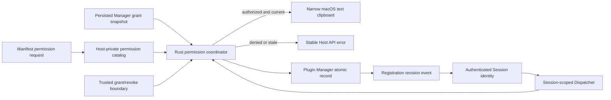

## Context

Host API `0.1.0` 已经把 `clipboard.read` 与 `clipboard.write` 定义为两个相互独立的显式权限方法；公共 Contract、SDK iframe transport、Runtime Session、Host-private Dispatcher 和 Plugin Manager 也已交付。当前 Manager 会持久化排序去重的 `granted_permission_ids`，Session 会把实际 grant snapshot 冻结进可信 Port identity，Dispatcher 也会从该 snapshot 计算 capability，但没有生产 grant/revoke 写边界，也没有每次调用的当前 Registration 复核。`clipboard.*` 因此始终返回 `unavailable`。

现有 Registration invalidation 已在 revision、resource generation 或 grant snapshot 变化时销毁旧 Runtime Session；升级也已将下一版本 grants 收窄为旧 grants 与新 Manifest 请求的交集。本 change 应复用这些边界，不建立第二套授权数据库、Session 热更新协议或官方插件特权路径。

权限写入、当前 Registration 复核和原生剪贴板都属于 Host 特权操作。React/TypeScript 只负责 Host-private service 组合与 Dispatcher 路由；Rust 继续拥有持久化、原生系统调用和稳定 Tauri command。当前生产目标是 macOS，Rust lockfile 已经通过 Tauri 间接包含 `objc2-app-kit` 与 `objc2-foundation`，但项目尚未把它们声明为直接依赖。

## Goals / Non-Goals

**Goals:**

- 建立只覆盖 `clipboard.read` 与 `clipboard.write` 的 Host-private permission catalog、风险元数据和 method 映射，且不复制公共 Contract 的 method/permission 真相。
- 提供 revision-bound、声明受限、Host-supported 且原子持久化的 grant/revoke 状态转换。
- 在每次显式权限调用的 native effect 前重新检查当前 Registration、Manifest 请求、Host 支持、真实 grant 和 Session revision。
- 让授权变更推进 Registration revision；旧 Session 立即失去调用能力并通过既有 invalidation 终止，新 grant 只能进入新 Session。
- 让已授权插件通过现有 SDK 使用有界纯文本剪贴板，同时保持读写权限独立、错误安全且无原生对象泄漏。
- 保持官方与外部插件使用同一套 catalog、授权算法、Runtime 和 native provider。

**Non-Goals:**

- 不实现安装、升级或运行时权限弹窗、设置页、拒绝/稍后决定历史、授权审计 UI 或任何新产品 surface；这些属于 Task 6.2。
- 不实现 Task 5.6 的通用 RPC envelope、消息大小、嵌套、频率、并发、timeout 或日志资源策略。
- 不新增文件、目录、网络、Shell、进程、外链、后台、跨插件或任意 Tauri 权限。
- 不改变公共 Host API `0.1.0` Schema、SDK API、Manifest 协议、Runtime private wire 或 Registration read contract。
- 不让 iframe 直接调用浏览器 Clipboard API、Tauri plugin command、AppKit、Rust对象或 Host executor。
- 不保证取消一个已经在授权线性化点之前开始的 clipboard 操作；grant/revoke 返回后，后续操作必须观察新状态。

## Decisions

### 1. Catalog 由公共 Contract method catalog 派生，风险元数据保持 Host 私有

TypeScript 新增冻结的 Host-private permission catalog。权限 ID 与 method 映射必须从 `@lensx/plugin-contract` 的 `HOST_API_METHOD_CATALOG` 派生并通过穷尽测试保证没有第二份 method-to-permission 表；Host 私有层只补充当前平台支持和风险等级。风险等级固定为 `standard | sensitive`，首版两个 clipboard 权限都标记为 `sensitive`，供后续 Task 6.2 选择单独确认策略，但风险等级本身绝不形成授权。

catalog 只包含 Contract `HostApiPermission` 闭集中的 `clipboard.read` 与 `clipboard.write`。未知 permission、`files.*`、`network.*`、`system.open_external` 或命名相似字符串都不是 Host-supported 权限。官方 source、Publisher 文本、签名占位或 builtin 状态不改变 catalog、risk 或 method requirement。

**替代方案：在 Rust 与 TypeScript 各维护一份完整 catalog。** 被否决，因为容易与公共 Contract 漂移。Rust 只保留执行 grant mutation 所需的闭集 permission ID，并用共享 Contract fixtures/drift test 校验；method 映射和插件可见语义仍只有公共 Contract 一份。

### 2. v0.1 的持久授权状态仍是规范化 grant set

现有 Plugin Manager record 的 `granted_permission_ids` 继续作为唯一持久授权状态。Host-private permission view 从当前 Manifest requests、Host catalog 与 grant set 派生以下结论：

| 状态 | 含义 |
| --- | --- |
| `not_requested` | Host 认识该权限，但当前 Manifest 未请求 |
| `unsupported` | Manifest 请求了权限，但当前 Host/catalog 不支持 |
| `not_granted` | 已请求且支持，但 grant set 不包含它 |
| `granted` | 已请求、支持且 grant set 包含它 |

拒绝与“稍后决定”在本 Task 都表现为 `not_granted`，不新增决策历史、时间戳或 actor。未来 Task 6.2 如确实需要区分交互历史，必须另起 spec 设计其生命周期，不能把 UI 状态伪装成 Runtime authority。运行时授权只认当前 grant set。

**替代方案：新增第二个 permission-decision store 或把状态写进 Manifest。** 被否决，因为会产生双真相、跨文件原子性和迁移问题；Manifest 仍只能表达请求及原因。

### 3. 一个 revision-bound Rust 边界原子更新 grant

新增 Host-private `PluginPermissionState`，持有共享 Plugin Manager、permission/native coordinator 与受限 clipboard provider。可信 Host caller 通过版本化、deny-unknown-fields 的 `set_plugin_permission_grant` request 提交：`entry_id`、`expected_revision`、`permission_id` 与目标 `granted` 布尔值。

Rust 在同一 Manager transition 中验证 Manager 未 degraded、revision 精确匹配、entry healthy 且 grant 候选仍排序去重。授予时还必须确认 Manifest 确实请求该 permission，且 permission 在当前 Rust-supported 闭集中；撤销则允许删除已经持久化但后来变成 undeclared/unsupported 的旧 grant，以保证 authority 始终可以收窄。成功写入沿用现有同目录临时文件、flush 与原子替换；只有持久化成功后才更新内存、推进 revision 并发出既有 Registration changed event。幂等设置返回 `unchanged` 且不推进 revision。

错误 contract 使用固定安全英文 message，区分 `invalid_request`、`conflict`、`not_found`、`unsupported`、`persist_failed`、`unavailable` 与 `internal`，不得返回 Manifest reason、plugin ID、路径、grant set、原始异常或 Rust 对象。command 只接受主 Host webview 的调用上下文；插件 iframe 没有 Tauri IPC bridge。即使边界被错误到达，Rust 仍执行全部声明、支持和 revision 检查。

**替代方案：直接修改 Registration detail 或由 TypeScript 重写完整 grant array。** 被否决，因为 author/renderer payload 不能成为 grant 真相，完整数组也更容易覆盖并发变化。

### 4. grant mutation 与 clipboard effect 共享 Rust 线性化 coordinator

只在 TypeScript 读取 Registration 后检查权限会留下 TOCTOU：撤销可能发生在检查与 native effect 之间。因此 grant/revoke 与 `plugin_clipboard` command 必须共享一个 Rust coordinator。clipboard request 由 Dispatcher 注入当前 Session 的 `entry_id`、`plugin_id`、`version`、`registration_revision`、operation 和 Contract-valid text；这些 Host-private identity 字段不进入公共 wire，且不接受 grant、source、path 或 executor。

在 coordinator 临界区内，Rust 重新读取 Manager 并验证：

1. Session registration revision 仍等于当前 revision；
2. entry、plugin ID、version 仍精确对应 healthy、enabled、compatible registration；
3. Manifest 当前请求该 operation 所需 permission；
4. Host 当前支持该 permission/native provider；
5. 当前持久 grant set 包含该 permission。

全部通过后才在同一线性化区间执行一次 native text read/write。若 clipboard operation 已先取得 coordinator，后到的 revoke 在线性化顺序上发生于该 operation 之后；一旦 revoke 返回，任何后续调用都必须看到新 revision 或缺失 grant。Dispatcher 在进入 Rust 前与异步返回后仍检查 AbortSignal 和完整 Runtime currentness，late result 不得跨旧 Port 返回。

**替代方案：只依赖 Session 冻结的 grant snapshot。** 被否决，因为 capability snapshot 不是持久 credential，撤销后旧 Session 在收到 invalidation 前仍可能发起调用。

### 5. grant 变化终止旧 Session，不通过 context event 热授权

成功 grant/revoke 复用 Registration revision event。Runtime resolver 完整重读 snapshot/detail，旧 descriptor 的 revision 或 grant snapshot 不再 current，因此既有 lifecycle 销毁 iframe Session、MessagePort、Dispatcher binding 与 pending calls。每次 Rust clipboard call 的 revision 检查保证即使 event 尚未到达，旧 Session 也不能越过授权边界。

新增 grant 不通过 `runtime.context_changed` 注入旧 Session，也不修改旧 identity；只有重新解析后建立的新 Session 才能在 Context capabilities 中看到对应 method。撤销同样不会给旧 Session发送 capability patch，而是终止它。与该插件无关的 Registration 变化仍使用既有 compare-current 逻辑，不应重启其他插件。

### 6. Dispatcher capability 与逐调用错误保持不同职责

Dispatcher factory 注入 permission/clipboard provider。Context 计算继续使用冻结 Session identity，但只有同时满足以下条件时才加入 `clipboard.read` 或 `clipboard.write`：method 有真实 provider、当前平台 provider available、catalog 支持且 Session grant snapshot 包含对应权限。两个 capability 独立出现。

每次调用仍进入 Rust authoritative check：

| 结论 | Host API error |
| --- | --- |
| request 不是 Contract-valid clipboard payload | `invalid_params`（通常在 transport 前拒绝） |
| permission 已知但 Manifest 未请求或当前未 grant | `permission_denied` |
| platform/catalog/native provider 不支持或不可用 | `unavailable` |
| Session revision/identity 不再 current | terminal disconnect；防御性直调为 `unavailable` |
| native 文本超过 Contract bound | `limit_exceeded` |
| 已取消 | `cancelled` |
| 未分类 native/内部错误 | `internal_error` |

任何失败都不读取、写入或返回剪贴板内容。日志与诊断只能记录 bounded operation/code，不能记录 clipboard text、Manifest reason、完整 identity 或 grant。

### 7. macOS 使用窄 AppKit text provider，其他平台 fail closed

不注册通用 clipboard Tauri plugin，也不把浏览器 Clipboard API 放开给 iframe。macOS target 将锁文件中已有的 `objc2-app-kit 0.3.2` 与 `objc2-foundation 0.3.2` 声明为直接依赖，由一个可注入 `PluginTextClipboard` trait 的生产实现只访问系统通用 pasteboard 的纯文本类型。AppKit 操作调度到主线程；测试使用内存 fake，不触碰真实用户剪贴板。

写入接受公共 Contract 已限制到最多 1,048,576 字符的 string；Rust 再验证同一字符上限与安全分配边界，空 string 清除/替换纯文本。读取只返回 string 或空 string；非文本剪贴板按空文本处理，超过 Contract bound 返回 `limit_exceeded`，不返回格式列表、文件、图片或 native object。非 macOS provider 显式 unavailable，capability 不出现且调用返回 `unavailable`。

**替代方案：`tauri-plugin-clipboard-manager` 或 renderer `navigator.clipboard`。** 被否决，因为它们会新增更宽 command/Permissions Policy surface，使 iframe 隔离与 Host permission check 之间出现旁路。

### 8. 测试和文档证明授权链而非只证明 happy path

Rust 测试覆盖 grant/revoke 原子性、stale revision、undeclared/unsupported permission、source independence、persistence failure、restart、upgrade intersection、event failure tolerance、coordinator race、AppKit fake 的空文本/超限/native error 与非 macOS unavailable。TypeScript 测试覆盖 catalog drift、permission view、严格 adapter parsing、capability 独立性、逐调用错误映射、Session invalidation、late result 和真实 MessageChannel/SDK loop。

架构与开发文档更新 `docs/en` 及相同路径 `docs/zh`，明确 request、grant、effective permission、capability 和 per-call authorization 的差异。本 change 不新增 UI，因此无新增产品文案、键盘、焦点、主题或可访问性 surface；Task 6.2 仍负责这些体验。公共 Contract/SDK tarball 测试继续证明外部与官方插件走同一 API，且没有 Host-private类型泄漏。

## Risks / Trade-offs

- **[风险] renderer command 被误认为授权来源** → grant mutation 在 Rust 重新验证 main Host context、revision、Manifest request 与 supported permission；iframe 无 IPC bridge，author payload 不进入该 command。
- **[风险] revoke 与 native effect 竞态导致撤销返回后仍产生副作用** → grant mutation 和 clipboard effect 使用同一 coordinator 与明确线性化顺序；Rust 在 effect 前读取当前 Manager。
- **[风险] Registration event 延迟让旧 iframe 短暂存活** → 每次 Rust call 比对 current revision/grant，event 只负责生命周期收敛，不承担最终授权。
- **[风险] AppKit 调用阻塞或违反线程约束** → provider 只做有界单次纯文本操作并调度到主线程；测试覆盖 timeout/cancellation 的 late-result containment。
- **[风险] native clipboard 内容超过公共 Contract bound** → 在结果跨边界前拒绝为 `limit_exceeded`，不截断或泄漏部分文本。
- **[权衡] 不持久化 denied/deferred 历史** → v0.1 保持一个 authority source；未来 UI 若需要交互历史，以独立非授权事实设计。
- **[权衡] grant 会重建当前插件 Session** → 换取 identity 不可变和撤销 fail-closed；不引入复杂的热授权协议。
- **[权衡] 当前 native provider 只在 macOS 可用** → 与现有本地 Runtime 交付范围一致；其他平台 capability 诚实缺失而不使用不安全 fallback。

## Migration Plan

1. 先增加 Host-private catalog、permission view、Rust grant mutation/coordinator、共享 fixtures 与 fault-injection 测试，保持生产 `clipboard.*` unavailable。
2. 接入 macOS text clipboard provider、严格 TypeScript adapter 和 Dispatcher provider，在聚焦测试中证明 authoritative recheck 与错误映射。
3. 将 grant mutation 的 revision event 接入既有 Registration refresh/Runtime invalidation，并验证旧 Session、pending call 与无关插件行为。
4. 最后开放符合条件的 Context clipboard capabilities，更新英中文档并运行真实 SDK/MessageChannel、目标 macOS native smoke 与完整仓库门禁。

现有 version-1 Plugin Manager records 已包含默认空或既有 grant set，无 on-disk schema 迁移。实现不得自动增加任何 grant。回滚时可先移除 Dispatcher/native provider，使 clipboard 恢复 `unavailable`；保留 grant 字段不会产生能力，旧版本可继续读取同一 record。若回滚 grant mutation wiring，已持久 grants 保持为 inert Host facts，不能静默删除或扩张。

## Open Questions

无阻塞问题。首版 permission 闭集、风险级别、authority source、错误映射、撤销线性化、macOS native 边界和非目标平台行为均在本设计中确定；实现中若 AppKit direct binding 无法满足主线程或安全边界，应先更新本 change 并重新评审依赖，而不是切换到通用 renderer/Tauri clipboard bypass。
