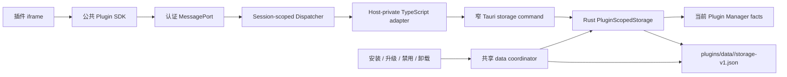

## Context

Host API `0.1.0` 已经固定五个无显式权限要求的插件私有存储方法及其 params/result/error 结构。公共 Contract、SDK iframe transport、Runtime Session 和 Host-private Dispatcher 均已交付，但生产 Dispatcher 只实现 `runtime.get_context`、`ui.close` 和 `actions.open`；`storage.*` 被排除在 Context capabilities 之外并返回稳定 `unavailable`。

插件 Runtime origin 自带的浏览器存储按 resource generation 隔离，新 generation 不能继承旧 generation 数据，因此它不能承担跨升级的正式插件数据。另一方面，本地 Installer 已经拥有 `app_local_data_dir()/plugins/data/<plugin-key>`、按需创建、升级保持、卸载 `retain_data | delete_data` 和 cleanup recovery 语义。此 change 应复用该数据边界，不能建立第二套插件数据根或让 TypeScript、iframe、Manifest 得到真实路径。

该能力横跨公共语义验证、Session-scoped Dispatcher、TypeScript/Tauri 私有边界、Rust 持久化、Installer 生命周期协调、恢复、测试和双语架构文档，因此需要在实现前确定数据模型、锁、限制和失败语义。

## Goals / Non-Goals

**Goals:**

- 让现有五个 `storage.*` 方法产生真实、跨重启的 Host-owned 效果。
- namespace 只由可信 Session `plugin_id` 派生，并在 Rust 再验证当前 Manager identity；插件不能选择 namespace、路径或其他插件。
- 用确定的数据模型、原子替换、具体配额、分页 cursor 和稳定错误实现可测试行为。
- 与独立插件数据子树、升级保持、卸载保留/删除和 cleanup recovery 共用同一所有权与序列化边界。
- 把损坏、异常文件和持久化失败限制在一个插件 namespace，不阻塞 Host 启动或其他插件。
- 保持公共 Contract `0.1.0`、SDK transport 和无显式 storage permission 的现有语义不变。

**Non-Goals:**

- 不提供任意文件、目录、SQL、跨插件共享、云同步、数据迁移框架或后台存储访问。
- 不新增公共 method、permission、SDK package 入口或 author-controlled namespace。
- 不实现 Task 5.5 权限管理、Task 5.6 通用 RPC 限制、Task 6.1 管理 UI 或 Task 6.2 权限交互。
- 不让浏览器 `localStorage` 与 Host 私有存储共享、迁移或互相回退。
- 不恢复或猜测已经损坏的用户 payload，也不以清空损坏数据来伪造成功。

## Decisions

### 1. Rust 独占持久化与真实路径

新增 Host-private `PluginScopedStorage` Rust service，由 App 启动时以现有插件 Installer root 和 Plugin Manager 初始化。真实文件固定为：

`app_local_data_dir()/plugins/data/<v1-plugin-key>/storage-v1.json`

只在第一次成功 `storage.set` 后按需创建 canonical data subtree；对不存在 namespace 的 `get`、`delete`、`list` 和 `get_quota` 不创建目录。Rust 使用现有 canonical plugin key 派生规则并拒绝符号链接、非普通文件、异常目录和 root escape。

TypeScript 只持有一个窄 provider/adapter，不接触 `Path`、文件内容、Installer root 或 Rust store 对象。Host-private command payload 采用版本化、deny-unknown-fields 的 tagged request/result/error contract，并在 TypeScript 与 Rust 两侧严格解析。payload 包含由 Dispatcher 注入的当前 `entry_id`、`plugin_id` 和 `version`，但这些字段不进入公共 Host API wire；Rust 在共享锁内重新核对 live Manager record 仍属于该 identity 且可用。

**替代方案：TypeScript/浏览器存储。** 被否决，因为无法安全复用 Installer data policy，也无法保证跨 Runtime generation、原子持久化和真实路径隔离。

**替代方案：复用应用 preferences 文件。** 被否决，因为应用偏好与插件数据必须拥有不同 namespace、限制、损坏域和卸载语义。

### 2. 每插件一个版本化 canonical JSON store

`storage-v1.json` 使用严格的 version-1 envelope，包含单调 namespace revision 和按 key Unicode code-point 顺序排列的 entry 数组。Rust 内部使用有序映射，读取时拒绝未知字段、重复 key、非 canonical 顺序、非法 JSON value、超限内容和不匹配的逻辑用量；写出采用确定性 compact JSON 加一个结尾换行。

一个 namespace 一个文件使跨 key 配额、稳定分页、单次原子替换和损坏隔离保持简单。数据规模由 1 MiB 逻辑配额和 1024 entries 限制，不引入数据库或新的运行时依赖。

**替代方案：每 key 一个文件。** 被否决，因为 key-to-path 编码、目录数量、跨 key quota 和原子 list snapshot 会显著扩大文件系统攻击面。

**替代方案：SQLite。** 被否决，因为当前容量和查询模型不需要数据库，新增依赖、迁移与损坏恢复成本不成比例。

### 3. 固定 v1 限制与计算方式

本 change 固定以下限制：

| 项目 | 限制 |
| --- | --- |
| key | 复用 Contract：1–256 Unicode code points，禁止 C0/DEL 控制字符 |
| JSON 最大嵌套深度 | 32；根值深度为 0 |
| 单值 logical bytes | 256 KiB，按确定性 compact JSON 的 UTF-8 字节数计算 |
| namespace entries | 1024 |
| namespace logical bytes | 1 MiB，为所有 key UTF-8 字节与对应 value logical bytes 之和 |
| `storage.list` 默认 limit | 100 |
| `storage.list` 最大 limit | 1000，复用公共 Contract 上限 |

`storage.get_quota.usedBytes` 返回同一 logical-byte 定义，空 namespace 为 `0`；`limitBytes` 固定为 `1_048_576`。写入前在 Rust 重新序列化和计量，不能信任 TypeScript 提供的 size。替换已有 key 时先扣除旧 entry logical bytes，再判断新总量。违反 key/shape 属于 `invalid_params`；违反深度、单值、entry 或总容量属于 `limit_exceeded`。

**替代方案：按磁盘文件大小计量。** 被否决，因为 envelope、format revision 和临时文件会让插件可见 quota 随私有实现变化。

### 4. 稳定排序、revision-bound opaque cursor

`storage.list` 只返回 key，不返回 value。结果按 Unicode code-point 顺序稳定排序。省略 limit 时使用 100；空 namespace 返回 `{ keys: [] }`。

Host-private cursor 编码 version、namespace revision 和下一页位置，并带有完整性校验；插件只能原样回传，不能选择 namespace。格式不进入公共规范。语法非法、完整性失败或越界 cursor 映射为 `invalid_params`；namespace 在两页之间发生变更时映射为 `conflict`。结果 cursor 长度必须继续满足公共 Contract 的 1024 字符上限。

**替代方案：裸 offset 或裸 last-key。** 被否决，因为它易被伪造，且无法区分稳定 snapshot 与两页之间的 mutation。

### 5. 原子替换、共享协调与 commit 语义

同一进程内的插件存储操作按 namespace 串行化；存储访问与 Installer 的安装、replacement、uninstall、cleanup recovery 共用一个 Host-private data coordinator 和现有跨进程 install lock，防止 `storage.set` 与 `delete_data` 互相重建或删除同一 subtree。读取也在该边界内验证 live Manager facts 和 canonical tree。

写入流程为：读取并严格验证当前 envelope → 计算候选状态与限制 → 在同目录 `create_new` 临时文件 → 写入、flush、`sync_all` → 原子 rename → 同步父目录。失败清理自己的临时文件，旧 canonical file 保持可读；未知临时文件不被猜测为有效 store。

Dispatcher 在调用 provider 前检查 AbortSignal 和 Session currentness，Rust 在接受 mutation 前核对 live identity。Rust 的原子 rename 是 mutation commit point：取消若先于 provider 接受则不得提交；commit 已发生后不能通过删除新文件来伪造回滚，transport 只丢弃 late response，插件可在新 Session 中通过 `get` 对账。`get/list/get_quota` 的 late result 一律丢弃。

**替代方案：只使用独立 storage mutex。** 被否决，因为它不能阻止 lifecycle cleanup 与 storage write 的 TOCTOU 竞争。

### 6. 生命周期沿用稳定 plugin identity

- **升级或同身份 replacement**：保持 `data/<plugin-key>` 和 `storage-v1.json` 不变；新 Session 以同一 plugin identity 继续访问。
- **禁用**：Runtime Session 被现有生命周期撤销，数据不改；没有 current Session 时不能调用 storage。
- **卸载 `retain_data`**：Registration 与 Session 消失，数据保持但不可调用；同 identity 成功重装且 cleanup 无冲突后重新可见。
- **卸载 `delete_data`**：沿用已持久化 cleanup intent，由 lifecycle 在共享 coordinator 下删除整个 canonical data subtree；storage 不能在逻辑卸载后重建它。
- **同 identity 重装**：不恢复 grant、诊断或 enabled intent，只复用明确保留的数据。

本 change 不在存储文件中写版本、来源、grant、Manifest、安装路径或 Page/Session 状态，避免把 Host facts 混入插件数据。

### 7. 损坏按 namespace 懒隔离，启动 fail-open 到 Host

service 初始化不扫描或反序列化所有插件 store。第一次访问某 namespace 时才进行 bounded metadata/read 和严格解析：

- 缺失文件视为空 store；
- 自己留下且可证明安全的未提交临时文件可被清理；
- oversized、malformed、duplicate、non-canonical、symlink 或异常类型保留原证据并把该 namespace 标记为 degraded/unavailable；
- 不自动覆盖损坏 canonical file，不读取其他 plugin subtree，不让异常内容进入诊断。

受影响插件得到稳定 `unavailable`；Host、Registration、其他插件和应用 preferences 继续启动和工作。卸载 `delete_data` 仍可通过既有、可证明所有权的 cleanup 删除整个 subtree；未来管理 UI 可以调用该生命周期能力，而不是新增本 change 的修复 API。

### 8. Dispatcher capabilities 与错误映射

生产 Dispatcher 增加 storage provider 依赖。只有 provider 全局已初始化、当前 identity 可解析且 namespace 未处于 blocked/degraded 状态时，五个 `storage.*` method 才进入 Context capabilities；它们在 Host API `0.1.0` 中仍无显式 permission。Clipboard 继续 `unavailable`，Task 5.5 仍负责完整权限系统。

Host-private domain error 映射为现有公共错误：

| Domain conclusion | Host API error |
| --- | --- |
| request/key/cursor 形状非法 | `invalid_params` |
| 深度、单值、entry、总容量超限 | `limit_exceeded` |
| stale list cursor 或竞争状态 | `conflict` |
| Session 已取消 | `cancelled` |
| identity 不再存在、已禁用、cleanup blocked、store 损坏或 service 未初始化 | `unavailable` |
| 未分类内部失败或非法 provider result | `internal_error` |

错误和诊断不得包含 key、value、plugin ID、路径、文件内容、原始异常或 stack。`get` missing 与 `delete` missing 继续返回 Contract-defined success discriminant，不能泄露其他 namespace 是否存在相同 key。

### 9. 验证和文档保持平台边界

共享 valid/invalid Host-private fixtures 由 TypeScript parser 与 Rust serde/validator 同时消费。Rust 测试覆盖 canonical round trip、原子失败、quota、depth、ordering、cursor、symlink/root escape、corruption、restart 和生命周期竞争；TypeScript 测试覆盖 adapter 严格解析、Dispatcher method routing、capabilities、错误映射、cancellation/currentness 和真实 MessageChannel 回路。

独立 tarball consumer 只使用公共 Contract/SDK/Testkit，证明外部插件无需 lensX 私有源码即可调用现有 storage methods。架构与验证文档更新 `docs/en` 及同路径 `docs/zh`；路线图只勾选 Task 5.4，Milestone 5、Task 5.5 和 Task 5.6 保持未完成。本 change 不新增 UI，因此 accessibility、主题和 i18n 产品文案没有新 surface；文档仍须语义镜像。

## Risks / Trade-offs

- **[单文件写入使每次 mutation 重写 namespace]** → 1 MiB/1024-entry 上限使成本可控；以原子性和简单恢复换取小规模写放大。
- **[全局 lifecycle/data coordinator 增加锁竞争]** → 锁内只处理 bounded 本地文件；先保持正确性，只有测量证明必要时才引入更细粒度锁。
- **[lazy corruption 隔离会让一个插件暂时无法存储]** → 保留证据、返回稳定 `unavailable`，不静默丢数据；Host 和其他插件继续工作，用户以后可通过 delete-data 流程清理。
- **[取消与 durable commit 存在竞态]** → 定义唯一 Rust commit point；commit 前取消不写，commit 后不伪造回滚，late response 由现有 transport 丢弃并可通过读取对账。
- **[固定 v1 限制未来可能过小]** → 限制不是公共 payload 形状；未来可在兼容 Host 版本中提高，但降低限制或改变计量必须经过新的 OpenSpec change 和迁移分析。
- **[cursor 绑定 revision 导致并发 mutation 后分页重试]** → 返回明确 `conflict`，避免重复、遗漏或把不一致页面伪装成 snapshot。

## Migration Plan

1. 先加入 versioned Rust store、Host-private contract、共享 fixtures 和 fault-injection 测试，保持生产 Dispatcher 不暴露 capabilities。
2. 将 data coordinator 接入现有 Installer/lifecycle/replacement，验证保留、删除、重装和 startup recovery 不回归。
3. 加入 TypeScript adapter/provider 与生产 App 组合，再将五个 storage methods 从 `unavailable` 切换为真实路由和 Context capabilities。
4. 运行真实 SDK/MessageChannel、Rust、独立 consumer 和完整仓库验证；随后更新英中文档和 Task 5.4 路线图状态。

不存在旧 Host-private storage 文件需要自动迁移；浏览器 local/session storage 不导入。首次成功写入创建 version-1 文件。

**回滚**：在未发布数据前可移除 provider wiring，使 `storage.*` 恢复 `unavailable`。一旦用户数据可能存在，代码回滚不得删除 `data/<plugin-key>/storage-v1.json`；旧版本应保留未知文件，新版本恢复后继续读取。任何未来 on-disk format 变更必须先提供向前迁移和可回退策略。

## Open Questions

无阻塞问题。v1 数据模型、限制、cursor、生命周期、损坏策略和回滚边界均在本设计中确定；实现阶段如发现现有跨进程锁无法被安全共享，应先更新本 change 的 design/specs，而不是建立第二套锁或数据根。
