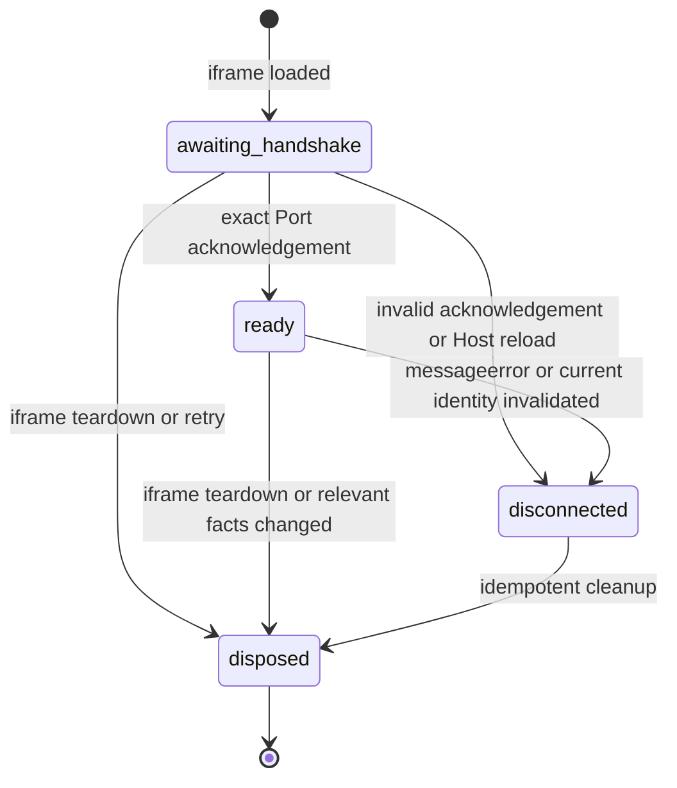

## Context

已归档的 Task 4.2 通过 `PluginPageRuntimeDescriptor`、Resource Service、独立 origin、native navigation lease 与 `PluginRuntimeFrame` 交付了一个只在当前 Plugin Page 活跃时存在的隔离 iframe。当前容器只有 `resolving`、`loading`、`loaded`、`failed` 和 `disposed` presentation 状态；它没有 iframe ref 驱动的消息认证、Session 身份、nonce、MessagePort 或可信通信入口。Registration summary/detail 已经提供 Host-owned entry、enabled/compatibility、version、process-local revision 和排序去重的 grant snapshot，但 Runtime read model 仍诚实地只有 `inactive`。

Task 4.3 位于隔离 iframe 与后续 SDK/Host API 之间。它必须证明 Host 正在与哪一个当前 iframe 通信，同时不能提前定义 Task 5.1 的 Host API method、Task 5.2 的 RPC/request/event transport 或 Task 5.3 的 Dispatcher。它还必须保持 Task 4.4 的完整 CSP、timeout、crash/recovery 和 pending-call cleanup 边界。

当前目标平台是 macOS WKWebView。已有 harness 证明 isolated-origin iframe 的 `event.source`/`event.origin` 可被观察，但尚未证明当前 sandbox、custom origin、一次性 nonce 和 transferred `MessagePort` 组合在真实目标 WebView 中形成可撤销的 Session，因此该证据是本 change 的交付门禁而非假设。

## Goals / Non-Goals

**Goals:**

- 为唯一当前外部 Plugin Page iframe 建立一个 Host 私有、进程内、不可持久化的认证 Session。
- 将真实 `contentWindow` 和严格 origin 与 Host 推导的 entry、plugin、version、Page、resource generation、Runtime attempt 和实际 grant snapshot 绑定。
- 用一次性高熵 nonce 与专用 `MessagePort` 完成最小 bootstrap，并让 Host 后续只从 Session 注入身份。
- 稳定拒绝错误 window/origin、跨插件消息、重放、旧 attempt/generation、同版本 replacement 和失效 Registration facts。
- 保持 iframe `loaded`、Session `ready` 和未来 SDK `ready` 三个状态语义独立。
- 在相关事实变化时 fail closed，同时让无关插件的 Registration revision 变化不重建当前 iframe 或撤销当前 Session。
- 为后续 SDK transport 提供窄的 Host 私有已认证 Port 消费边界，而不公开 wire 或 Host 对象。

**Non-Goals:**

- 不发布 SDK iframe transport，不实现 JSON-RPC、request ID、并发、Host event、request cancellation 或通用 pending-call 管理。
- 不定义或执行 Host API method，不做 permission grant decision、授权 UI、插件私有存储或 privileged Rust dispatch。
- 不扩展 Registration Contract 的 `inactive` Runtime read model，不持久化 Session，也不把 DOM/MessagePort 对象传给 Rust。
- 不交付完整 Host/iframe CSP、handshake timeout、crash loop、自动重连、后台 Runtime、sidecar 或多 Page/多 iframe 策略。
- 不新增用户可见设置、状态或错误文案；现有本地化、主题、加载和页面错误 UI 保持不变。
- 不声明 Windows 或 Linux Runtime Session 支持。

## Decisions

### 1. Session 由可信前端 service 持有，持久事实继续由 Rust 持有

在 `src/app/plugins/runtime/` 增加 Host 私有 `PluginRuntimeSessionService` 及可测试 adapter。React iframe 容器只负责把当前 descriptor、真实 `iframe.contentWindow` 和 load/teardown 时机交给 service；service 持有 window reference、nonce、Host 端 Port、状态和不可变 Session identity。Registration adapter 继续从 Rust Plugin Manager 读取当前 entry/detail/grants，Rust 不接收或序列化浏览器对象。

Session identity 至少包含：

- opaque `entry_id`；
- `plugin_id`、`version` 和 `page_id`；
- 当前 Runtime descriptor/generation/attempt key 与严格 expected origin；
- 用于验证读一致性的 Registration revision；
- 排序、去重、只读的 `granted_permission_ids` snapshot。

Manifest requested permissions 只保留在 author facts 中，不进入 Session grants。未来 Dispatcher 必须同时使用 Session identity 和当时的当前授权判断；本 change 只建立可信 snapshot 与失效语义。

**替代方案：**把完整 Session 放进 Rust Plugin Manager。拒绝，因为 `Window`/`MessagePort` 只存在于 WebView JavaScript realm，跨 Tauri 序列化会制造伪造边界，而且稳定规格已经要求 Runtime activity 为 process-local、恢复后为 `inactive`。

### 2. 使用 Host-push MessageChannel bootstrap，而不是长期 window 消息总线

iframe 报告 `loaded` 后，Session service 从 OS/browser cryptographic randomness 生成至少 128 bit、固定小写十六进制的一次性 nonce，并创建一个新的 `MessageChannel`。Host 使用当前 descriptor 推导的精确 `targetOrigin`，只向记录的 `contentWindow` 发送版本化 bootstrap，并转移 child Port。插件 fixture（未来由 Task 5.2 的真实 SDK transport 替代）必须在 transferred Port 上返回 exact、版本化、携带相同 nonce 的 ready acknowledgement；Host 只在首次合法 acknowledgement 后进入 Session `ready`。

bootstrap data 不含 plugin identity、entry ID、grant、Registration revision、resource token 或 Host 对象。Port transfer 本身把通道交给指定 window/origin，nonce 把 acknowledgement 绑定到本次 Runtime attempt。Host 不接受插件通过 window message 自报身份，认证成功后的消息也不得退回共享 `window.postMessage` 总线。

**替代方案：**始终通过 `window.postMessage` 并在每条消息上检查 source/origin。拒绝，因为共享 listener 扩大解析与混淆面，且无法像专用 Port 一样自然隔离不同 attempt。只使用随机 bearer token 也被拒绝，因为 token 不能替代真实 window/origin 和 current facts 绑定。

### 3. 私有 bootstrap 版本与未来公共 SDK transport 分层

Task 4.3 定义一个 Host 私有 `0.1.0` Session bootstrap contract，仅覆盖 bootstrap、ready acknowledgement 和 disconnect/dispose 信号所需的 exact payload。Parser 从 `unknown` 开始，拒绝缺失、额外、错误类型或超界字段；未知版本 fail closed。该 wire 不进入 `@lensx/plugin-contract`、`@lensx/plugin-sdk` 公共类型、Plugin Manifest 或 Registration Contract。

Task 5.2 将实现插件侧正式 bootstrap consumer，并在已认证 Port 上增加 request ID、RPC method/params/result、事件、取消和 timeout。Task 4.3 的测试 fixture 可以消费私有 bootstrap 以证明安全闭环，但不得作为插件作者手写消息的公共 API。

### 4. currentness 使用相关事实比较，不能把全局 revision 当成 Session 身份

Registration revision 仍用于检测读取竞态：Session 创建必须让 summary、detail、Page/Resource descriptor 收敛到同一当前 entry。创建完成后，任何 changed-event 都触发刷新和相关事实比较，但全局 revision 数字本身不进入 Session 身份等价判断。

以下任一相关变化必须撤销 Session，并由现有 Page/Runtime 流程决定是否创建新 iframe：entry 消失、disabled、quarantined、incompatible、plugin/version/Page 不匹配、resource origin/generation 或 Runtime attempt 改变、grant snapshot 改变、retry、replacement、close/navigation/App teardown。

如果变化只属于其他插件，且当前 entry、Page、origin/generation、attempt 和 grants 全部相同，则保留当前 iframe 与 Session。无法证明相关事实仍当前时 fail closed。

这要求调整 `plugin-iframe-runtime` 的 currentness 语义：旧要求中的“revision change”解释为相关 current facts 变化，而不是任何全局 revision 增量。Resource/Registration 调用仍携带 revision 做竞态检查。

**替代方案：**任何 Registration revision 都重建 iframe。拒绝，因为一个无关插件的安装或状态变化会中断当前插件页面和 Session，且全局 revision 不是当前插件 generation。

### 5. Session 状态与 presentation/SDK 状态分离

Host 私有 Session 状态为：

`loaded` 继续只属于 Task 4.2 presentation。Session `ready` 只表示通道和身份认证成功，不表示 SDK 已获取 Runtime context、Host API 可用或 JavaScript 整体健康。Task 5.2 之后，SDK `ready` 仍只能在 transport connect 返回并验证 Runtime context 后产生。

Session disconnect 是 terminal；Task 4.3 不自动重连。Host reload 销毁 JavaScript realm 后旧 nonce/Port/Session 不得恢复，新 document 必须建立新 Session。Task 4.4 可以在此语义上增加 timeout、crash detection 和更完整恢复。

### 6. 安全失败、清理和可观测性保持最小

错误 window/origin 或与当前 Session 无关的 window message 直接忽略，不返回可用于探测 expected origin/nonce/identity 的信息。指定 Port 上的畸形、错误版本、错误/重复/过期 nonce 或 `messageerror` 使本次 Session fail closed，并关闭两端可控 Port、清除 nonce 和自己的 listener。dispose 必须幂等，late acknowledgement 不能复活 Session。

Session service 只暴露给可信 Host consumer 的冻结 identity、当前状态和已认证 Host Port lease；不把 raw plugin payload、nonce、origin token、URL、entry ID、grant 或内部异常写入用户 UI、日志 fixture 或插件响应。本 change 没有新 UI，因此现有英文默认 locale、中文镜像、light/dark 和可访问性行为不改变。

Task 4.3 必须清理自己创建的 listener/Port，否则身份撤销并不安全；Task 4.4 的“完整 lifecycle cleanup”继续覆盖通用 timeout/crash/recovery、未来 pending RPC、完整 CSP 和应用退出编排，而不是要求 4.3 暂留泄漏。

### 7. 测试同时覆盖纯逻辑、React 集成和真实 WKWebView

纯 TypeScript tests 使用注入的 crypto、MessageChannel/window adapter 和 Registration facts，覆盖 exact parsing、状态机、一次性 nonce、late result、幂等 dispose、无关 revision、相关 invalidation、同版本 replacement、cross-plugin/source/origin forgery。React tests 证明 iframe ref/onLoad 与 Runtime attempt/teardown 只创建一个 Session，且不把 `loaded` 命名为 `ready` 或改变现有可访问 UI。

macOS focused gate 扩展 canonical normal/malicious `.lxp` harness，真实验证 isolated origin 与现有 sandbox 下的 exact `event.source`/`event.origin`、MessagePort transfer、ready nonce、wrong-window/origin rejection、old Port after retry/replacement 和零 Tauri privileged hits。证据必须有界且不得包含 capability URL、origin token、nonce、Port 内容、本地路径或原始插件 payload。如果目标 WKWebView 不能证明这些边界，change 不得完成，也不得退回 wildcard origin、共享长期 window 总线或删除 negative case。

不增加第三方运行时依赖；使用浏览器标准 `crypto.getRandomValues`、`MessageChannel`、现有 Rstest/Testing Library 和 Tauri WKWebView harness。

## Risks / Trade-offs

- **[MessagePort transfer 在目标 WKWebView 的行为与浏览器模拟不同]** → 以前置真实 harness gate 验证；失败则修订设计，不以弱化 origin/source 检查绕过。
- **[Registration detail 与 Runtime descriptor 之间发生竞态]** → 使用 revision 检测读取窗口、重新读取并比较相关 current facts；无法收敛时不建立 Session。
- **[无关 revision 与相关 replacement 难以区分]** → identity comparison 使用 entry、Page、version、resource generation/origin、attempt 和 grants，而不是 revision 数值；为同版本 replacement 与无关插件变化建立独立 fixtures。
- **[Task 4.3 与 5.2 重复定义协议]** → 4.3 只拥有私有 bootstrap/ready 和已认证 Port lease；所有通用 RPC/SDK transport 语义留给 5.2。
- **[没有 handshake timeout 会让 Session 长期停在 awaiting]** → 本 change 仍不把 iframe `loaded` 当作 ready；Task 4.4 增加通用 timeout/crash policy。页面关闭和相关 invalidation 仍立即 dispose。
- **[grant snapshot 在 ready 后变化]** → Registration invalidation 重新比较当前插件 grants 并撤销 Session；未来 privileged Dispatcher 仍必须执行当时授权复核。
- **[安全拒绝缺少用户可见诊断]** → 保持当前页面可见行为不变并只提供安全、可测试的 Host 私有状态；面向用户的 Runtime recovery/diagnostics 随 Task 4.4/6.1 单独设计。

## Migration Plan

1. 先建立纯 Host 私有 Session types/parser/state/service 与 focused unit tests，不连接生产 iframe。
2. 扩展 Registration/current-facts resolver 和 iframe descriptor，使相关身份/grants 可被可信 Session service 消费，同时保持公共 Page/Action/SDK exports 不变。
3. 接入 `PluginRuntimeFrame` 的真实 iframe ref、load 与 teardown，调整无关 revision currentness，并完成 React/regression tests。
4. 扩展真实 macOS WKWebView harness；只有安全矩阵通过后才把 Session capability 视为可交付。
5. 更新英中双语文档、focused gate 和完整验证；最后才勾选 Roadmap Task 4.3。

本 change 无持久化数据迁移。回滚时移除 Session wiring 和私有 bootstrap，现有 Task 4.2 iframe 仍可恢复为仅 `loaded` 的展示能力；Plugin Manager records、安装 payload 与公共 packages 不需要回滚或迁移。

## Open Questions

无。MessagePort 在目标 macOS WKWebView 的可用性是必须通过的实现证据门禁，不作为允许弱化设计的未决选择。
