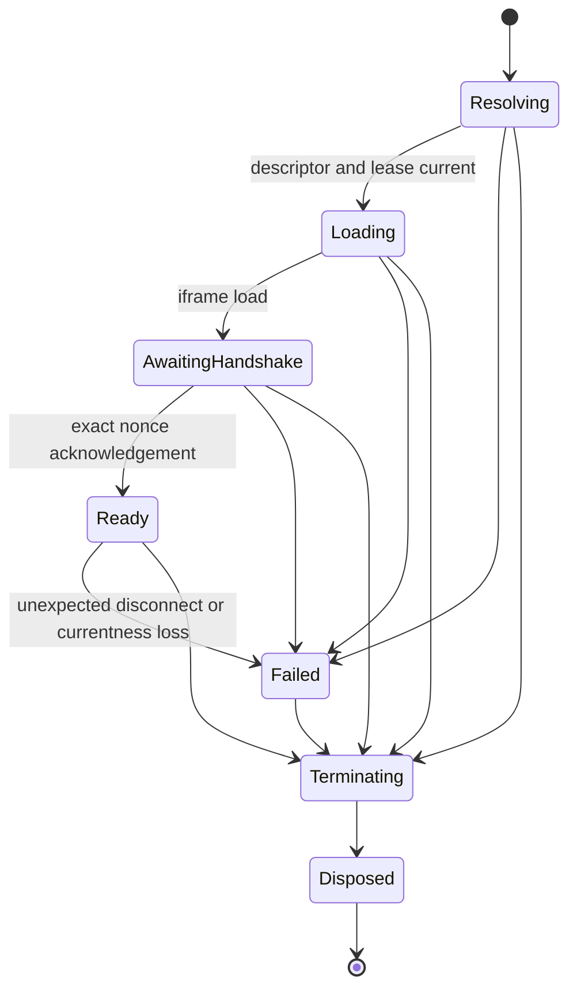

## Context

当前 macOS Runtime 已形成以下链路：Plugin Registration/Page projection 选择当前 Page，Resource Service 为当前 `entry_id` 与 `resource_generation` 颁发独立 origin，frame-aware navigation lease 只允许当前入口文档，React `PluginRuntimeFrame` 创建最多一个固定 sandbox/Permissions Policy 的 iframe，Host-private Runtime Session 再把真实 `contentWindow`、精确 origin、一次性 nonce 与专用 MessagePort 绑定为当前身份。

这些前置能力已经处理关闭、重试、相关 Registration 失效和 App unmount 的基础清理，但边界仍有明确缺口：生产 Tauri CSP 为 `null`；插件入口响应没有 Host-owned CSP；iframe load 与 Session handshake 可以无限等待；没有统一覆盖所有终止来源的 generation-aware 协议；连续失败没有进程内熔断；既有规范也明确把完整 CSP、通用 timeout/crash recovery 与 Runtime-owned pending cleanup 留给 Task 4.4。

本 change 横跨 Tauri 配置、Rust 自定义协议响应、React iframe 容器、Runtime Session、应用退出协调、i18n、测试夹具和真实 WKWebView 证据，因此需要一个共同设计，而不能把 CSP、timer 和清理分别作为互不关联的补丁。

## Goals / Non-Goals

**Goals:**

- 让 Host 主文档和插件入口文档都在 Host-owned、默认拒绝且可验证的 CSP 下运行。
- 保持当前隔离 origin、`sandbox="allow-scripts allow-same-origin"`、Permissions Policy、navigation lease 与 Session source binding，不以放宽任一前置边界换取兼容性。
- 将 Runtime 的创建、失败和销毁放入一个 attempt/generation-aware 状态机，使所有终止原因共享同一幂等清理顺序。
- 对 iframe load 和 Session handshake 设置明确期限；禁止自动重启，并限制短时间连续失败。
- 证明终止后不残留当前 iframe、Port、nonce、listener、timer、navigation lease 或 Runtime-owned pending work，且迟到事件不能影响后续 attempt。
- 保持 Host-owned 反馈可访问、英语默认并与简体中文语义一致，同时兼容现有明暗主题。

**Non-Goals:**

- 不定义公共 SDK iframe transport、JSON-RPC/request ID、Host API、权限决策、插件存储或 RPC pending-call cancellation。
- 不增加插件管理 UI、开发模式 CSP 例外、远程 CSP reporting、后台/sidecar Runtime、iframe pool、tab/history、多窗口或自动重启。
- 不实现通用 CPU、内存、消息大小、RPC 并发或执行时间配额；这些属于后续 RPC/resource-limit 能力。
- 不声称 Windows 或 Linux Runtime 支持，不新增生产依赖或公共 package export。

## Decisions

### 1. Host 强制两套独立 CSP，插件不能声明例外

Host 主文档 CSP 由 Tauri production configuration 管理；插件入口 CSP 由 Rust Plugin Resource response 在返回当前入口 HTML 时附加。Manifest、publisher/source、作者 HTML、query/header 输入和插件消息都不能选择、覆盖或扩展策略。

Host profile 以 `default-src 'self'` 为基线，只加入当前 Tauri IPC、自有 bundled asset 和 `lensx-plugin:` frame 加载实际需要的精确 source；同时至少拒绝 object、base mutation 和 form submission。Tauri/Rsbuild 生成的 script hash/nonce 优先于内联或 eval 放宽。若现有 Host/Semi 样式在真实 production bundle 中确实需要 style-only 例外，例外必须限制在 `style-src`、记录原因并由 production gate 锁定；`script-src 'unsafe-inline'`、`script-src 'unsafe-eval'`、通配 host 和任意远程 script 均是交付阻断项。

插件 profile 以 `default-src 'none'` 为基线，只允许当前隔离 origin 的必要 script、style、image 和 font；默认拒绝 connect、media、worker、child frame、object、base mutation 与 form submission，并用精确 Host ancestor 约束嵌入。`data:`、`blob:`、远程 origin、`unsafe-eval` 和 script inline 不默认开放。未来某类资源只有在 Manifest/package Contract 和真实插件需求先被接受后才能单独扩展，4.4 不提供作者自定义 allowlist。

选择 response Header 而不是作者 `<meta>`，因为 Header 由 Host 控制、能覆盖完整 CSP 指令且插件不能省略。也不在正常路径重写已校验的插件 HTML，避免改变包字节、破坏完整性或创建 HTML parser/injection 边界。自定义协议 Header、Host ancestor source 与 target WKWebView 的实际执行效果必须先由 bounded harness 证明；不能证明时停止实现并修订设计，不能回退到 CSP `null`、通配来源或信任作者 meta。

### 2. CSP 与现有隔离层保持职责分离

CSP 只约束文档可加载、执行、连接或嵌入的内容。独立 origin 继续隔离 DOM/storage，iframe sandbox 继续约束浏览上下文能力，Permissions Policy 继续拒绝浏览器设备能力，frame-aware policy 继续决定当前文档导航，Runtime Session 继续认证消息来源。任何一层成功都不能替代另一层，也不把 CSP violation 当作身份或权限信号。

插件入口 HTML 的 GET 与 HEAD 必须返回一致的 CSP/security headers；非入口 HTML 不能通过猜测路径获得可导航的授权。普通子资源继续走现有 scope、generation、path、MIME、`nosniff`、`no-store` 和 no-CORS 校验。

### 3. 一个 Host-owned Runtime controller 拥有 attempt 生命周期

React presentation 继续由 `PluginRuntimeFrame` 组合，但把 resolve、load deadline、Session handshake、currentness subscription、failure accounting 和 terminal cleanup 收敛到一个 Host-private controller/service。controller 为每次显式打开或重试生成不可复用的 attempt key，并持有本 attempt 的 Abort/cancel handle、timer、subscription、Session、iframe binding 和 navigation lease；不把这些对象写入公共 contract 或持久化状态。

现有 iframe presentation 的 `loaded` 语义继续保留为浏览器 load 完成；controller 的 `AwaitingHandshake` 和 `Ready` 是 Host-private 安全状态，不能把 `loaded`、Session ready 与未来 SDK ready 合并。

### 4. 所有结束来源执行同一幂等、generation-aware 终止顺序

关闭、返回 Home/Search/Host Page、重试、provider quiescence、禁用、卸载、替换、相关 current-fact/grant 变化、resolve/load/handshake 失败、意外 Session disconnect、Host reload、App unmount 和正常应用退出均请求同一个 terminal operation：

1. 原子标记 attempt 为 terminating，拒绝新 Runtime-owned work；
2. 取消 resolve/currentness 等可取消异步工作并清除 load/handshake/cooldown timer；
3. unsubscribe Registration/Session/browser listeners；
4. idempotently dispose Session，清空 nonce/Port/window lease；
5. 解除 iframe binding，使 React 移除 iframe；
6. compare-current 释放 navigation lease；
7. 丢弃 descriptor、window、attempt 和诊断内部引用，进入 disposed。

每个回调在提交状态前都比较 attempt key；旧 promise、timer、Port event、load event 或 cleanup 只能结束自己的 attempt，不能释放或更新后来者。突然进程崩溃不依赖 JavaScript cleanup 保证安全：操作系统销毁进程资源，scope/Session/breaker 均不持久化，下一进程从 Runtime `inactive` 开始。正常退出仍执行上述 best-effort cleanup，并用 App/window teardown 测试证明路径已接线。

### 5. deadline 使用固定 Host-private 常量和可注入 scheduler

- iframe 从 navigation lease 激活且 `src` 提交后开始 10,000 ms load deadline；当前 attempt 的有效 load event 清除 timer。
- Session 成功发送 bootstrap 后开始 5,000 ms handshake deadline；第一个精确 ready acknowledgement 清除 timer。
- deadline 到期先提交稳定失败码，再执行 terminal cleanup；迟到 load/ack 不能恢复状态。
- timer/scheduler 通过 Host-private adapter 注入以支持确定性测试，不进入 public API 或用户设置。
- 不自动重试。用户的显式重试重新读取当前 facts，创建新 attempt、nonce、MessageChannel、iframe 和 lease。

选择固定值而不是立即引入设置，是因为它们是安全边界而非用户偏好；10 秒允许本地包在目标设备上完成首次资源加载，5 秒足以完成同进程 MessagePort acknowledgement，真实 WKWebView gate 将验证不会误伤 canonical bundle。

### 6. 连续失败熔断按当前资源 generation 进程内计数

breaker key 使用 Host-derived entry identity 与 resource generation，不信任 plugin ID 文本。`load_timeout`、`handshake_timeout`、ready 后意外 Port/WebView disconnect，以及目标 WebView 可观察的 Runtime process failure 计为 qualifying failure；用户关闭、导航、相关 Registration 失效和 Host 正常退出不计失败。

同一 key 在滚动 60 秒内第三次 qualifying failure 后进入 30 秒 cooldown。cooldown 期间不创建 descriptor/lease/iframe/Session，重试操作保持可访问但返回稳定的 Host-owned “暂时不可重试”反馈；cooldown 到期后仍需用户再次显式重试，不自动启动。新 resource generation 或当前 Runtime 连续 ready 30 秒会清除该 key 的失败记录；进程退出丢弃全部记录。

该设计只阻止快速重建风暴，不创建持久 quarantine、Plugin Manager 状态、自动 rollback 或通用资源配额。

### 7. 单窗口 Page surface 继续全局最多一个外部插件 iframe

现有 UI 没有多 tab 或多窗口 Plugin Page 模型，因此约束为整个 lensX 窗口最多一个活动外部插件 iframe，也自然意味着每个插件最多一个。切换 Page 采用 dispose-before-create；不预加载、不隐藏、不池化、不跨 Page 复用。Host Page 仍是可信 React surface，不创建外部 iframe。

### 8. 诊断分为稳定用户反馈和最小内部证据

稳定 Host-private codes 至少区分 `runtime_load_timeout`、`runtime_handshake_timeout`、`runtime_session_disconnected`、`runtime_security_policy_failure`、`runtime_crash_loop` 和普通 `runtime_unavailable`。用户 UI 通过现有 i18n/Semi feedback surface 显示有限原因和显式重试，英语为 canonical，简体中文语义一致，保留 alert/status、键盘、焦点和明暗主题行为。

内部日志/测试证据只允许记录 bounded code、lifecycle phase、布尔结果、platform/dependency version 和必要的非秘密 plugin/version/Page 标签；不得记录完整 capability URL、origin/scope、nonce、Port 内容、blocked URI、安装/文件路径、grant 列表、消息 payload、原始异常或 stack。4.4 不建立远程 `report-uri`/`report-to`。若 target WKWebView 不能可靠把单次 CSP violation 提升为安全的 Host UI code，浏览器仍必须强制阻止，并由 load/handshake 的 bounded failure 向用户收口；测试 harness 单独证明对应 CSP directive 与 blocked class，而不伪造生产回调。

### 9. focused gate 必须组合模拟与真实边界证据

新增 `pnpm run check:plugin-runtime-security-lifecycle` 作为 focused gate，覆盖：

- Tauri production/harness CSP 配置和 response-header drift；
- Rust Resource response 的 GET/HEAD Header、入口与非入口、failure、lifecycle race 测试；
- TypeScript controller/Session 的 virtual-timer、cancel、listener/Port/lease cleanup、late-event 和 breaker 测试；
- React 的 timeout/failure/retry/cooldown、i18n、accessibility、focus 与 light/dark regressions；
- normal、malicious、slow、never-acknowledge、crash/reload 和 replacement `.lxp` fixtures；
- target macOS WKWebView 的 CSP source matrix、module graph、no Host/Tauri access、single iframe、cleanup 和 zero privileged-hit evidence；
- 既有 resource/origin/navigation/iframe/session gates、workspace boundary 和 public tarball regression。

模拟 DOM 或 source inspection 不能替代真实 WebView CSP/teardown 证据；真实 WebView 也不能替代纯状态机和 race 的确定性单元测试。

## Risks / Trade-offs

- **[Risk] 自定义协议 CSP Header 或 `frame-ancestors` 在目标 WKWebView 上行为不同于普通 HTTPS。** → 先建立最小真实 harness，锁定 native/translated URL 行为；无法证明时停止，不放宽 CSP 或删除负例。
- **[Risk] Semi/现有 Host 样式需要运行时 style injection。** → 优先 nonce/hash/静态 CSS；确需例外时只限 `style-src`，由 bundle 与真实 UI matrix 证明，不扩展 script policy。
- **[Risk] 固定 deadline 在慢设备上误报。** → 使用本地 canonical fixture、冷启动和重复运行测量验证 10s/5s；常量保持 Host-private、可在同一 change 内基于证据调整，不做用户设置。
- **[Risk] 多个 cleanup 来源竞争，旧 cleanup 误释放新 lease。** → attempt key、terminal compare-and-set、compare-current lease disposal 和 late-event matrix 共同约束。
- **[Risk] CSP violation 在生产中不能安全逐条上报。** → 执行与诊断解耦：浏览器强制阻止，Host 以 bounded Runtime failure 收口，详细 directive 只进入无秘密的本地 test evidence，不新增上报通道。
- **[Trade-off] 无自动重试降低偶发失败后的便利性。** → 保留明确、可访问的手动重试；安全性和避免重建风暴优先。
- **[Trade-off] 全局单 iframe 排除后台和多页面插件。** → 与当前 Launcher 单 Page surface 一致；未来需求必须通过独立 change 扩展生命周期模型。

## Migration Plan

1. 先以独立 harness 验证 Host CSP、插件 response CSP、精确 ancestor/source 和 canonical module graph；验证失败则保持 production CSP 未变并修订 change。
2. 在 Rust Resource response 与 Tauri production config 中加入已验证策略和 drift tests，不改变公开 package/Manifest。
3. 引入 Host-private lifecycle controller、scheduler 和 breaker，并让现有 iframe/Session adapter 逐步接入统一终止路径。
4. 接入 Host reload、App unmount 与正常应用退出，扩展 i18n、安全诊断及 real WebView fixtures。
5. 运行 focused gate、全部前置 gates 和完整 frontend/Rust validation，再更新双语架构文档。

回滚时可以恢复上一版 Host CSP/config 与 response Header，并让 `PluginRuntimeFrame` 回到既有 4.2/4.3 composition；不存在持久数据或 Schema 迁移。breaker、timer 和 Runtime state 全部进程内，回滚不需要清理 Store。若 CSP 无法在目标 WebView 可靠交付，不能以回滚为由声明 Task 4.4 完成。

## Open Questions

以下是实现前置证据问题，不是允许实现自行改变的产品策略：

- target macOS WKWebView 对 `lensx-plugin` native/translated response CSP Header、精确 `frame-ancestors` 和 GET/HEAD 一致性的实际行为是什么？
- 当前 Host/Semi production bundle 是否能在不使用 script inline/eval、且尽量不使用 style inline 的策略下完整运行？若必须保留 style-only 例外，最小 source 表达式是什么？
- WKWebView 能否在不暴露 blocked URI 或建立新 reporting channel 的情况下给 Host 提供可靠 CSP violation 分类？若不能，按本设计使用 bounded load/handshake failure 与 harness-only directive evidence。

上述任一项不能由真实证据回答时，change 保持未完成并更新 design/spec；不得回退到无 CSP、通配来源、作者控制策略或删除负面用例。
