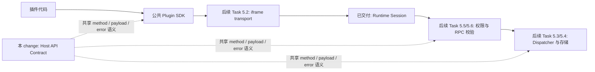

## Context

Milestone 1 已交付 `@lensx/plugin-contract` 与框架无关 `@lensx/plugin-sdk`，Milestone 2 已交付 Host-private Registration snapshot/detail，Milestone 4 已交付隔离 iframe、可信 Runtime Session、专用 MessagePort lease 与完整 CSP/lifecycle。当前 SDK 只提供生命周期、冻结的 Runtime Context、抽象 transport、取消/超时和 SDK 级错误；`PluginSdkClient` 没有 Host API 方法，Runtime Session 的 `ready` 也不代表 SDK 或 Host API 可用。

Task 5.1 位于真实 transport、Dispatcher、存储与权限执行之前，因此必须定义一个不依赖 DOM、Tauri 或 Host service 的公共语义契约，同时不能提前把 MessagePort envelope、请求 ID、权限状态机或持久化实现固化为公共 API。

## Goals / Non-Goals

**Goals:**

- 以 Host API `0.1.0` 定义小而真实的方法、事件、permission requirement 与错误目录。
- 让 JSON Schema、生成 TypeScript 类型、纯校验 API、method/permission catalog 和共享 fixtures 形成单一事实链。
- 让 Host、SDK、Rust fixture gate 和仓库外消费者可以在没有真实 Runtime 的情况下独立验证契约。
- 让 SDK 初始化 Context 与 `runtime.get_context` 使用同一语义和同一结构事实源。
- 使所有操作目标都由当前 Runtime Session 身份和 Host 当前事实推导，插件参数不能携带或覆盖 plugin ID、entry、Page、grant、source 或 Host executor。
- 为后续 transport、Dispatcher、插件私有存储、权限管理和 RPC 校验提供稳定输入。

**Non-Goals:**

- 不实现 MessagePort transport、RPC request ID、并发、取消传播、超时执行或 pending-call cleanup。
- 不实现 Host API Dispatcher、真实 Action/导航副作用、剪贴板 native 调用、存储持久化或容量执行。
- 不实现权限申请、用户授权、撤销、升级差异或管理 UI。
- 不公开 raw `request(method: string, params: unknown)`、Tauri command、Rust/React Host 对象或 Runtime Session 私有 envelope。
- 不提供任意文件、任意网络、Shell、进程、插件间消息、后台执行或打开外链能力。
- 不新增组件、样式、产品文案或运行时依赖。

## Decisions

### 1. Host API 语义 Contract 归 `@lensx/plugin-contract` 所有

`@lensx/plugin-contract` 新增受限 Host API Schema entry、由 Schema 生成的 TypeScript 输入类型、规范化的只读成功值类型、纯校验函数、method catalog、permission catalog 和 package-owned fixtures。JSON Schema 继续作为可序列化结构的事实源，TypeScript 与 Rust 使用同一批 valid/invalid fixtures 做 drift gate。

SDK 可以从 Contract 消费或重新导出面向作者的类型，但不能复制 Host API 版本、Context 字段、方法名、permission ID 或错误码。Host-private Runtime 与 Dispatcher 可以依赖 Contract，Contract 不能反向依赖 SDK、Testkit、React、Tauri 或根应用代码。

**替代方案：在 SDK 中直接手写方法类型。** 拒绝，因为 Host 与 Rust 仍需另一份结构定义，会再次产生版本、Schema 和错误 drift。

**替代方案：新建第四个 Host API package。** 拒绝，因为 v1 规模有限，现有 Contract 已负责 Manifest/Host API 版本和跨 TypeScript/Rust 的公开协议事实；新增 package 会制造没有实际边界收益的发布顺序。

### 2. 公共语义对象与私有 RPC envelope 分离

本 change 定义可序列化的 semantic request `{ method, params }`、与 method 对应的 result、Host API error `{ code, message }` 和 event `{ event, payload }` Schema，但不定义 request ID、nonce、origin、Window、MessagePort、重试或批量 envelope。Task 5.2 可以在专用 Port 上设计 Host-private wire，Task 5.6 再把共享语义校验接到该 envelope 的执行前后。

公共 SDK 只会逐步暴露类型化能力，不公开任意字符串 method 调用。Contract package 中存在可校验的 method 字面量 union，不代表插件可以绕过 SDK 自行发送消息。

**替代方案：现在发布 JSON-RPC 2.0 envelope。** 拒绝，因为 request ID、取消、断开和 transport 生命周期属于 Task 5.2/5.6，提前公开会把 Host-private安全机制变成插件可依赖的兼容承诺。

### 3. v1 方法目录保持最小且每项都有后续真实 owner

| Method | Params | Result | Permission requirement | 目标约束 |
| --- | --- | --- | --- | --- |
| `runtime.get_context` | `{}` | 完整 `PluginRuntimeContext` | 无显式权限 | Context 来自当前 Host/Session 事实 |
| `ui.close` | `{}` | `{ accepted: true }` | 无显式权限 | 只能请求关闭当前调用 Session 的页面 |
| `actions.open` | `{ actionId }` | `{ opened: true }` | 无显式权限 | `actionId` 是调用者自身的 plugin-local Action ID |
| `storage.get` | `{ key }` | `{ found, value? }` | 无显式权限 | namespace 从 Session plugin ID 推导 |
| `storage.set` | `{ key, value }` | `{ stored: true }` | 无显式权限 | 不接受 namespace/plugin ID |
| `storage.delete` | `{ key }` | `{ deleted }` | 无显式权限 | 不接受 namespace/plugin ID |
| `storage.list` | `{ cursor?, limit? }` | `{ keys, nextCursor? }` | 无显式权限 | 仅列出当前插件 key，稳定排序并分页 |
| `storage.get_quota` | `{}` | `{ usedBytes, limitBytes }` | 无显式权限 | 仅返回当前插件 namespace 用量 |
| `clipboard.read` | `{}` | `{ text }` | `clipboard.read` | 由后续 Host privileged service 执行 |
| `clipboard.write` | `{ text }` | `{ written: true }` | `clipboard.write` | 由后续 Host privileged service 执行 |

私有存储不弹出系统权限提示，因为其 namespace、容量和数据类型都由 Host 限定；它仍必须出现在 capability snapshot 中，Host 未实现或当前不可用时插件不能假定可调用。剪贴板已经有 Task 7.3 的权限型官方插件作为后续消费者，因此进入 v1。打开外链目前没有同等明确的实现与 dogfood owner，因此不发布 `system.open_external` 或 permission 占位；后续需要独立 change 增量加入。

`ui.close` 必须先让 response 进入 transport handoff，再由 Host 调度终端 teardown，避免成功请求因立即销毁 Port 而表现成 transport failure。`actions.open` 不接受全局 Action ID；Host 用 Session plugin ID 与 local ID 派生全局 ID，并只解析当前 Registry 中调用者自己的可用 Page-only Action，不能触发 `lensx.core` 或其他插件 Action。

### 4. Runtime Context 是能力发现的唯一快照

`runtime.get_context` 的 result 与 SDK `PluginRuntimeContext` 保持一一对应：`hostApiVersion`、`locale`、`theme` 和排序去重的 `capabilities`。`capabilities` 使用 Host API method ID，表示该 method 对当前 Session 同时满足 Host 支持、实现可用和当前有效授权；它不公开原始 Manifest 请求、grant store、source 或 publisher 事实。

SDK 的 `initialize()` 仍是作者入口；未来真实 transport 的 connect 阶段以 `runtime.get_context` 语义取得快照，SDK 校验、复制和冻结后才进入 `ready`。SDK 不再维护第二份 Context 结构或独立 Host API 版本常量。

v1 定义 `runtime.context_changed` event，payload 是完整 Context replacement，而不是字段 patch。locale、theme 或非身份型 capability 变化可以发布该事件；任何使当前 Session 身份或 grant snapshot 失效的变化仍遵循 Runtime currentness 规则终止 Session，不能靠事件把旧 Session 重新授权。

**替代方案：分别暴露 capability 与 raw granted permission。** 拒绝，因为插件关心的是当前可调用能力，原始 grant/request/source 是 Host 状态且容易被误当成调用授权。

### 5. Permission requirement 是静态契约，授权判断仍属于后续能力

method catalog 为每个方法记录 `permission: null | "clipboard.read" | "clipboard.write"`。`null` 只表示该方法不需要用户授予的显式系统权限，不绕过当前 Session、Host 支持、method 可用性、参数校验或资源限制。Manifest request、Registration grant、Host 支持和当前 Session 有效性必须继续分开；本 change 不把 request 转换为 grant，也不因为 builtin/official/source/publisher 事实放宽要求。

Permission ID 与 method ID 都是闭集字面量 union。未知值严格拒绝，package patch 不可以静默新增方法或 permission；新增兼容能力需要 Host API minor 版本和 capability discovery，删除或不兼容改形需要 Host API major 版本。

### 6. 错误保持稳定、安全且与 SDK 生命周期错误分层

Host API v1 定义至少 `invalid_request`、`invalid_params`、`method_not_found`、`permission_denied`、`not_found`、`conflict`、`limit_exceeded`、`unavailable`、`cancelled`、`timeout` 和 `internal_error`。错误只包含稳定 code 与有界、非本地化的安全 message，不包含 raw exception、stack、URL、路径、payload、grant、Host 对象或 Rust/Tauri 值。

SDK 已有的 `disposed`、`disconnected`、`transport_failure` 等生命周期错误继续属于 SDK 层；后续 transport 负责在边界上保留两类错误的判别，不能把 Host `permission_denied` 折叠成通用 `transport_failure`。

方法特定失败使用上述通用语义组合：例如未知自身 Action 为 `not_found`，存储超限为 `limit_exceeded`，剪贴板未授权为 `permission_denied`，平台能力暂不可用为 `unavailable`。插件不能依靠 message 文本或内部异常类型分支。

### 7. 结构限制与运行时资源限制分阶段交付

Schema 现在固定可独立验证的结构边界：exact objects、有限 method/event/error union、JSON-compatible 存储值、受限 key/action ID/cursor/text 字符串、正整数分页 limit、有限列表长度和安全整数 quota。`storage.list` 只返回 key，不批量返回 value，以降低响应体和意外数据扩散。

具体持久化总容量、单值字节数、序列化深度、消息字节数、并发和超时执行由 Task 5.4/5.6 定义并强制；这些后续限制不得扩展 v1 接受的数据种类或改变 method/result 判别结构。

### 8. 独立验证沿用 Contract package 的发布门禁

生成门禁必须拒绝 Schema/生成类型 drift；valid/invalid fixtures 必须覆盖每个 method、result、event、permission 和 error，以及 unknown/additional fields、错误 method-payload 配对、插件自报身份和危险占位能力。TypeScript 与 Rust fixture consumers 必须对有效性和稳定诊断达成一致，但本 change 的 Rust 侧只做契约消费/验证，不注册 Tauri command 或执行 Host API。

真实 `@lensx/plugin-contract` tarball 必须让仓库外 no-DOM consumer 完成 typecheck、ESM Runtime 校验和 catalog 使用；包内容不得包含 Host-private source、fixtures、生成脚本、测试或未声明 entry。SDK tarball 验证必须证明共享 Context/版本事实可消费，同时 `PluginSdkClient` 仍没有 raw request 或具体 Host API 方法。

## Risks / Trade-offs

- **[Contract 定得过宽，后续实现被占位 API 绑住]** → 只纳入有明确 Task owner 的方法；外链保持未发布，未知 method 严格拒绝。
- **[Context、Schema 与 SDK 类型迁移产生破坏性 drift]** → 保持现有 Context 字段形状，改为共享事实源，并以 SDK typecheck、tarball consumer 和 fixture gate 验证。
- **[capabilities 被误解为持久 grant]** → 规范只把它定义为当前 Session 的可调用快照；安全相关事实变化仍会使 Session 失效。
- **[`actions.open` 成为通用 Host executor]** → 参数只接受 local Action ID，Host 从 Session 派生 owner，并只允许调用者自己的当前 Page-only Action。
- **[`ui.close` teardown 吞掉成功响应]** → 契约明确 acknowledgement 先完成 transport handoff，副作用随后调度；具体时序由 Task 5.2/5.3 验证。
- **[Contract 校验被误报为运行时安全已交付]** → 文档、spec 和 package README 明确 transport、dispatch、permission enforcement 与资源限制仍未实现。
- **[中英文文档或 stable spec 归档漂移]** → 实现同时更新 `docs/en` 与同路径 `docs/zh`，归档前把 delta spec 重写为英文后再同步。

## Migration Plan

1. 在 Contract package 中加入 Host API Schema、生成类型、catalog、纯校验和 fixtures，不改变现有 Manifest entry 行为。
2. 让 SDK Runtime Context/Host API 版本消费共享 Contract export，保持当前 `PluginSdkClient` public shape 和无 DOM/Tauri 边界。
3. 增加 TypeScript、Rust fixture、package tarball、workspace boundary 与文档门禁，确认没有真实调用路径被意外开放。
4. 后续 Task 5.2–5.6 逐步消费该 Contract；在那些任务完成前，capability 不得被宣传为可执行。

若应用阶段无法保持 SDK 公共兼容或跨语言 drift gate，可删除新 Host API exports/fixtures并恢复 SDK 原有内部 Context 定义；由于本 change 不写持久数据、不注册命令也不改变 Runtime 消息，回滚不需要数据迁移或用户恢复步骤。

## Open Questions

没有阻塞本 change 的开放问题。存储的具体字节配额、RPC 并发/消息上限，以及未来外链 scheme 策略分别由 Task 5.4、5.6 和独立增量 change 决定；它们不能改变这里已经冻结的 v1 方法判别结构。
