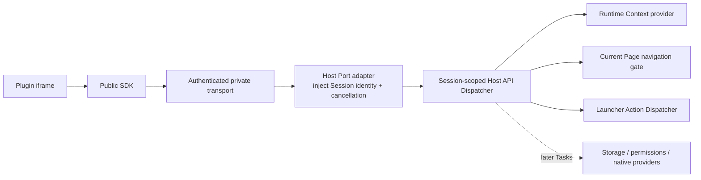

## Context

Host API `0.1.0` 已经拥有十个方法的公共语义目录、精确 params/result/event/error Schema、生成类型与跨 TypeScript/Rust fixtures。Runtime Session 会把可信的 plugin/Page identity、Registration revision、Runtime attempt、origin 和 grant snapshot 绑定到一条专用 Port；官方 iframe transport 再把 Contract-valid request 与 Host-owned cancellation signal 交给 Host 私有 handler。

当前生产 `PluginRuntimeFrame` 在 Session ready 后仍把这条 handler 固定为 `unavailablePluginRuntimeTransportHandler`。这保证了 Task 5.2 不会提前执行 Host 能力，但也意味着 transport 在初始化时发送的 `runtime.get_context` 必然失败，真实 SDK 无法进入 `ready`。现有 App 已经有可注入的 `AppNavigationService`、Launcher Action Service、locale/theme provider 和 Runtime currentness/lifecycle 边界，可以作为首批 Dispatcher provider；本 change 不需要新增 Rust command 或第三方依赖。

## Goals / Non-Goals

**Goals:**

- 让生产 SDK 通过真实 `runtime.get_context` 完成初始化，并得到只包含当前可调用方法的 Context。
- 在不让插件选择 identity、target、executor 或 Tauri command 的情况下实现 `ui.close` 和 `actions.open`。
- 让每次 dispatch 都以当前 Session identity、当前 Runtime/navigation/registry 状态和取消信号为依据，过期调用失败关闭。
- 保持公共 Host API Contract、SDK interface、iframe wire、Runtime Session handshake 与官方/第三方插件路径不变。
- 为后续 storage、permission 和 RPC validation provider 留下封闭、可测试且不需要重写 transport 的扩展点。

**Non-Goals:**

- 不实现 `storage.get/set/delete/list/get_quota` 的持久化 provider。
- 不实现 `clipboard.read/write`、permission catalog、用户授权、撤销、升级权限差异或权限 UI。
- 不实现通用消息大小、嵌套、频率、并发、执行时间和日志策略；这些属于 Task 5.6。
- 不增加 Host API method、公开原始 call、公开 dispatcher、identity/grant 字段或 transport trust configuration。
- 不增加 Rust command、依赖、插件管理 UI、正式项目模板、CLI 或开发模式。

## Decisions

### 1. Dispatcher 保持 Host 私有，并按 Session 创建绑定

新增 Host 私有 Dispatcher factory，以现有 `PluginRuntimeTransportHandlerInput` 为唯一请求入口。factory 接受窄依赖：Context snapshot source、App Navigation gate、Launcher Action Dispatcher 和 currentness predicate；每条 ready Session 创建独立绑定。Port adapter 继续从 lease 注入冻结 identity 和取消信号，Dispatcher 不读取 wire identity，也不接受插件配置 provider。

选择这个方案而不是公共 SDK executor 或通用 service locator，是因为 authority 已经绑定在 Session lease 上；把 Dispatcher 公开或允许插件选择 handler 会重新引入 confused-deputy 和跨插件调用风险。选择按 Session 绑定而不是全局可变 singleton，可以让 identity、pending effect、事件订阅和销毁与 Page 生命周期一起终止。

### 2. 用封闭 provider table 覆盖 Contract catalog，但本 Task 只启用三个方法

Dispatcher 对 Contract `HostApiRequest` 做穷尽式 method 分派，并明确区分：

- `runtime.get_context`、`ui.close`、`actions.open`：本 change 提供真实 provider；
- `storage.*`：在 Task 5.4 provider 存在前返回稳定 `unavailable`；
- `clipboard.*`：在 Task 5.5 的当前授权检查和窄 native provider 存在前返回稳定 `unavailable`；
- 不属于 Contract catalog 的方法：正常生产 transport 应在进入 Dispatcher 前拒绝；防御性直调仍返回稳定 `method_not_found`。

Context capability list 从“当前具备实现且当前授权允许”的 provider 集合生成，而不是复制十个 method catalog。Task 5.3 只发布三个无显式 permission 且真实可用的方法；`storage.*` 虽然 Contract permission 为 `null`，但因没有实现而不得出现；`clipboard.*` 不得因为 Manifest 请求、official source 或旧 grant snapshot 自动出现。

该设计避免让 5.3 提前吞并 5.4/5.5，同时后续 provider 可以在不改变 wire 或 SDK 的情况下加入同一封闭表。

### 3. Runtime Context 是完整 Host snapshot，不暴露 grant 或 identity

Context source 从应用当前状态读取：

- `PLUGIN_HOST_API_VERSION` 的唯一 Contract source；
- `en-US | zh-CN` locale；
- `light | dark` theme；
- 排序、去重、冻结的 capability method IDs。

`runtime.get_context` 只返回 Contract 定义的四个字段。plugin ID、Page ID、source、Manifest requests、Registration revision、raw grant IDs、安装路径和 Host lifecycle 对象只参与 Host 内部判断，不进入 Context。

当同一 Session 仍然 current 且 locale、theme 或 capability snapshot 改变时，session binding 通过现有 transport adapter `emit` 发布完整 `runtime.context_changed` replacement；相同 snapshot 不重复发送。若变化涉及 identity、Registration revision、resource generation、Runtime attempt 或 grant snapshot 的失效，旧 Session 走既有终止/替换路径，不能靠 context event 重新授权。

### 4. `ui.close` 使用“响应交付后 effect”并再次匹配当前 Page

现有 handler 只返回 `HostApiResult | HostApiError`，无法表达“先把 `{ accepted: true }` 放入 Port，再关闭会销毁该 Port 的页面”。因此 Host 私有 handler outcome 将支持一个不可序列化、永不跨 wire 的 post-response effect。Port adapter 必须先验证并成功 `postMessage` Contract result、把 request 标记 terminal，再在 currentness 和 cancellation 仍成立时执行至多一次 effect。

`ui.close` provider 只构造当前 Session 的 `{ owner_id: identity.plugin_id, page_id: identity.page_id }`，并通过新增或收窄的 Navigation API 做原子式 match-and-close。它不能调用无目标的宽泛关闭来影响在响应等待期间替换进来的 Page。effect 执行失败只能进入安全诊断/终止路径，不能撤回已经交付的成功响应或泄露内部错误。

选择显式 post-response outcome，而不是 `setTimeout`/`queueMicrotask`，是为了让顺序、取消、exactly-once 和测试证据由 transport/Dispatcher 合同控制，而不是依赖浏览器调度时机。

### 5. `actions.open` 只从可信 owner 推导全局 Action ID

provider 接受 Contract-valid plugin-local `actionId`，按现有投影规则生成 `${identity.plugin_id}.${actionId}`，再调用已注入的 Launcher Action Dispatcher。插件不能提交 global ID、owner、Page route 或 executor。Dispatcher 的 typed result 映射如下：

- 成功执行映射为 `{ method: "actions.open", result: { opened: true } }`；
- unknown/unavailable Action 映射为稳定 `not_found`；
- executor failure 映射为安全 `internal_error`，不暴露原始异常或 Host 对象。

现有 Action Registry/Dispatcher 在执行前重新解析当前 registration 和 enabled 状态，因此 Registration/投影变化不会使用缓存 executor。Runtime currentness 和 cancellation 在调用前后都要检查；终止后完成的异步结果不得发送响应或触发第二次 effect。真实 transport/React lifecycle 测试必须证明 Action 导航不会把响应错误映射为私有 transport failure。

### 6. 生产组合通过可注入 factory 接线，不在组件中硬编码 service locator

`App` 已经注入 Navigation 与 Action Service，并持有当前 locale；Theme 由现有 App Theme provider 提供。实现将把这些窄事实组合为 Host API dispatcher factory/binding，并传给 `PluginRuntimeFrame`。Frame 仍然负责把 binding 附着到当前 ready Port、保存 adapter emitter、在 Context 变化时刷新 snapshot，以及在 Session/Page cleanup 时销毁 binding。

测试可以注入 fake Context source、Navigation gate 和 Action Dispatcher；生产默认组合使用现有 services。保留一个显式 unavailable factory 仅用于缺少依赖或聚焦 transport fixture，不再作为正常生产路径。

### 7. 错误、取消和私有值在 Dispatcher 边界统一收敛

所有 provider 只返回 Contract-valid result/error 或 Host 私有 post-response outcome。已知 domain failure 映射为封闭代码；未知 throw、非法 provider output 或内部异常转换为 `internal_error` 与固定安全英文消息。原始异常、stack、URL、path、payload、grant、executor、Tauri/Rust/Host 对象不得进入 result、error、event、diagnostic 或插件可观察日志。

每次副作用前检查 cancellation 和 currentness；异步返回后再次检查。取消、Session disconnect、Page replacement、disable/uninstall、Host reload 和 adapter disposal 共用既有 terminal cleanup，禁止 late effect、late event 或跨 Session 复用 binding。

## Risks / Trade-offs

- **[风险] `ui.close` 在响应前销毁 Port，SDK 得到 disconnect 而不是成功结果** → 由 adapter-owned post-response outcome 固化先响应、后终止顺序，并覆盖真实 MessageChannel 与 WebView 测试。
- **[风险] 旧 Session 关闭或操作了替换后的 Page** → Navigation 使用 trusted target 的 match-and-close，并在 effect 执行前复查 Runtime currentness。
- **[风险] Context 把 catalog、Manifest request 或 raw grant 错当成 capability** → capability 只从已安装 provider 与当前授权交集生成，fixtures 覆盖空集合、排序和敏感字段缺失。
- **[风险] `actions.open` 形成通用 Host executor 或跨插件跳转** → 只接受 local ID、Host 推导 owner namespace、复用当前 Registry lookup，禁止 core/其他 provider 和插件提供 executor。
- **[风险] 新 session binding 与 React lifecycle 发生 listener/late-callback 泄漏** → 所有订阅、emitter 和 pending effect 绑定到既有 Runtime attempt cleanup，并验证重复销毁幂等。
- **[权衡] 本 Task 的十方法 Contract 只有三个生产 provider** → 保持 capability discovery 诚实，其余方法稳定不可用，换取不预建 storage/permission 系统的窄范围。

## Migration Plan

1. 先增加纯 Host 私有 Dispatcher、Context snapshot、Navigation gate 和测试，不改变生产 handler。
2. 扩展 Host adapter 的私有 outcome 以支持 response-after-effect 顺序，并通过现有 transport 回归与恶意 frame 测试。
3. 在 `PluginRuntimeFrame`/`App` 生产组合中注入 session-scoped binding，替换固定 unavailable handler，同时保留测试显式注入能力。
4. 更新英文架构、workspace/validation 文档及中文镜像，并完成聚焦、浏览器、目标 WebView和全量门禁。
5. 本 change 无持久化数据迁移。若生产回归，可恢复 unavailable production factory；Contract、SDK、wire、Manifest、Registration store 和插件数据无需回滚。

## Open Questions

本 change 没有阻塞 implementation 的开放决策。后续 Task 5.4/5.5 必须分别决定 storage provider 的持久化/配额边界和 clipboard 的当前授权/native command 边界，不能在本 change 中预实现。
