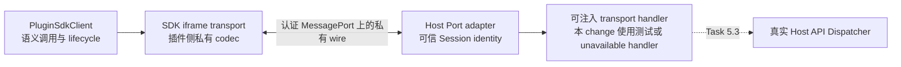

## Context

当前外部 Plugin Page 运行在 Host-owned isolated iframe 中。`PluginRuntimeSessionService` 已使用精确的 target window、受限 origin、一次性 nonce 和新建 `MessageChannel` 完成 bootstrap/ready acknowledgement，并在成功后保留绑定当前 Registration、Page、资源 generation、Runtime attempt 与实际 grants 的 Host 私有 Port lease。Session `ready` 只表示这条 Port 已认证，不表示公共 SDK ready 或 Host API 可执行。

`@lensx/plugin-sdk` 当前提供实例化 client、`PluginSdkTransport` 语义注入接口、Runtime context 校验、取消、超时、事件、断开、销毁与安全 SDK error；`@lensx/plugin-testkit` 提供不含 wire 的 `FakePluginSdkTransport`。公共 SDK 还没有浏览器 iframe transport，`PluginSdkClient` 也没有 Host API v1 的受约束调用入口。

`@lensx/plugin-contract` 已定义 Host API `0.1.0` 的十个 method、`runtime.context_changed`、精确 params/result/error Schema、Runtime context、版本和 capability 语义，但明确不定义 request ID、nonce、origin、Port、RPC envelope、可信 identity、dispatch 或副作用。

因此本 change 必须连接三个既有边界，同时保持其职责分离：

## Goals / Non-Goals

**Goals:**

- 提供可发布的官方 iframe transport，让插件只通过公共 SDK 消费现有 Runtime Session。
- 在不公开 wire 或可信 Host facts 的前提下，建立版本化 request/response/event/cancel/disconnect 协议。
- 支持多个并发请求、乱序响应、取消、SDK timeout、事件订阅、显式断开、幂等销毁和晚到消息抑制。
- 给公共 SDK 增加由 Host API Contract 判别联合类型驱动的窄请求与事件入口，编译期和运行时均拒绝未声明 method/event。
- 让 Host 从当前 Port lease 注入 identity，严格解析最小 wire，并通过可注入 handler 完成无真实应用副作用的 round-trip。
- 保留 Host API error 与 SDK lifecycle/transport error 的判别边界。
- 保持现有 fake transport、非浏览器 SDK consumer 和 `createPluginSdk({ transport })` 用法兼容。
- 以 focused、真实 tarball、浏览器 MessageChannel 和目标 WKWebView 证据验证交付。

**Non-Goals:**

- 不实现 Task 5.3 的 Host API Dispatcher、应用 service、Rust command 或真实 UI/Action/存储/剪贴板副作用。
- 不实现 Task 5.5 的 permission catalog、授权决策、授权 UI 或 grant 持久化。
- 不完成 Task 5.6 的消息大小、嵌套深度、批量、全局并发、Host 执行 deadline、审计日志与完整资源限制；本 change 只建立安全运行所必需的闭合 frame、语义校验和逐请求清理基线。
- 不增加 public raw RPC、任意字符串 method、identity/origin/nonce 覆盖、Host executor、Tauri/Rust 对象或 SDK 全局单例。
- 不增加 React/Semi UI、项目模板、CLI、开发模式、后台插件、sidecar、remote transport 或跨插件通信。
- 不声称 Windows/Linux WebView Runtime 已交付。

## Decisions

### 1. 保留语义 transport 根边界，新增显式 iframe 子入口

新增声明式公共入口 `@lensx/plugin-sdk/iframe`，导出概念上的 `createPluginIframeTransport()`，其返回类型仍是根入口的 `PluginSdkTransport`。插件继续显式执行 `createPluginSdk({ transport })`；根入口不自动访问 `window`，也不建立模块级默认 client。

iframe 子入口的公共函数签名不接收 plugin identity、origin、parent window、nonce、Port 或自定义 wire codec，也不在 `.d.ts` 中引用 DOM global types。浏览器对象访问和可替换测试 adapter 留在 package 内部，现有非 DOM tarball consumer 仍只消费根入口。

选择这一方案而不是让根入口自动侦测 iframe，是为了保持现有 framework-neutral/no-DOM 契约、显式 lifecycle 和 fake transport 注入能力。选择 package 子入口而不是独立 package，是因为它只是一种官方 `PluginSdkTransport` 实现，不形成新的公共协议所有者。

### 2. SDK 公开闭合、Contract 驱动的请求与事件入口，不公开 raw RPC

`PluginSdkClient` 增加一个以 `HostApiRequest` 判别联合类型为输入的请求入口，并用 request 的 `method` 推导对应 `HostApiResult` 的 result 类型；调用选项继续复用现有结构化 cancellation signal 与 timeout。SDK 在进入 transport 前调用 Contract validator 复制并冻结 request，因而任意字符串、method/params 错配、额外 identity/grant/path/executor 字段或非 JSON 值无法进入 wire。

SDK 同样增加只接受闭合 `HostApiEventName` 的类型化订阅入口。`runtime.context_changed` payload 由 Contract 校验后作为完整 context replacement；SDK 更新只读 `context` 后再通知订阅者，缺失 capability 立即从新 snapshot 消失。无效或未知事件不得通知插件，并终止不再可信的 transport。

选择一个 Contract 判别联合类型入口而不是十个手写 wrapper，是为了避免在 SDK 内复制 method catalog、params/result 映射或业务语义。它不是 arbitrary string call：类型与运行时 validator 都只接受 Contract 的闭合集合。未来可在独立 change 中增加便利 wrapper，但 wrapper 必须复用本入口。

### 3. 复用一次 Session bootstrap，不建立第二套 window 握手

iframe transport 的 `connect()` 等待现有 `lensx.plugin_runtime.bootstrap`，只接受来自当前 parent browsing context、SDK 支持的精确 Host origin、当前 contract version、精确字段和恰好一个 transferred Port 的第一条有效消息。生产支持的 Host origin 由 SDK 内部版本化策略持有；不提供插件可覆盖的 wildcard 或 arbitrary-origin 选项。开发来源和额外 origin 策略留给 Task 6.5。

transport 在收到 bootstrap 后立即移除 window listener，通过 transferred Port 返回现有 nonce ready acknowledgement。Host 验证 acknowledgement 后把 Port lease 交给 Host adapter；后续 request、response、event、cancel 和 disconnect 全部只走该 Port，不再使用全局 window message bus。重放、第二个 bootstrap、错误 source/origin/version、缺失或额外 Port 均失败关闭。

选择复用 Task 4.3 bootstrap，而不是增加一个并行 SDK nonce，是为了维持单一 source/origin/nonce 认证点，并保持 Session ready 与 SDK ready 的顺序可观察。

### 4. 私有 wire 版本化、闭合且只有一个受检事实源

Port frame 使用与 bootstrap 兼容的 transport contract version，并定义五类精确 frame：

- request：transport 生成且本 Session 内唯一的 request ID，加一个已经通过 Contract 校验的 Host API request；
- response：同一 request ID 的 exactly-one success result 或 Host API error；
- event：一个已经通过 Contract 校验的 Host API event；
- cancel：指向仍 pending 的 request ID；
- disconnect：不携带 Host 私有原因、payload 或对象的终止信号。

frame 不包含 plugin/Page identity、origin、nonce、Registration revision、resource generation、grant、路径、executor、Tauri command 或 Host object。每一端都把输入视为 `unknown`，要求 plain JSON-compatible data、精确键、已知 type/version 和有界 request ID；未知、畸形、重复终局、method/result 错配或错误版本不会进入 handler。

wire codec/schema 由 `packages/plugin-sdk` 内不导出的 canonical 定义生成插件侧 codec 与 Host 私有 projection，并用 deterministic drift gate 和共享 valid/invalid fixtures保证一致。tarball 必须包含运行 iframe transport 所需实现，但不得 export wire schema、frame type、codec、fixture 或 Host projection。私有表示 unsupported，不表示依赖保密获得安全性。

选择闭合自有 frame 而不是引入通用 JSON-RPC library，是因为首版只需单 Session、单 Port、单请求/响应、一个事件通道与取消；现有 stack 足以实现，新增通用 runtime dependency 会扩大攻击面和公共语义。

### 5. Host adapter 从 Port lease 注入 identity，handler 永远不信任 wire identity

Runtime Session 在 ready acknowledgement 后把同一 Port 的读取权一次性交给一个 Host 私有 adapter。adapter 捕获冻结的 `PluginRuntimeSessionIdentity`，对每个合法 request 构造 `{ identity, request, signal }` 并调用可注入 handler。handler API 不接收 origin、window、Port 或 envelope，也不允许请求替换 identity。

adapter 在调用 handler 前验证 request，在发送前验证 result 或 Host API error。Task 5.2 的 production handler 对所有请求返回稳定 `unavailable`，不会产生应用副作用；focused/browser/WebView fixture handler只返回 Contract-valid context、result、error 和 event，用于证明 transport。Task 5.3 将在同一 handler 边界接入真实 Dispatcher，而无需改动插件侧 wire。

选择 placeholder `unavailable` handler 而不是在 5.2 实现 `runtime.get_context`，是为了避免提前承担 Host support、locale/theme、实际 capability 与 permission 决策。SDK `initialize()` 仍通过 transport 请求 `runtime.get_context`；因此本 change 的 fixture 能进入 SDK ready，production integration 则在 5.3 接入前可预测地保持不可执行。

### 6. request ID、并发、取消和终止均以 Session 为作用域

request ID 由 iframe transport 生成，插件业务调用不能提供；ID 在单个 Port 生命周期内不可复用。插件端用 pending map 将乱序 response 关联到唯一 Promise。SDK cancellation/timeout 会 abort transport operation，transport 至多发送一次 cancel 并立即清理本地 pending；Host adapter abort 对应 handler signal 并抑制任何晚到 result/error。

Session disconnect/dispose、Port message error、显式 disconnect frame 或 fatal codec error均进入同一个幂等 terminal path：拒绝新请求、以 `disconnected` 终止 pending、停用订阅、清除 listener、尝试发送一次 terminal signal并关闭 Port。SDK dispose 使用既有 `disposed` 语义；已形成的 Contract-valid Host API rejection保持原错误，不转换为 `transport_failure`。受控关闭之外的底层异常只映射为安全 SDK lifecycle error。

本 change 只要求正确支持实际并发和逐请求 cancellation，不在这里制定全局并发上限、频率、消息尺寸或 Host deadline；这些由 Task 5.6 在现有 frame/handler 边界上加固。

### 7. 测试分层证明语义一致性与真实 Port 行为

- SDK 单元测试验证类型化 request/event、Contract 运行时拒绝、context replacement、Host API error 保真、timeout/cancel/disconnect/dispose 和 late suppression。
- codec 与 Host adapter 测试覆盖 valid/invalid/version/extra-key/identity injection、request ID collision、并发乱序、重复 response、cancel race、handler throw、invalid result/error/event 和幂等 terminal cleanup。
- 现有 `FakePluginSdkTransport` 继续证明相同的 SDK lifecycle；Testkit 不暴露 wire、origin、nonce、Port 或 Host identity 配置。
- 真实 tarball consumer 分别验证根入口 no-DOM 用法和 iframe 子入口浏览器构建；不允许 deep import 私有 transport 模块。
- 浏览器 MessageChannel fixture 和目标 macOS WKWebView fixture 使用真实 SDK iframe transport 与 Host test handler，覆盖正常 round-trip、恶意/过期 Port、页面替换和关闭后零 handler hit。
- 新增 `pnpm run check:plugin-sdk-transport` focused gate，并纳入根 workspace test/check/build；最终验证保持顺序执行。

## Risks / Trade-offs

- **[Risk] 浏览器子入口可能破坏根 SDK 的 no-DOM consumer。** → 使用独立 exports 子路径、无 DOM global 的公共声明、根入口 isolated tarball consumer 和 browser consumer 双重门禁。
- **[Risk] SDK 与 Host 私有 codec 漂移。** → 使用 package-owned canonical 私有定义生成两端 projection，并以 deterministic drift check 和相同 valid/invalid fixtures 阻止提交。
- **[Risk] `MessagePort.close()` 对远端没有可靠 close event。** → 受控终止先发送一次 disconnect frame；同时处理 `messageerror`、iframe/Session terminal cleanup。心跳和崩溃探测不在本 change 假装完成。
- **[Risk] 5.2 的 handler 抽象可能演变为通用 RPC 平台。** → handler 只接受当前 Session identity、闭合 Host API request 与 cancellation signal，只返回 Contract result/error；不增加路由插件、middleware 平台、批处理、流式 RPC 或跨插件消息。
- **[Risk] 类型化 request 入口被误解为 Host API 已可执行。** → production handler 在 5.3 前稳定返回 `unavailable`，Roadmap、双语文档和测试名称明确区分 transport round-trip 与真实副作用。
- **[Risk] 取消与 response 同时到达造成重复 settle 或副作用误判。** → 每个 request 只有一个 terminal transition；先到的 terminal 状态获胜，晚到 frame/handler result 被丢弃并不得恢复 pending。
- **[Trade-off] 私有 wire 仍可从发布 bundle 中观察。** → 不把保密当安全边界；安全依赖 exact parsing、Session-bound Port、Host-derived identity 和后续 permission/dispatch checks。

## Migration Plan

1. 在保持现有 SDK 根 API 和 fake transport 通过测试的前提下，增加 Contract 驱动的 request/event client 能力与 iframe 子入口。
2. 建立 canonical 私有 codec、Host projection、fixtures 和 drift gate，再实现插件侧 transport 与 Host adapter。
3. 将 Host adapter 接到 Runtime Session ready lease 和统一 terminal cleanup；production 仅安装 `unavailable` handler。
4. 完成 focused、tarball、浏览器和目标 WebView 证据后更新双语文档与 Roadmap Task 5.2 状态；Roadmap 复选框只在实现、验证、同步和归档完成后更新。

回滚时可以移除 iframe exports 和 Host adapter 集成，恢复 Session ready 后无 transport consumer 的现状；现有 SDK root、Contract、Testkit、Runtime Session、插件安装数据和 Rust persistence 均无需迁移或回写。

## Open Questions

无阻塞问题。Task 5.3 需要决定真实 Dispatcher 的 service/Rust 绑定；Task 5.5 决定 capability 与 grant 的实时计算；Task 5.6 决定消息与执行资源上限。这些决定均可在本设计留下的 handler 和 codec 边界上独立完成。
