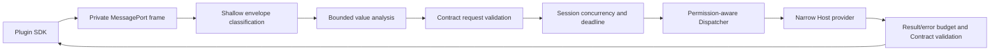

## Context

Task 5.1–5.5 已交付公共 Host API Contract、SDK iframe Transport、Host-private Dispatcher、插件私有存储和权限管理。当前私有 Transport 在两端从 `unknown` 解析 exact frame，并使用公共 Contract 校验 request、result、event 和 error；Host adapter 还维护 pending 请求、取消和 exactly-once settlement。

现有边界仍有三处缺口：

1. `isJson`/`isJsonValue` 会在没有统一字节、深度和节点预算的情况下递归遍历完整值；
2. Host adapter 的 `pending` 和 `terminal` 集合没有正式的 Session 级预算，Handler 也没有 Host-owned 最长执行期限；
3. Handler throw、非法输出、method/result 不匹配或非法 Host event 当前会走 Session 断开，而路线图要求非法输出转换为受控内部错误且不抵达插件。

该变更位于私有 MessagePort wire 与 Dispatcher 之间，不改变 Rust 特权边界、公共 Contract/SDK API 或权限授权来源。

## Goals / Non-Goals

**Goals:**

- 在递归 Contract 校验和 Handler 调用前，对插件输入执行可提前终止的统一预算检查。
- 为每个 Runtime Session 限制并发、pending 状态和 Host 执行时间，同时保持取消、currentness 和 exactly-once 语义。
- 将可关联请求的错误映射为现有 Host API 错误，将 Host 自身的非法输出收敛为安全 `internal_error`。
- 生成不含 payload、异常、路径、grant 或 Host 对象的结构化诊断。
- 通过共享 fixture、真实 MessageChannel、SDK 集成和现有 macOS WKWebView 证据证明边界。

**Non-Goals:**

- 不新增或修改公共 Host API 方法、参数、结果、事件和错误代码集合。
- 不公开私有 frame、policy、diagnostic 或 Host adapter，也不允许插件配置预算。
- 不支持 batch、streaming、插件间 RPC、任意 method 调用或自动重试。
- 不实现调用频率时间窗、iframe/CPU/内存监控、崩溃隔离、暂停与恢复；这些属于 Task 7.5。
- 不新增 Tauri command、Rust service、权限决策、授权 UI、设置页面或持久化诊断历史。

## Decisions

### 1. 使用固定的 Host-private v1 预算

生产 policy 是冻结的 Host-private 常量，不来自 Manifest、SDK、插件来源、权限或用户配置：

| Budget | v1 value | Rationale |
| --- | ---: | --- |
| 单 frame canonical JSON-compatible byte cost | 5 MiB | 覆盖 Contract 允许的最多 1,048,576 字符剪贴板文本及 envelope 开销，同时为异常大消息设硬上限 |
| semantic payload nesting depth | 32 | 与插件私有存储当前 JSON 深度上限一致 |
| total private frame depth | 36 | 为 request/result/event 的固定私有 envelope 层级预留空间 |
| visited values/keys | 16,384 | 阻止由大量微小数组项或对象键造成的遍历放大 |
| batch requests per frame | 1 | 当前 wire 只有单请求 frame，不借 Task 5.6 引入 batch |
| in-flight requests per Session | 32 | 保留真实并发，同时限制 pending controller、timer 和 Handler 工作量 |
| Host execution deadline | 10,000 ms | 与 SDK 默认 operation timeout 对齐，但保持 Host deadline 与调用方生命周期 timeout 可区分 |

字节预算使用迭代式、可提前终止的 JSON-compatible cost analyzer 计算，不先 `JSON.stringify` 整个值，也不使用无界递归。字符串按 JSON escaping 后的 UTF-8 cost 增量计算；遇到超限、循环、非 plain object、非有限数字或非 JSON 值立即停止。SDK 侧可继续做现有 Contract 校验，但 Host 是权威 enforcement point。

备选方案是仅依赖各方法 Schema 和 provider 限制。它无法在 Schema 深度遍历前阻止放大，也不能覆盖 event、error、envelope 或并发状态，因此不采用。另一个备选是让每个插件配置预算；这会把安全策略交给不可信输入，也不采用。

### 2. 将接收流程拆为可恢复 envelope 分类与有界语义校验

Host 先只读取固定外层字段，判断 frame 是否具有受支持版本、已知类型和合法 request ID。随后执行预算 analyzer，再调用共享 Contract validator：

- 版本、frame type、request ID、身份字段、extra envelope 字段或非 JSON frame 无法建立可信关联，属于 protocol violation，终止当前 Session；
- 具有合法单请求 envelope/request ID，但 `request` 不是合法请求结构，返回 `invalid_request`；
- 已知 method 携带不匹配 params，返回 `invalid_params`；
- 未声明 method 保持 Contract 的 `method_not_found`；
- 超过字节、深度、节点或并发预算返回 `limit_exceeded`；
- Dispatcher 的 `permission_denied` 等合法业务错误原样保留。

请求级拒绝会 terminal 该 request ID，但不调用 Handler、不消耗并发槽位，也不终止健康 Session。无法信任 request ID 的 protocol violation 仍 fail closed，避免向攻击者提供解析 oracle。

备选方案是所有异常都断开 Session。它简单但会把可恢复的参数错误、资源超限和 Host 内部 bug 变成页面级故障，也不满足稳定错误语义，因此仅保留给不可关联的协议违规。

### 3. 使用单调 request sequence 取代无界 terminal Set

SDK 已以固定 16 位十六进制序列生成 request ID，MessagePort 对同一发送端保持消息顺序。Host adapter 记录最高已观察 request sequence，并要求新的 request ID 严格递增；pending map 只保存最多 32 个活跃 controller/timer。已经完成、取消、拒绝或超时的旧 ID 因不高于 high-water mark 而不能重放，无需让 `terminal` Set 随 Session 生命周期无限增长。

重复或倒退的 request ID 仍是 protocol violation；未知 cancel ID 保持幂等忽略。该规则只收紧私有 wire，官方 SDK 的现有行为已满足，不需要 wire 或 SDK 主版本变化。

备选方案是保留一个有限 LRU terminal Set。淘汰后旧 ID 可被重放，安全语义弱于单调 high-water，因此不采用。

### 4. Host execution deadline 与 SDK lifecycle timeout 分层

每个被接纳的请求创建一个 Host-owned 10 秒 timer，并与现有 `AbortController`、Session currentness 和插件 cancel 竞争。Host deadline 先发生时：

- 删除 pending、释放并发槽位并 abort Handler signal；
- 发送一个 Contract-valid `timeout` Host API error；
- 忽略任何迟到的 result、error、throw 或 post-response effect。

调用方 SDK timeout 先发生时，SDK 继续产生现有 lifecycle `timeout` 并发送至多一个 cancel；Host 取消 Handler 且不再发送请求结果。二者来源不同，不互相伪装。

测试通过注入 Host-private clock/scheduler 控制竞态；生产常量不可由插件覆盖。

### 5. Host 输出失败按责任归属进行隔离

result、error 和 event 在发送前同时通过预算 analyzer 与公共 Contract validator。处理规则为：

- Handler throw、非法值、超限值或 method/result 不匹配：为该请求发送固定安全 `internal_error`，保持 Session 可用；
- 非法/超限 Host event：抑制该 event 并记录诊断，不通知订阅者，也不因单次 Host bug 断开 Session；
- `postResponseOutcome` 只有在其 response 通过校验并成功发送后才能执行 effect；非法 response 或超时永不执行 effect；
- Port `postMessage`、`messageerror`、Session currentness 或底层 codec 无法维持时仍进入现有 terminal cleanup。

这将 Host/provider 缺陷与插件协议攻击分开。Task 7.5 可在未来根据重复诊断采取插件级暂停或隔离，本 change 不提前实现该策略。

### 6. 诊断是有界、观察性的 Host-private record

Transport adapter 接受可选 `onDiagnostic` sink。每条冻结 record 只包含可信 lease `plugin_id`、已验证时才存在的 catalog method、`ingress | execution | egress` stage 和闭集 code，例如 `frame_limit_exceeded`、`concurrency_limit_exceeded`、`execution_timeout`、`handler_failed`、`invalid_handler_output`、`invalid_event`。

record 不包含 request ID、params、result、event/error payload、原始值、路径、URL、origin、grant、异常、stack、Port 或 Host 对象。sink throw 被吞掉，不能改变 settlement 或 cleanup。该 change 不持久化诊断；未来管理页若需要历史，必须通过独立 change 定义存储和展示边界。

### 7. 新增聚焦门禁并复用现有证据

新增 `check:plugin-rpc-validation`，包含：

- policy/analyzer 单元测试和共享合法/恶意 fixture corpus；
- Host adapter 对 byte/depth/node/concurrency/deadline/high-water/error mapping/diagnostic 的竞态测试；
- 真实 Contract + SDK tarball 的 MessageChannel 集成，证明 SDK 与 Host 错误含义一致；
- Dispatcher、permission、storage、Runtime cleanup、workspace boundary 和私有 export 回归；
- 现有有界 macOS WKWebView Transport 证据，补充至少一项资源拒绝与零 Handler hit 证据。

不新增运行时依赖；使用现有 TypeScript、Contract validators、Rstest、浏览器 fixture 和验证脚本。

## Risks / Trade-offs

- [Risk] 5 MiB frame 仍会在浏览器 structured clone 阶段产生内存成本 → analyzer 在 Host 接收后立即提前终止；持续消息频率和进程级内存隔离留给 Task 7.5。
- [Risk] 固定 32 并发或 10 秒 deadline 可能限制未来长操作 → Host API v1 当前均为短操作；任何 streaming/long-running 方法必须通过后续独立 Contract change 设计。
- [Risk] Host 与 SDK timeout 同时发生时插件可能观察到不同层级的 timeout → 保持两类既有错误可区分，并用 controlled-clock 测试证明 whichever-wins 只 settlement 一次。
- [Risk] 严格递增 request ID 收紧私有 wire → wire 不公开且官方 SDK 已单调生成；真实 SDK/MessageChannel 和 WKWebView 回归作为兼容门禁。
- [Risk] 将非法 Handler 输出从断开改为 `internal_error` 可能掩盖重复 Host bug → 每次都产生安全诊断；重复故障隔离策略由 Task 7.5 接续。

## Migration Plan

1. 先加入纯 policy/analyzer、诊断类型和 fixture，不接入生产路径。
2. 在 Host adapter 中替换无界 JSON 遍历与 terminal Set，接入请求级错误、并发和 deadline；保持私有 wire `0.1.0`。
3. 接入出站 containment 与生产组合诊断 sink，更新集成测试和 WKWebView 证据。
4. 更新英文架构/验证文档及简体中文镜像，运行聚焦和完整验证。

该变化无持久化迁移、公共 API 迁移或数据回填。若出现回归，可回滚 Host adapter/policy 组合并恢复原 Transport 行为；公共 Contract、SDK 和 Rust 数据不需要降级。

## Open Questions

无阻塞问题。上述 v1 预算作为本 change 的明确实现基线；未来调整 production 数值、增加 batch/streaming 或加入持续频率/隔离策略均需要独立规格变更。
