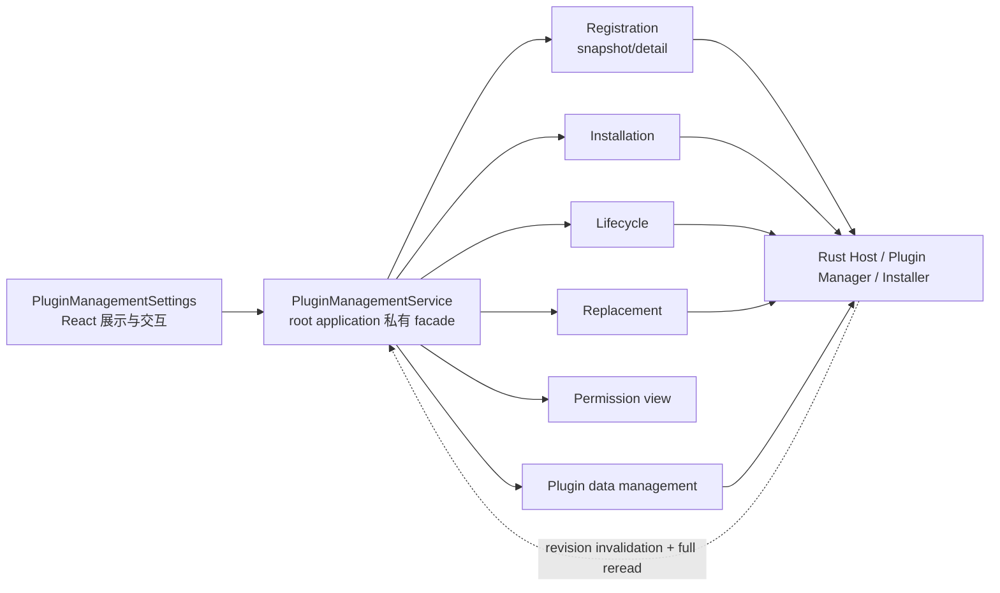

## Context

当前 `SettingsPage` 的 Plugins 区只组合 `LocalPluginInstallationClient`，可打开原生 `.lxp` 文件选择器并显示一次性结果。与此同时，root application 已有严格的 Registration snapshot/detail adapter、生命周期 service、本地 replacement service、permission view 和 scoped storage provider；Rust 已拥有 Plugin Manager、Installer、revision、数据所有权与恢复规则，但这些能力尚未形成用户管理面。

本 change 跨越 React 设置页面、Host-private TypeScript service、一个新的 Rust/Tauri 数据清除边界、双语文档与完整验证。管理页必须保持为 `lensx.core/settings` 的 Host 页面，不能成为插件可调用能力；当前 Registration revision 是进程内的全量刷新依据，不应引入第二套前端持久状态或补丁协议。

## Goals / Non-Goals

**Goals:**

- 在现有 Plugins 设置区提供真实安装列表、详情、只读权限/诊断与完整本地生命周期入口。
- 让安装、启用、禁用、替换、卸载和清除数据都经由 typed、严格校验、可恢复的 Host-private service，React 只维护展示与短暂交互状态。
- 为“插件保持安装但清空 scoped storage”建立窄范围安全语义：仅健康、已禁用、revision-current 且所有权可证明的插件可执行。
- 对空、加载、降级、隔离、过期、失败与恢复状态提供可操作反馈，并保持选择、焦点、主题与语言一致。
- 不新增运行时依赖或组件库，复用 Semi Design、UnoCSS、Less、现有 i18n/theme 和应用 service composition。

**Non-Goals:**

- 不提供权限授予、撤销、安装/升级权限风险确认或授权历史；这些属于 Task 6.2。
- 不提供远程下载、Catalog、Marketplace、自动更新、签名或 Publisher 验证。
- 不保留旧 payload、版本历史或用户触发回滚，不提供隔离修复。
- 不浏览、导出或逐 key 编辑插件数据；清除数据只把当前 scoped storage 重置为空。
- 不公开新的 plugin SDK、Contract、Testkit API，也不允许 iframe、Manifest 或插件包调用管理边界。

## Decisions

### 1. 使用一个 root-private `PluginManagementService` 组合现有能力

管理页接收一个应用级 facade，而不是分别持有多个 desktop adapter。该 facade 负责：启动/订阅 Registration、读取详情、派生只读权限视图、调用 installation/lifecycle/replacement/data-management service、把稳定错误码映射为页面状态，以及在提交后等待 current snapshot 收敛。UI 只接收冻结的 view model、操作可用性和 typed outcomes。

root composition 是这些共享服务的唯一生命周期 owner：每次 React effect setup 创建并初始化一代新的 composition，配对 cleanup 只销毁该代实例；`App` 与管理页组件只消费已注入服务，不重复初始化或销毁。这样开发模式 `StrictMode` 的 setup-cleanup-setup 会得到新的可用实例，而不会复用已经进入 terminal destroyed 状态的 facade 或 Registration projection。

选择该方案是因为 Registration revision、surface convergence 和 replacement prepare/commit 已经跨多个 service；让组件直接编排会复制并发、过期与恢复规则。没有选择新的 Rust 聚合查询命令，因为当前 Registration detail 与 permission view 已足够，重复投影会产生第二个漂移边界。

### 2. 以 snapshot revision 和 opaque `entry_id` 驱动主从状态

页面使用当前完整 snapshot 渲染确定性排序的列表，以 `entry_id` 保存选择并按同 revision 读取 detail。snapshot 更新时：仍存在的 selection 保留并重读；已删除 selection 选择相邻条目；安装成功按返回的 plugin ID/version 在收敛后的 snapshot 中选择；列表为空时聚焦安装入口。detail 与 snapshot 不一致时不显示混合数据，而是进入刷新状态。

没有引入列表 patch、客户端缓存持久化或历史，因为 changed event 只是失效提示，revision 重启后也不延续。

### 3. 采用连续表面的主列表/详情布局与 Semi Design 原语

Plugins 区在既有固定 page surface 内使用一块连续内容面：列表负责选择，详情负责状态、权限、诊断与操作。优先使用 Semi Design 的 `Button`、`Tag`、`Banner`、`Empty`、`Spin`、`Modal`、`Typography` 等原语，通过 props 扩展；简单布局使用 UnoCSS，跨状态、主题化和复用样式使用 Less。不会引入第二套卡片背景、组件库或继承 Semi 组件。

列表项使用原生可聚焦选择语义并提供可见焦点，不把含多个操作的行伪装为 listbox option。危险操作进入 Modal；Modal 关闭、取消或完成后焦点返回触发按钮，条目被移除时返回确定的相邻条目或安装按钮。

### 4. 操作按页面级单一 mutation 串行化并始终绑定 current revision

页面同一时刻只允许一个安装或插件 mutation；读取和 snapshot invalidation 可继续，但会使尚未提交的确认失效。启用/禁用/卸载沿用 `PluginLifecycleService`，替换沿用 prepare/commit/cancel service，安装沿用 pathless client。每次确认前展示目标名称与动作，提交请求携带当前 `entry_id` 和 `expected_revision`，冲突后关闭旧确认、刷新并要求用户重新决定。

替换确认展示 from/to version、`upgrade | downgrade | reinstall` 和 added/removed permission IDs；新增请求保持未授权，6.1 不调用 grant mutation。没有选择乐观提交，因为 Plugin Manager persistence 与 surface convergence 才是事实来源。

### 5. 卸载与独立清除数据使用不同语义

卸载继续调用现有 lifecycle service，并要求用户显式选择 `retain_data` 或 `delete_data`；产品默认 `retain_data`。独立“清除数据”不卸载插件，只清空当前 `storage-v1.json` 逻辑 namespace：目标必须是健康、已禁用、当前 revision 的 Registration。隔离、启用中、Manager/Installer 降级、未知 entry 或不安全目录拒绝执行。

为此新增 Host-private Plugin Data Management Contract `0.1.0` 与 `clear_plugin_data` 命令。请求只包含 contract version、opaque entry ID 和 expected Registration revision；结果返回 `changed` 与仍然 current 的 revision，不返回路径、大小、key、value 或删除内容。错误使用闭合集合，例如 `invalid_request | conflict | not_found | plugin_enabled | operation_not_supported | unsafe_storage | unavailable | internal`，并在 Rust/TypeScript 两端严格校验。

Rust 在现有 data coordinator 与跨进程安装序列化边界内重新验证 Manager identity、disabled intent、canonical data root/namespace 和固定文件类型。不存在或已经为空返回幂等 `changed=false`；合法 store 通过同目录 create-new 临时空 envelope、flush、`sync_all`、原子 rename 与目录 sync 提交。固定 store 文件损坏但 ownership 仍可证明时允许替换为空；未知 entry、symlink、额外未知文件或 root escape 均保留证据并拒绝。提交点之后的响应/事件失败不伪造回滚。

没有复用 uninstall `delete_data` cleanup record，因为该记录以逻辑移除 Registration 为前提；也没有让 UI 冒充 Runtime identity 调用 `storage.delete`，因为逐 key API 无法证明完整清除且会破坏权限边界。

### 6. 只读权限和诊断保持事实分层

详情把 Manifest requested permissions、Host catalog support、grant snapshot 与 effective conclusion 分开展示，Publisher/source/启用状态不转换为信任或授权。6.1 不渲染授予/撤销控件。诊断只显示 Registration 与各 service 返回的 bounded safe code/message 对应的本地化解释；绝不显示原始异常、stack、路径、digest、Store key、payload 或插件数据。

隔离条目只显示 Host 能证明的 opaque/optional identity 与安全诊断；它不伪造 Manifest、权限或兼容性。可用操作由 facade 根据 current typed facts 与 service contract 输出，命令本身仍为最终权威。

### 7. 通过错误码、本地化与焦点规则统一恢复体验

canonical English locale 定义所有新增 copy，并维护语义一致的 `zh-CN`。pending、success、cancelled、conflict、degraded 和 destructive 状态使用文本、语义 role 与 Semi theme token，不依赖颜色。snapshot/详情读取失败提供重试；操作冲突先刷新；已 durable commit 但 surface convergence/cleanup pending 的结果明确区分“操作已生效”和“后续清理/刷新待恢复”。

## Risks / Trade-offs

- **[全局 Registration revision 使并行操作容易冲突]** → 页面级串行 mutation，所有确认绑定 current revision，冲突后强制重读而不自动重放。
- **[清除数据可能与活跃 Runtime 写入竞争]** → 只允许 disabled Registration，复用 data coordinator 和跨进程序列化，Rust 在提交边界内再次验证 disabled/current。
- **[损坏 namespace 的清除可能掩盖取证]** → 仅在目录、固定 store 文件和 ownership 可证明时原子重置；未知文件、symlink、root escape 或所有权歧义保持原状并返回 `unsafe_storage`。
- **[双栏内容在固定 Launcher viewport 内拥挤]** → 使用紧凑连续表面、可滚动详情和受控文本截断，在固定 native page viewport 下做中英文、light/dark 截图与 computed-style 验收。
- **[Facade 可能成长为第二个 Plugin Manager]** → 只组合 typed services、派生 view model 和恢复状态，不持久化插件事实、不复制 Rust transition/ownership 规则。
- **[6.1 展示权限可能被误解为可授权]** → 明确只读状态和未授权文案，所有 grant/revoke controls 与高风险提示延后到 6.2。

## Migration Plan

1. 先增加并验证 Host-private data-management contract、Rust command、TypeScript adapter/service 和 focused fixtures，不改变现有设置 UI。
2. 建立 `PluginManagementService`，用现有 Registration/lifecycle/replacement/permission services 和新 data service 完成无 UI 的编排测试。
3. 将 Plugins 区迁移到管理列表/详情，同时保留当前安装行为并接入刷新/选择；补齐 i18n、主题、键盘、焦点和危险确认。
4. 更新 English canonical 文档及简体中文镜像，增加 focused validation gate，最后运行所有相关回归与完整验证。

回滚前端页面可恢复到当前最小安装入口；新增 private clear command 在无调用方时不改变现有持久状态。若清除命令在 durable rename 前失败，旧 store 保持；rename 后不得通过前端回滚恢复被用户明确清除的数据。

## Open Questions

无。权限交互、远程分发和版本历史均已明确延后；独立清除数据采用“必须先禁用、只重置 scoped storage”的确定语义。
