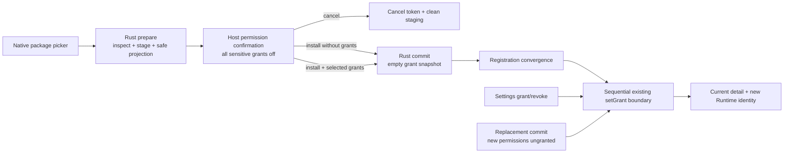

## Context

当前 Host 已经交付两层相互独立的基础：Task 5.5 的 `PluginPermissionService`/Rust permission coordinator 能投影权限、逐项 `setGrant`、持久化唯一 grant snapshot，并让授权变化推进 Registration revision 和终止旧 Runtime authority；Task 6.1 的 `PluginManagementService` 则串行组合安装、生命周期、替换、只读权限和数据管理服务。现有 React 页面只显示 effective permission 状态，虽然 permission service 已有 mutation 方法，但 management facade 与 UI 都没有暴露它。

首次安装是当前最大的结构缺口：用户从原生文件选择器选包后，Rust 在同一次命令中完成检查、提交和 Registration 发布，React 在 durable commit 前拿不到任何可安全展示的候选权限事实。替换已经具备 prepare/confirm/commit 和 permission diff，因此可以在不改变 replacement 持久化真相的前提下增加显式授权选择。

本 change 横跨 Rust/Tauri 首次安装 contract、Host-private TypeScript adapters/services、React 设置页、Runtime 失效反馈、双语文档和视觉/行为验证。授权 authority 仍只能来自 Plugin Manager grant snapshot；UI 的选中态、Manifest reason、Publisher 文本、Host source 和插件自报用户手势都不能成为 Runtime credential。

## Goals / Non-Goals

**Goals:**

- 在首次安装、同 identity 替换和设置详情中提供 Host-owned、默认拒绝、敏感权限逐项确认的统一交互。
- 让用户在 durable commit 前看到名称、版本、权限用途、风险、支持状态和 Publisher 未验证边界，同时允许零授权安装或替换。
- 复用现有逐项、revision-bound `setGrant` 作为唯一 grant/revoke 写边界；UI 不提交完整 grant array，installer/replacement 也不获得授权 authority。
- 让安装/替换 durable commit 与随后的授权步骤安全串行：任何后续 grant 失败都保持较窄的真实状态，不伪造回滚或整单成功。
- 让设置页 grant/revoke、冲突恢复、旧 Session 失效、反馈、键盘、焦点、英中双语和 light/dark 行为可验证。
- 保持官方与外部插件使用同一 catalog、风险规则、确认和授权算法。

**Non-Goals:**

- 不新增权限、Host API method、公共 SDK `permissions.request`、Runtime wire frame、plugin-to-Host 授权事件或浏览器权限 API。
- 不相信插件自报“这是用户手势”，不因任意 iframe 请求或 `permission_denied` 自动打开 Host modal。
- 不新增 denied/deferred 历史、时间戳、actor、审计日志或第二套 permission-decision store；两者都保持 `not_granted`。
- 不实现签名或 Publisher 验证、远程下载、自动更新、Catalog、Marketplace、文件/网络/Shell/进程权限或通用通知/路由平台。
- 不把多个敏感权限合并为批量授权，也不让“全选”或官方来源绕过逐项确认。
- 不改变 public Contract/SDK/UI/Testkit exports，不增加 runtime dependency、组件库或 Tauri plugin。

## Decisions

### 1. 权限提示使用 Host-owned display projection，作者事实与授权事实分层

新增冻结的 `PluginPermissionPromptItem`/candidate view model，由可信 Host 将 normalized Manifest request、当前 permission catalog 和当前 Registration/grant facts 合并。每项包含闭集 permission ID、Host 风险等级、当前支持状态、Host-owned 本地化权限名称/风险说明，以及 Manifest 提供的当前 locale reason；reason 缺失时按 Manifest 的既有 locale fallback 规则回退。作者 reason 必须显式标识为“插件提供”，不能覆盖 Host 风险文案。

安装/替换候选只向 TypeScript 返回最小安全投影：opaque preparation token、plugin ID、版本、normalized display name、Publisher 展示字段、requested permission IDs/reasons 和 replacement diff（如适用）。Host source 单独显示；本地外部包的 Publisher 始终标注“未经验证”，即便文本声称 lensX、official 或 verified。投影不包含完整 Manifest、路径、digest、package bytes、staging fact、grant set、Rust/Tauri object 或 raw error。

**替代方案：直接把完整 normalized Manifest 或 inspector result 发给 React。** 被否决，因为页面只需要少量展示事实，完整 payload 会扩大 private contract、路径/asset 泄漏和前端复制语义的风险。

### 2. 首次安装升级为 Host-private `0.2.0` prepare/commit/cancel contract

现有直接安装 contract `0.1.0` 被一个严格的 Host-private `0.2.0` 两阶段 contract 取代：

1. `prepare` 打开原生单文件选择器，读取同一组有界 bytes，完成 package/Manifest/asset/compatibility 检查，提取并校验 installer-owned staging，返回 `cancelled | prepared`。
2. `prepared` 在 Rust 进程内持有唯一 opaque token，绑定 candidate identity、immutable bytes/staging 和 inspected facts；不会写 Manager、推进 revision、发布 event 或创建 grant。
3. `commit` 仅接受该 opaque token，在现有 in-process/cross-process installer lock 内重新验证 token、staging、identity absence/quarantine 和 package facts，再沿用原子 payload/Manager 提交流程，且始终创建空 grant snapshot。
4. `cancel`、新 preparation、失败 commit、service destruction 或进程退出使 token 失效并尽力清理 staging；startup recovery 继续清理符合规则的残留 staging。

一个无关插件的 Registration revision 变化不必使首次安装 token 失效；commit 直接重新验证目标 plugin identity 仍不存在。相同 identity 在确认期间被安装或进入 quarantine 时必须 fail closed。所有 operations、results 和 errors 在 Rust/TypeScript 从 `unknown` 严格验证，旧直接安装 command 不再作为生产旁路保留。

**替代方案：先安装再展示权限。** 被否决，因为不满足“安装前知情”，并让用户在看到风险前已经产生 durable Registration。

**替代方案：只做 inspection、不 staging，确认后重新打开源路径。** 被否决，因为会产生 TOCTOU；prepare 与 commit 必须使用同一已检查候选，不重新读取用户路径。

### 3. 初始授权和新增授权在 durable commit 后逐项应用

首次安装和替换的 Rust commit 都保持各自既有 authority：首次安装创建空 grant snapshot；replacement 只保留旧 grants 与 candidate requests 的交集。确认 UI 可以记录用户明确允许的 permission IDs，但这些短暂选择不是授权。durable commit 与 Registration snapshot 收敛后，`PluginManagementService` 按稳定 permission ID 顺序逐项调用现有 `PluginPermissionService.setGrant`，并把上一结果返回的新 revision 用作下一次 `expected_revision`。

每个敏感权限必须先有独立 Host modal 确认；列表 checkbox/selection 默认关闭，不能一次确认多项、不能默认勾选、不能把“安装”按钮本身解释为授权。用户可以不选择任何权限继续安装/替换。拒绝某项或关闭其确认即不调用 grant；“稍后决定”关闭整组权限选择并继续 durable operation，二者都不持久化历史且保持 `not_granted`。

如果 durable install/replacement 成功而后续某项 grant 遇到 stale revision、persist failure、unsupported 或 convergence failure，Host 不回滚 payload 或版本，也不把未完成选择显示为 granted；它停止剩余 grant 序列，完整刷新 detail，显示“安装/替换已成功，权限仅部分或尚未应用”的安全反馈，并保留设置页恢复入口。

**替代方案：扩展 installer/replacement commit 接受完整初始 grant set。** 被否决，因为会复制 permission coordinator 的声明、支持、revision 与持久化授权规则，形成第二个 authority path。

**替代方案：增加批量 grant command 以追求全有或全无。** 被否决，因为首版只有两个独立敏感权限，较窄的逐项 fail-closed 状态比新的批量授权 contract 更容易验证，也符合逐项确认要求。

### 4. 替换只允许选择 candidate 新增权限

现有 replacement preparation 继续报告 `added_permission_ids` 与 `removed_permission_ids`。确认界面将 retained grants、removed requests 和 added requests 分开展示：retained grants 不再次确认，removed requests 在 commit 时按既有 intersection 规则失去 grant，只有 added 且当前 Host 支持的敏感权限能进入默认关闭的选择区。任何选择在 replacement durable commit 前都不调用 `setGrant`。

替换 token 或 Registration revision 变化会关闭旧确认、取消 preparation 并清空所有暂存选择；刷新后必须重新选包和决定。downgrade/reinstall 与 upgrade 使用同一规则，版本方向、Publisher 或 source 不影响授权。

### 5. 设置页通过 management facade 提供逐项 grant/revoke

`PluginManagementService` 扩展 permission mutation、confirmation 和 operation availability，但仍是唯一给 React 的管理 facade。grant 仅对 healthy、current、Manifest-requested、Host-supported 且 effective `not_granted` 的 permission 可用；点击后打开单权限 sensitive confirmation，确认才调用 `setGrant({entry_id, expected_revision, permission_id, granted: true})`。revoke 对真实 persisted grant 可用，并使用明确撤销确认后提交 `granted: false`。

permission mutation 与安装、替换、生命周期和数据操作共享页面级单一 mutation；pending 禁止重复提交。成功后 facade 等待返回 revision 通过 Registration full snapshot/detail 收敛，UI 不做 optimistic grant。conflict 关闭过期 modal、清除选择、刷新并要求重新决定；幂等 `unchanged` 仍以当前 snapshot 为准。

撤销成功会沿用现有 permission coordinator 终止受影响的旧 Session/Port/pending calls。设置页明确宣布权限已撤销以及活动插件页面可能已关闭；它不自动重开页面、不模拟 Runtime 错误，也不影响无关插件。

### 6. 运行时保持 capability/error 模型，不接受插件驱动的自动 prompt

缺失 grant 时，Page/Action availability、Runtime Context capability 和 Host API `permission_denied`/`unavailable` 继续按现有规范工作。Host 不从 iframe RPC、Manifest reason、SDK payload 或插件声明的 user activation 推断授权意图，也不在方法失败时自动弹 modal。插件可在自己的 UI 中解释受限功能，并通过既有 Host Action 导向普通设置入口，但真正 grant 只能由用户在 Host-owned surface 再次明确操作。

这避免 prompt spam、后台插件诱导和新的 public permission request/wire contract，同时满足“运行时体验明确”：能力缺失时插件得到稳定可分支状态，撤销时旧 Runtime authority 立即终止，用户从执行撤销的 Host surface 收到可操作反馈。

### 7. 权限交互复用 Semi Design 与既有连续设置表面

安装/替换/敏感 grant/revoke 使用 Semi Design `Modal`、`Button`、`Checkbox`、`Tag`、`Banner` 和 `Typography`；简单排列用 UnoCSS，权限列表、风险层级、滚动、focus/hover/pending 等复用语义样式用 Less。不会新增卡片系统或组件库。

canonical English locale 定义全部 Host copy，并维护语义一致的 `zh-CN`、message schema 和 key parity。permission ID 不是唯一可见名称；风险、支持、作者 reason、未验证 Publisher、结果和错误都使用文本/语义而非颜色。Modal 支持键盘、可访问标题/说明、初始焦点、Esc/cancel、pending 防关闭和关闭后返回触发器；取消 prepared install/replacement 后焦点回到对应入口，grant/revoke 收敛后回到原权限行。固定 `650×600` native page viewport 覆盖两语言、两主题、长 reason、全部未授权、部分授权、unsupported、conflict 和 partial-grant feedback。

### 8. 私有边界、测试和文档随交互扩展

installation preparation contract、permission prompt view、management mutations 与 adapters 继续只存在于 Rust Host 和 trusted root application；Contract/SDK/UI/Testkit、official/example plugin 和 iframe Runtime 均不得导入或调用。focused gate 组合：installation `0.2.0` Rust/TypeScript fixtures、token/staging recovery、permission prompt derivation、management service orchestration、grant/revoke and revision conflicts、Runtime invalidation、public-package boundaries、i18n/schema、keyboard/focus、截图/computed styles 和现有 permission/installation/replacement regressions。

英文 `extension-platform`、frontend guidelines、validation 文档及其中文镜像说明 shipped/proposed 边界、默认拒绝、Publisher 未验证、post-commit grant、partial failure 和无自动 runtime prompt。实现完成前不得把本 change 描述为 shipped。

## Risks / Trade-offs

- **[风险] durable 安装成功后 grant 序列部分失败]** → 每项独立 fail closed，停止后续写入、完整刷新并明确区分 durable operation 与实际 grant；不回滚已提交 package，也不伪造全成功。
- **[风险] preparation 持有 staging 导致磁盘残留]** → 每进程最多一个 token，新 prepare/cancel/failure/destroy 清理，token 不跨重启，startup recovery 只清理可证明的 staging。
- **[风险] confirmation 期间目标 identity 或 revision 变化]** → first install commit 重新检查 identity absence；replacement/settings 绑定 exact revision；冲突关闭旧 modal 并要求重新决定，绝不自动重放。
- **[风险] 用户把 Publisher 或 reason 当作验证事实]** → Host 风险说明和未验证标签固定显示，作者 reason 分区呈现，source/official provenance 不改变确认或 grant。
- **[风险] 插件通过重复失败请求制造 prompt spam]** → Runtime 失败永不自动打开 Host prompt，grant 入口只在 Host-owned explicit interactions。
- **[风险] 权限 modal 和长双语 reason 挤压固定窗口]** → 使用一项一确认、可滚动连续表面和固定 viewport 视觉/键盘验收，不扩大原生窗口或引入任意尺寸。
- **[权衡] denied 与 deferred 不可在重启后区分]** → 保持单一 grant authority 和无迁移；两者都清楚说明未授权，设置页始终允许以后授予。
- **[权衡] grant 会重建受影响的 Runtime Session]** → 保持 immutable identity 与立即撤销语义，不引入热授权协议；用户通过明确反馈理解活动页面可能关闭。

## Migration Plan

1. 增加 local installation `0.2.0` prepare/commit/cancel Rust/TypeScript contract、process-local token、safe candidate projection 和 recovery tests；在切换生产入口前保持现有行为测试可比较。
2. 扩展 permission prompt derivation 与 `PluginManagementService` orchestration，使用 fake installation/replacement/permission services 验证零授权、逐项 post-commit grant、partial failure、conflict 和销毁清理。
3. 将 Plugins 设置入口原子切换到新的 preparation flow，并加入安装、替换、settings grant/revoke UI、i18n、theme、keyboard/focus 与视觉证据；移除生产直接安装旁路。
4. 更新英中文档和 focused gate，顺序运行相关 permission、installation、replacement、management、Runtime 回归以及完整 frontend/Rust 验证。

没有磁盘 schema 迁移：现有 Manager record 与 grant snapshot 保持不变，首次安装仍以空 grant 创建。回滚 UI/installation `0.2.0` 时必须先取消 process-local preparations；startup recovery 可清理残留 staging。已经由用户授予的 grants 不能在回滚时静默删除，旧 permission core 会继续强制执行它们；回滚后的产品若没有 grant UI，应明确作为功能回退限制而非伪造撤销。

## Open Questions

无阻塞问题。首版明确采用零授权可安装、敏感权限逐项默认关闭、durable commit 后复用单项 `setGrant`、不持久化 denied/deferred 历史以及不接受插件驱动 runtime auto-prompt；实现如需改变其中任一边界，应先更新本 change 并重新评审，而不是在代码中扩张范围。
