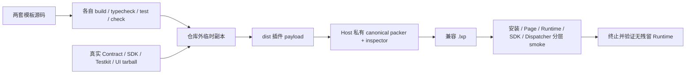

## Context

当前仓库分别维护了公共 Plugin Contract、SDK、Testkit、可选 Plugin UI、Host 私有 canonical `.lxp` reference packer/inspector，以及安装、资源、iframe Runtime、Runtime Session、Host API Dispatcher 和 RPC 校验。各公共 package 都有真实 tarball 的隔离 consumer，但这些 consumer 只证明单个 package 的发布边界：它们没有完整 Manifest、Page、Action 和可安装插件产物，也不会共同经过真实 Host 执行链。

Task 6.3 需要提供一个共享的“正确用法”而不是新平台层。官方插件和第三方插件必须使用同一模板、公共 package 和安全边界；模板不能导入 Host 私有代码、Tauri adapter、package-format 工具或未导出的 package 子路径。Task 6.4 才会把创建、验证和打包封装成公共 CLI，因此本 change 可以在仓库验证门禁中调用 Host 私有 reference packer，但不能把该调用暴露为模板公共命令。

## Goals / Non-Goals

**Goals:**

- 在 `examples/plugins/*` 中维护 framework-neutral TypeScript 和 React/Semi 两个直接 workspace member，作为可复制的正式模板。
- 让模板源码本身使用普通公共 SemVer 依赖，复制到仓库外后不需要 `workspace:*`、lensX 私有源码或本地路径。
- 用无权限示例展示完整 Manifest → Action → Page → iframe SDK 初始化 → Runtime context → 清理链路。
- 同时验证模板级单元测试、仓库外真实 tarball 消费、canonical `.lxp` 打包和生产边界 Host smoke。
- 保持英文默认、简体中文对齐、light/dark、键盘操作、焦点与可访问状态反馈。

**Non-Goals:**

- 不提供公共 generator/CLI、公开 packer、Development Mode、watch 或 hot reload。
- 不增加或改变 Manifest、Host API、SDK、Runtime Session、RPC、权限或安装协议。
- 不演示剪贴板、存储等需要权限或 Host 状态的业务能力。
- 不为官方来源建立单独依赖图、Runtime、权限或 CSP 路径。
- 不把两套模板抽象成可配置模板引擎；变量替换和交互式创建留给 Task 6.4。

## Decisions

### 1. 两套模板是 `examples/plugins/*` 下的直接 workspace member

使用以下固定位置和私有 package 名称：

- `examples/plugins/framework-neutral` → `@lensx/example-plugin-framework-neutral`
- `examples/plugins/react-semi` → `@lensx/example-plugin-react-semi`

这两个位置已经被 pnpm workspace、workspace lifecycle 和 dependency-boundary 规则支持，因此根级 `build`、`typecheck`、`test`、`check` 会自动覆盖它们，官方插件与示例插件也继续受同一公共依赖规则约束。每个模板都声明完整的四个 lifecycle script，且不作为 npm package 发布。

**备选方案：**把模板放在新的 `templates/**` 目录。该方案会绕过现有 workspace member 发现、生命周期排序和边界检查，还需要建立第二套规则，因此不采用。

**备选方案：**只维护一个带条件分支的模板。没有 Task 6.4 的生成器时，条件文件会让模板本身不可直接运行，并模糊 React 与 framework-neutral 的依赖差异，因此本 change 使用两个完整而小的工程。

### 2. 模板使用普通 SemVer，仓库通过 workspace linking 消费当前实现

模板的 `package.json` 对 `@lensx/plugin-contract`、`@lensx/plugin-sdk`、`@lensx/plugin-testkit` 和可选 `@lensx/plugin-ui` 使用与当前 `0.1` 协议线一致的普通 SemVer 范围，而不是 `workspace:*`、`file:` 或仓库相对路径。根 workspace 显式启用匹配版本的 workspace linking，使仓库内开发消费当前 workspace package；仓库外验证则通过临时 consumer 自己的 pnpm overrides 指向本次构建产生的真实 tarball，不改写模板源码。

模板不会读取根 `node_modules`。隔离安装只在临时 consumer 目录中使用机器配置的全局 pnpm store；仓库根命令不得传入 `--store-dir`，也不得创建或引用仓库内 `.pnpm-store`。

**备选方案：**模板源码使用 `workspace:*`，复制时再重写。这会使直接复制的工程天然无效，并把关键正确性推迟到未来 CLI，因此不采用。

### 3. 两套模板共享行为契约，但不共享 Host 或框架私有代码

每套模板包含一个独立、合法、可安装的 Manifest，使用不同的 namespaced plugin ID，并贡献一个 Page、一个指向该 Page 的 Action 和可选默认 Launcher Action。`requested_permissions` 为空或省略，示例不调用存储、剪贴板或其他授权能力。

两套 Runtime 都从 `@lensx/plugin-sdk/iframe` 创建 official transport，再通过 `createPluginSdk` 初始化。它们读取并响应完整 Runtime context：

- `locale` 在 `en-US` 与 `zh-CN` 之间选择模板自有文案，英语为默认回退；
- `theme` 反映到当前插件 document；
- `runtime.context_changed` 用完整 replacement 更新当前视图；
- 初始化失败显示有界、可访问的错误和显式 retry；
- Page 退出、unmount 或 retry replacement 经过同一个幂等 cleanup，取消订阅、卸载 UI 并 dispose SDK client。

Framework-neutral 模板使用 TypeScript、DOM 与现有 Rsbuild/Rstest 工具，不安装 React、React DOM、Semi Design 或 Plugin UI。React/Semi 模板由 React 负责视图和交互状态，使用 `PluginUiProvider`、`PluginPage`、`PluginFeedback` 与 Semi Design 控件；React、React DOM 和插件 UI Runtime 均由插件 bundle 自己拥有，Host 不提供 externals、globals 或 React Context。

两套模板的构建输出统一为自包含 `dist/` payload，其中 `manifest.json`、`index.html` 和 Manifest 引用的所有脚本、样式或资源均位于 package-local 路径。CSP 不依赖 inline script、eval、远程资源、网络请求或 author-selected policy。

### 4. 模板测试使用 Testkit；生产 smoke 明确不使用 Testkit fake

每个模板的常规测试使用真实 Contract validator 和真实 SDK client，并注入 `FakePluginSdkTransport` 覆盖：

- 合法 Manifest 与实际 Page/Action 引用；
- English/light 与 Chinese/dark context；
- 初始化成功、失败、显式 retry、context replacement 和幂等 dispose；
- 可访问 loading/error/ready 反馈和 React 模板键盘/焦点行为。

Testkit 只用于插件作者侧测试。专用生产 smoke 使用构建后的真实模板 payload、公共 SDK iframe transport 和现有 Host 私有生产组件，不导入 Testkit，也不把 fake transport 当成 Host API 或权限实现。

### 5. 专用门禁分三层证明“外部可用、可打包、可运行”

根级新增一个聚合入口 `pnpm run check:plugin-project-template`，包含三层互补验证：

1. **External project gate**：构建真实公共 package tarball，将每套模板复制到仓库外临时目录，通过 consumer-local overrides 安装这些 tarball，运行模板的 `test`、`typecheck`、`build` 和 `check`，并拒绝 workspace/local-path spec、Host 私有/Tauri import、未导出子路径、回链仓库的 symlink 或 root `node_modules` 解析。
2. **Package gate**：从每个临时模板的 `dist/` 收集普通文件，由仓库 Host 私有 reference packer 生成两次 `.lxp`，要求 byte-for-byte 相同；随后由 TypeScript inspector 和 Rust Host package/installer 测试接受同一产物为 compatible，并验证所有 Manifest resource 都被 checksum 覆盖。生成的 `.lxp` 只存在于临时目录，不提交到仓库。
3. **Production-boundary Runtime gate**：以模板的真实 Manifest 和构建入口经过当前 Registration/Page projection、resource/Runtime resolution、Runtime Session、公共 iframe transport、Host adapter、Dispatcher `runtime.get_context` 和 terminal cleanup。该层要求真实 public codec、MessagePort、RPC validation 和 Dispatcher 参与，不允许 Testkit fake；它可以复用现有可确定的 production-component harness，而不启动脆弱的整应用 GUI 自动化。

真实 macOS WKWebView 的 CSP、custom protocol 和隔离证据继续由现有 Runtime/transport gates 负责。本 change 的 smoke 验证“模板产物接入已证明的生产边界”，不复制整套 WebView 安全矩阵。

**备选方案：**只运行模板的编译和 Testkit 测试。它无法证明模板的资源布局、`.lxp`、真实 iframe transport 或 Host Dispatcher 接线，正是先前把正式模板后移到 Task 6.3 所要避免的结果，因此不采用。

**备选方案：**新增完整 Tauri GUI end-to-end runner。它会把窗口焦点、原生文件对话框和 WKWebView 时序引入模板门禁，重复现有 target-WebView 证据且降低确定性，因此采用上述 production-component smoke。

### 6. React 模板增加行为与视觉矩阵，文档保持窄范围

React/Semi 模板复用现有 UI package 的主题和 locale 机制，并在固定插件视口验证 `en-US`/`zh-CN`、light/dark、loading/error/ready、键盘 retry、焦点可见性、长文本和关键 computed styles。Framework-neutral 模板通过 DOM 行为测试验证相同语义，但不复制 lensX UI 视觉语言。

新增 `docs/en/development/plugin-project-template.md` 及对应 `docs/zh/` 镜像，记录模板选择、目录结构、公共边界、生命周期命令、当前无公共 pack CLI 的限制，以及未来 Task 6.4/6.5 的职责。两种语言索引和现有 Plugin Workspace 文档链接到该文档。完整从创建到开发模式的教程仍由 Task 6.6 负责。

## Risks / Trade-offs

- **[普通 SemVer 在 workspace 中可能错误解析到 registry]** → 显式启用匹配版本 workspace linking，并用 lockfile/隔离 tarball 门禁分别证明仓库内与仓库外解析来源。
- **[两套完整模板发生行为漂移]** → 共享可观察验收矩阵和根级 gate，不共享会把框架依赖重新耦合的业务源码；Manifest 与 Runtime 行为差异必须显式测试。
- **[Host 私有 packer 被误认为模板 API]** → packer 只由根级验证脚本调用，模板依赖和命令中不存在 `tools/**`、内部 pack import 或公开 `pack` 命令；Task 6.4 再建立公共 CLI。
- **[分层 smoke 被误述为完整 GUI E2E]** → 文档明确 production-component 与 existing WKWebView evidence 的分工；门禁名称和诊断描述实际覆盖范围，不宣称自动操作完整桌面窗口。
- **[无权限示例不足以教授业务 Host API]** → 保持起步模板最小且安全；Host API、权限和真实能力教程留给 Task 6.6，模板只证明 `runtime.get_context` 与执行主链。
- **[模板产物或截图增加仓库噪声]** → `.lxp`、临时 consumer 和普通 build output 均生成到系统临时目录并清理；只提交稳定模板源码、测试、必要视觉基线和文档。

## Migration Plan

1. 增加两个 template workspace member 和匹配版本 workspace linking，更新 lockfile，并先通过 workspace lifecycle/boundary 测试。
2. 实现各模板的 Manifest、Runtime、测试和构建产物布局。
3. 增加 external project、package 和 production-boundary Runtime 三层 gate，再将其接入根级检查。
4. 增加 React 模板视觉矩阵和双语工程文档。
5. 完成全量 frontend/Rust 验证后再勾选路线图 Task 6.3。

本 change 不迁移用户数据、已安装插件或协议版本。回滚时删除新增 workspace member、专用门禁和文档，恢复 workspace 配置与 lockfile；因为没有持久化迁移或公共协议变更，不需要兼容读取或数据恢复步骤。

## Open Questions

无阻塞问题。Task 6.4 可以决定 CLI 最终如何复制、命名和替换模板字段，但不能改变本 change 已验证的模板公共依赖与 Runtime 安全边界。
