## Context

Task 6.4 已交付 `@lensx/plugin-cli` 的 `create`、`build`、`validate`、`pack` 和 `inspect`。作者侧 `validate` 可以在不执行构建的情况下检查自包含 `dist/`，正式 Host 则只接受 canonical `.lxp`，将验证后的 payload 提交到 installer-owned digest 路径并以 `source=external` 注册。当前 Plugin Manager 的健康注册全部对应持久化安装记录，Registration Contract `0.1.0` 只允许 `builtin | external`。

Task 4.4 及后续 Runtime/SDK/Host API 工作已经提供 generation-aware Resource scope、单 iframe Runtime attempt、真实 window/origin/nonce/Port Session、CSP、权限判断和终止清理。当前 retry 或 package replacement 会创建新 attempt，但没有开发目录、开发来源或手动 reload 边界。

本 change 面向本地插件作者、官方插件维护者和调试 Host 的 lensX 开发者。开发输入仍是不可信的本地目录；“本机文件”“开发模式”或 publisher 文本都不能建立来源信任、权限或 Runtime 例外。正式 `.lxp` installer、public CLI 和公共 SDK 不能依赖 Host-private development implementation。

建议的数据流如下：

```mermaid
flowchart LR
    Project["Plugin project"] -->|"lensx-plugin build"| Dist["Self-contained dist/"]
    Dist -->|"native folder picker"| Inspect["Rust bounded directory inspection"]
    Inspect -->|"compatible"| Stage["Host-owned staging snapshot"]
    Stage -->|"atomic publish"| Generation["Current development generation"]
    Generation --> Registry["Process-local Plugin Manager entry"]
    Registry --> Resource["Existing scoped Resource service"]
    Resource --> Runtime["Existing isolated iframe Runtime"]
```



## Goals / Non-Goals

**Goals:**

- 只在明确支持该能力的非正式构建中提供 Development Mode，并要求每个应用进程由用户显式开启。
- 从原生目录选择器接收一个自包含 `dist/`，以 Host-private Rust 边界完成有界读取、内容校验和 Host-owned snapshot 提交。
- 让开发注册以 `source=development` 进入现有 Registration、Page/Action projection、Resource、Runtime、Host API 和权限主路径。
- 让手动 reload 即使内容未变化也创建新的 resource generation 和 Runtime attempt；任何失败都保留旧 generation 可用。
- 让插件设置清楚显示 Development、Unpacked、Unsigned，提供 register/reload/remove 和安全诊断，并满足中英文、light/dark、键盘和焦点恢复要求。
- 通过共享目录 corpus、确定性 race tests 和目标 macOS WebView 证据证明开发路径没有引入安全放宽或残余旧 Session。

**Non-Goals:**

- 自动 watch、HMR、自动 reload、后台 daemon 或在 Host 内执行项目 `build` script。
- 接受项目根目录、源码入口、symlink、special file、远程 URL 或 `.lxp` 以外的另一种发布包格式。
- 持久化 Development Mode 开关、开发目录授权、开发注册、grant、snapshot、scope 或 Runtime 状态。
- 让开发注册覆盖、shadow、升级或修复同 ID 的 builtin、external、quarantine 或另一个 development 注册。
- 修改 Manifest/Host API/SDK/Plugin UI/Testkit 的公共协议，或提前实现签名、verified publisher、provenance、发布与 Marketplace。
- 为开发来源放宽 CSP、iframe sandbox、Session 身份、Host API capability、权限、兼容性、资源限制或 crash breaker。

## Decisions

### 1. 使用双重构建门控和进程内显式开关

新增默认关闭的 native `plugin-development-mode` feature，并为 frontend build 提供同源、默认 `false` 的 compile-time capability。专用开发启动命令同时打开两者；正式 build/check 证明 frontend bundle 不包含开发 UI/command 调用，Rust command registration 和 development managed state 也不存在。即使构建包含能力，native process-local switch 每次启动仍为 `false`，只有 Host settings 中的显式用户操作可以开启；关闭开关会先 remove 全部开发注册并终止相关 Runtime，再撤销目录操作能力。

frontend 还会读取一个最小 Host capability snapshot，并且只有 compile-time capability、native capability 和会话开关共同成立时才显示或允许目录操作。native command 始终再次校验自身 feature 和会话开关，frontend 状态不是授权依据。

选择该方案而不是只依赖 `import.meta.env.DEV`，因为前端开发标志不能证明 native command 是否存在，也不能保证正式二进制没有可调用入口。选择显式 feature 而不是 debug assertion，是为了让测试、dogfood 和发行构建的能力组成可复现。

### 2. 原生选择目录，frontend 永不接触绝对路径

`register` 使用 pathless Tauri command 打开原生目录选择器。选择结果、canonical path、snapshot root 和原始 I/O 错误只保留在 Rust；frontend 只收到 versioned、strict、bounded 的 result/error、opaque entry identity、plugin ID/version 和安全 diagnostics。`reload`、`remove` 使用 opaque entry identity、预期 Registration revision 和 operation token，不接受 frontend 提交路径或 plugin ID 作为 authority。

选择该方案是为了沿用 local installation 的来源授权和隐私边界，避免在 React state、日志、events 或序列化 contract 中暴露开发者绝对路径。

### 3. 只接受自包含 `dist/`，不执行构建

目录根必须直接包含 `manifest.json` 和 Manifest 引用的全部 Runtime/asset 文件。Rust development inspector 只读取普通文件，不跟随链接，执行 portable path/case collision、文件数量/单文件/总大小、Manifest、resource completeness 和当前 Host compatibility 检查；它不读取 `package.json`、不检查项目 imports、不运行 `pnpm`，也不生成或要求 `checksums.json`。

CLI `validate` 继续负责项目 metadata/import 和 `dist/` payload 两层规则。新增共享 directory corpus 只比较双方共同拥有的 payload 语义；不能把 CLI 项目级拒绝错误要求为 Host 结论。这样既避免 Host 执行作者工具链，也避免复制第二套项目系统。

### 4. Runtime 只读取 Host-owned immutable snapshot

每次 register/reload 都在 `app_cache_dir()/plugin-development/<process-id>/` 下创建唯一 staging generation。Host 以有界方式复制已授权目录中的普通文件，拒绝 root/entry link 和读前后不一致，随后只对 staging bytes 执行完整校验。成功后 flush 必要的文件/目录并原子 rename 为不可变 generation；失败删除该请求 staging，且不发布任何 registration/resource fact。

snapshot 使用按排序 portable path、长度和文件 bytes 计算的 domain-separated SHA-256 identity，例如 `sha256-development-tree-v1`。它不是 `.lxp` package digest，也不进入 public Registration Contract。Plugin Manager 的 Host facts 改为严格 payload variant：持久化 installed payload 继续持有 canonical package path/digest；进程内 development payload 持有 snapshot root/identity 和原始目录 capability。只有 Host-private code 可以读取任一 variant。

选择 snapshot 而不是 Runtime 直接读取作者目录，是为了消除 validation/read 之间的目录修改、symlink replacement 和 mixed-generation 风险，并让现有 scope/generation currentness 继续成立。选择 cache snapshot 而不是先写 `.lxp`，是为了保留快速反馈且不把开发产物伪装成正式 package。

### 5. 开发注册属于同一个 Manager read model，但不进入 Store

Plugin Manager 继续是 Registration 当前事实的唯一 Host-private来源。其 snapshot 同时包含持久化 installed entries 和 process-local development entries，并使用同一个 plugin ID 唯一性、revision、resource generation、compatibility、enabled、grant 和 diagnostic 模型。development entry 从不调用 Store write/delete，也不会形成 quarantine record；进程退出后自然消失，启动 recovery 只恢复已有 installed records。

register 默认 `enabled=true`、Runtime `inactive`、grants empty。若同 ID 已存在 builtin、external、quarantine 或 development identity，操作返回稳定冲突且不覆盖。reload 必须保持 plugin ID；可以更新 version、Manifest metadata、资源和 requested permissions。它只保留仍被新 Manifest 声明的旧 grant，删除不再声明的 grant，并让新增 request 保持未授权。remove 删除进程内 entry 和 snapshot，不删除 plugin data 或 Launcher collections。

选择同一 Manager read model 而不是建立第二套 frontend registry，是为了让 Registration projection、Page/Action、permission、Runtime invalidation 和 UI 全部 dogfood 正式路径；payload lifetime variant 则避免把临时目录伪装成已安装记录。

### 6. Registration Contract 独立升级到 `0.2.0`

Registration summary/detail source 扩展为 `builtin | external | development`。由于 `0.1.0` TypeScript parser 对 closed enum fail closed，新增值会改变 wire compatibility，所以 snapshots、details、events、Rust fixtures 和 TypeScript parser 一起升级到 `0.2.0`；不增加双版本适配或 silent fallback。

Contract 仍不暴露目录、snapshot root/identity、package digest、feature、operation token、signature 或 grant authority。`development` 只表示 Host 创建了当前进程内开发注册，不表示 official、verified、signed 或额外权限。

### 7. reload 是 compare-and-commit 的强制新 generation 事务

reload 流程为：

```mermaid
sequenceDiagram
    participant UI as "Plugin settings"
    participant Dev as "Development coordinator"
    participant PM as "Plugin Manager"
    participant RT as "Runtime lifecycle"
    participant FS as "Snapshot storage"

    UI->>Dev: reload(entry_id, expected_revision)
    Dev->>FS: copy and validate a new staging snapshot
    Dev->>PM: compare current identity and commit development replacement
    alt validation or conflict fails
        Dev->>FS: remove staging
        Dev-->>UI: safe failure; old generation remains current
    else commit succeeds
        PM-->>RT: changed revision and resource generation
        RT->>RT: terminate old attempt and all owned resources
        Dev->>FS: retire old snapshot after publication
        Dev-->>UI: success with new version/generation facts
        UI->>RT: explicit reopen/retry of the current Page
    end
```

即使 snapshot identity 与当前值相同，显式 reload 仍强制 advance affected plugin 的 Registration revision/resource generation，从而不会被普通 no-op replacement 优化吞掉。Manager commit 之前旧 scope/Runtime 保持可用；commit 之后旧 scope 立即 fail closed，旧 attempt 经既有 invalidation 终止。页面仍为当前目标时，Host 执行一次显式 reopen；reload 不建立持续自动重试。

### 8. 开发 UI 是现有 Plugins 设置的一部分

使用 Semi Design Switch、Button、Tag、Banner/Modal 等现有组件，不引入依赖。能力可用但会话开关关闭时，页面显示一段明确风险说明和“Enable Development Mode”控制；开启后显示“Register development directory”。development entry 使用文本标签同时呈现 Development、Unpacked、Unsigned，并提供 Reload 和 Remove。普通 external/builtin/quarantine entry 不显示这些操作。

所有文案进入 English canonical i18n 和 `zh-CN` 镜像。pending 时禁止重复操作和关闭竞态；成功、取消、invalid、incompatible、source changed、conflict、snapshot cleanup pending 等状态使用安全文案。Modal/确认、键盘顺序、live announcement 和操作后焦点恢复遵循现有管理页面语义，状态不只依赖颜色或图标。

### 9. 验证同时覆盖安全等价与开发专属事务

Rust tests 覆盖目录 walker、race/link/limit、snapshot 原子性、process-only Manager entry、contract `0.2.0`、scope currentness、reload/remove/disable/permission races 和 crash residue cleanup。TypeScript/React tests 覆盖 strict parsing、typed service convergence、capability/session gating、来源标签、错误、i18n/theme、键盘和焦点。共享 corpus 证明 CLI/Host payload 结论重叠部分一致。

目标 macOS WebView harness 必须证明 register/open/reload 后旧 scope、iframe、Session、nonce、Port、listener、timer、pending RPC 和 privileged handler authority 全部失效，新 generation 完成正常 handshake，并且 CSP、sandbox、Permissions Policy 和 Host API authorization 与 external 插件相同。正式 build artifact gate 证明没有开发 UI、command registration 或 managed state。

## Risks / Trade-offs

- [每次 reload 需要复制完整 `dist/`，大型插件可能比直接读目录慢] → 沿用严格总大小限制，只复制普通文件；优先保证 generation 安全，不在本 change 引入增量 snapshot。
- [作者在复制期间持续写文件可能造成不一致输入] → 对 root 和每个文件执行 link/type/metadata 检查，在 Host-owned staging 上重新验证；检测到变化时返回可重试的 `source_changed`，绝不发布部分 generation。
- [Registration Contract 升级会同时影响多层 fixture 和 parser] → 一次性迁移 Rust serializer、TypeScript exact parser、events、shared fixtures 和所有 consumers，不维护含糊的双版本路径。
- [process-local 开关和注册要求应用重启后重新选择目录] → 用更窄的安全与正式构建隔离换取可控范围；持久化属于后续独立设计。
- [开发 reload 修改 requested permissions 时可能造成授权误解] → 只保留新 Manifest 仍声明的旧 grant；新增权限保持未授权并走现有明确授权流程，UI分别显示 request 与 grant。
- [commit 后旧 snapshot 清理失败] → 旧 generation 已被 scope currentness 撤销，记录 bounded cleanup diagnostic 并在当前 process 的受限 development cache recovery 中重试；失败不回滚到旧 authority。
- [frontend/native build flag 漂移] → 运行时 capability handshake fail closed，专用 build script 同时设置两端，release/boundary gate 检查二进制和 bundle 均无开发入口。

## Migration Plan

1. 先引入 feature/capability gate、Registration Contract `0.2.0` 和 Manager payload lifetime model，在 development capability 关闭时保持现有 installed snapshot 与行为不变。
2. 增加 Rust directory inspector、snapshot storage 和 process-local coordinator，完成 shared corpus 与事务测试后再连接 Resource service。
3. 接入 reload terminal lifecycle 和目标 WebView harness，确认旧 generation 完整失效后再暴露 frontend service。
4. 最后增加 Plugins 设置 UI、双语文档和专用开发启动命令；正式 build 默认继续关闭 feature。
5. 回滚时关闭/移除 feature 即可恢复原正式路径；development entries 不持久化，现有 Store format、`.lxp` payload 和 installed registrations 无需迁移。

## Open Questions

无阻塞问题。command、diagnostic 和 build-script 的最终标识在实现时应遵循现有命名约定，但不得改变本设计确定的能力门控、process-local lifetime、snapshot、contract version 和 reload 原子性。
