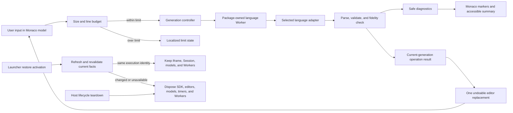

## Context

Task 7.1 已提供面向 `plugins/official/*` 的独立发布流水线，Task 6.x 与 `adopt-open-isolated-plugin-runtime` 已提供公开 Contract/SDK/UI/Testkit/CLI、普通 `.lxp` 安装、隔离 iframe Runtime、Dedicated Worker 和确定性 teardown。当前缺口不是再建一层 Host 能力，而是用首个真实产品成员验证这些边界能否承载具有重型编辑器、异步语言处理和真实发布生命周期的插件。

`ConfigLens` 面向用户粘贴或输入的配置文本。四种目标语言具有不同的语义风险：JSON 的数字与转义容易被普通对象序列化破坏；YAML 具有注释、anchor、tag、多文档和别名资源风险；TOML 的注释、顺序和日期时间类型需要专用 formatter；XML 的文本与空白可能具有语义，且 DTD/实体不得触发外部访问。因此 Monaco 只负责编辑体验，不能被当作四种语言完整且安全的解析/格式化实现。

实现利益相关方包括使用 ConfigLens 的用户、维护官方插件的贡献者、公共插件平台维护者以及复核候选产物和依赖供应链的发布维护者。设计必须同时满足产品可用性、公开边界 dogfood、目标 macOS WKWebView 行为和独立发布可复现性。

首次完整实现后的真实交互验收发现：Rust `hide` 只隐藏 Launcher，但恢复时的 typed activation 会刷新 Page facts；`PageRegistry.lookup` 返回的语义等价新对象随后被 `PluginRuntimeFrame` 当作新请求依赖，导致 effect cleanup、iframe/Session 重建和 ConfigLens 内存输入丢失。这不是 Page close，也不是 ConfigLens 临时内容合同允许的 teardown；修复必须位于通用 Host Page/Runtime 组合边界。

## Goals / Non-Goals

**Goals:**

- 以 `dev.lensx.config-lens` / `@lensx/official-config-lens` / `plugins/official/config-lens` 三个稳定身份交付中英文均名为 `ConfigLens` 的首个官方插件。
- 使用单一 Monaco model 提供高质量查看、编辑、语法高亮、诊断 marker、撤销和键盘体验，并把重型语言工作隔离到插件自有 Worker。
- 为 JSON、YAML 1.2、TOML 1.0、XML 1.0 定义保守、确定性、可回归的校验与格式化语义。
- 通过公开插件边界、普通安装和现有隔离 Runtime 完成开发、打包、安装、运行、关闭、禁用、升级与卸载闭环。
- 在当前插件的 entry、Page、version、origin、resource generation 与 Runtime attempt 均未变化时，让 Launcher 隐藏/恢复保持同一 Session、iframe 和 Page 内存；平台仍须在恢复时刷新并复核当前 facts，全局 Registration revision 只作为 invalidation hint。
- 将依赖、bundle、输入资源上限、生命周期和真实 WKWebView 行为变成自动化证据。

**Non-Goals:**

- 不做格式转换、schema/语言服务器、远程资源解析、云服务、历史记录、默认持久化或原生文件/剪贴板集成。
- 不做格式化结果预览、前后 Diff、Apply result、fresh/stale 结果管理或其他变更应用工作流。
- 不扩展 Manifest、Host API、Tauri 命令、官方来源信任、插件权限或跨插件通信。
- 不把四种语言适配器抽象成新的公共 lensX 包或通用 Host 语言平台。
- 不以自动修复容错输入替代标准一致的语法错误，也不承诺无限输入规模。

## Decisions

### 1. ConfigLens 是普通公开边界插件和独立 release unit

以 React/Semi 正式模板为起点创建 `plugins/official/config-lens`。Manifest `0.2.0` 只贡献一个 `main` Page、一个指向该 Page 的 `open` Action 和默认 Launcher Action；中英文 display、Page 与 Action 文案均使用品牌 `ConfigLens`。运行依赖仅使用 `@lensx/plugin-sdk`、`@lensx/plugin-ui` 公开 exports 和普通前端包，测试使用 `@lensx/plugin-contract`、`@lensx/plugin-testkit` 和 CLI 生命周期，不导入 Host、Tauri、内部 packer 或其他插件源码。

官方目录只提供维护和发布身份。Host 仍把候选交给普通 `.lxp` inspector、安装准备、registration、Resource、iframe Runtime 与 Session 流程，不根据仓库路径、Publisher、GitHub Release 或 audit sidecar 增加权限。

备选方案是让 Host 内置工具页面或直接 import 官方源码。该方案无法验证外部插件边界，并会形成官方专用耦合，因此拒绝。

### 2. 页面采用编辑器优先的单一 Monaco 布局并直接执行可撤销操作

Host Page chrome 已经通过贡献 Page 标题标识 `ConfigLens`，因此 iframe 工作区不重复渲染可见主标题或临时工作区副标题，但保留可访问 main/region 名称。工作区首先展示一个 Monaco 编辑区域，随后展示语言选择器以及 Format、JSON-only Compact 操作区，再展示状态/诊断反馈。页面只创建一个可编辑 model 和一个 standalone editor，不创建预览 model 或 Diff Editor。用户选择 `Format`，或在 JSON 下选择 `Compact` 后，当前 generation 的 Worker 结果只有在原始文本、所选语言和 Runtime context 仍然匹配时，才通过一次 `pushEditOperations` 替换整个 model，使 `Cmd/Ctrl+Z` 能一次恢复操作前内容。该替换是普通编辑器操作，不引入 Apply result 或变更应用状态机。

语言选择器始终显式显示 JSON、YAML、TOML、XML，初始值为 JSON；页面不检测或建议其他语言。空输入不启动 Worker，操作按钮禁用并显示简洁引导。校验、格式化或压缩失败保留当前内容，把安全诊断映射为 Monaco markers 和可访问摘要；超时、失效或 late Worker response 也不得写回编辑器。

备选方案是保留双模型预览、Diff 和显式 Apply。该方案把简单配置编辑器扩展为变更比较与应用工具，增加第二 model、Diff Editor、结果新鲜度和应用状态，但不属于产品目标，因此拒绝。单个 textarea 或仅使用 Monaco 内置 JSON language service 也无法提供四语言统一高亮、诊断和保真语义，因此仍使用 Monaco 与专用语言适配器。

### 3. Monaco 只负责编辑表面，语言适配器拥有语义

插件内部定义非公开的 `LanguageAdapter` 边界：

```ts
type LanguageId = 'json' | 'yaml' | 'toml' | 'xml';
type Operation = 'validate' | 'format' | 'compact';

interface LanguageRequest {
  requestId: number;
  language: LanguageId;
  operation: Operation;
  source: string;
}

interface LanguageResult {
  requestId: number;
  status: 'valid' | 'invalid' | 'unsupported' | 'limit' | 'internal-error';
  diagnostics: SafeDiagnostic[];
  output?: string;
}
```

`SafeDiagnostic` 只包含稳定 code、severity、UTF-16 offset/length、message key 和受限参数；不得包含完整输入、绝对路径、原始异常、stack 或依赖内部对象。主线程统一验证 Worker 消息、限制最多 200 条诊断并转换为 model position；用户可见文本由插件本地 `en-US` / `zh-CN` catalog 生成。

每个语言 adapter 负责 parse、validate、format 与“输出仍满足本语言保真条件”的复验。Monaco 的 tokenizer/highlighting 可以使用内置 language contribution，但内置 validator 不作为产品结论，避免两套冲突诊断。

### 4. 语言处理运行于可替换的插件自有 Dedicated Worker

Rsbuild 使用静态 `new Worker(new URL('./language.worker.ts', import.meta.url), { type: 'module' })` 入口生成包内 Worker chunk；Monaco editor Worker 也必须解析到 `dist/` 自有资源。所有 language engine 通过按语言动态 import 切分为稳定 chunk，`.lxp` 必须完整包含资源图，不使用 CDN、远程 script、运行时 npm 解析或 sourcemap。

主线程对输入使用短 debounce 只触发 `validate`，显式操作立即触发对应请求。请求使用递增 generation；新请求、语言切换、超时或 Runtime teardown 会终止旧 language Worker 并按需创建新实例，旧结果因 generation 不匹配而被忽略。每次操作最长 5 秒；超时后显示可恢复诊断，不自动无限重试。关闭、导航、禁用、替换、升级、卸载、SDK retry、React unmount 和 document teardown 共同进入幂等 cleanup，释放 Monaco editor、model、marker owner、ResizeObserver、事件监听器、定时器、SDK client 和 Worker。

备选方案是在主线程同步解析，简单但会让复杂 YAML/TOML/XML 或恶意输入阻塞 Launcher；共享 Worker/Service Worker 又不属于当前 Runtime 承诺，因此拒绝。

### 5. 固定输入预算和安全失败边界

v1 只处理 UTF-8 编码后不超过 2 MiB 且不超过 100,000 行的输入。超过任一上限时不向 Worker 发送内容、不产生部分输出，并显示本地化限制说明。Worker 必须限制 YAML alias/collection 深度、解析递归、XML nesting 和诊断数量；实现阶段的首个目标 WKWebView spike 必须验证这些常量、Worker chunk 加载、终止和 5 秒截止时间。若依赖在该合同内无法有界失败，实现必须暂停并先更新本 change 获得一致的新产品决定，不能绕过测试、静默降低上限或把解析移回主线程。

用户输入只存在于当前 Page 内存、Monaco model 和当前 Worker 消息中。ConfigLens 不调用 fetch/WebSocket，不读取远程 schema/DTD/XInclude，不写 localStorage/IndexedDB，不记录输入或诊断参数，不提供程序化复制按钮。正常选区和系统键盘复制仍由 WebView 标准行为决定，不被描述为 Host API。

### 6. 各语言采用保守而不同的格式化合同

| 语言 | Validate | Format | Compact | 保真门槛 |
| --- | --- | --- | --- | --- |
| JSON | 是 | 是 | 是 | 格式化/压缩只改变非字符串 token 之间的空白；数字词法、键顺序、重复键、字符串转义和 token 顺序完全一致 |
| YAML 1.2 | 是 | 是 | 否 | 保留文档数量、注释、directive、anchor、alias、tag、map/sequence 顺序和标量语义；受限 alias/depth 必须安全失败 |
| TOML 1.0 | 是 | 是 | 否 | 保留注释、key/table 顺序、字符串、数字和日期时间语义；无损 formatter 复验不通过则不给出结果 |
| XML 1.0 | 是 | 是 | 否 | 保留 declaration、namespace、attribute/text/CDATA/comment/PI 顺序和文本空白；仅在无文本混合内容的结构边界增加缩进 |

JSON adapter 使用 token/CST 级 formatter 而不是 `JSON.parse`/`JSON.stringify` 作为唯一实现，并以忽略非语义空白后的 token 序列相等复验输出。YAML 与 TOML 选择能暴露 CST/Document 与 formatter 的浏览器兼容实现，格式前后分别执行 parser-specific semantic fingerprint 和注释/顺序清单比较。XML 使用不解析外部实体的流式/token parser 与保守 formatter；发现 DOCTYPE、entity declaration、XInclude 或需要外部解析的内容时返回 `unsupported`，保留原文且不替换编辑器内容。

实现前置 spike 必须对候选库的准确版本、许可证、维护状态、Node 24 构建、ESM/Worker/WKWebView、CSP/无 `eval`、WASM（若使用）、bundle 体积和恶意语料行为形成仓库内自动化证据后再固定依赖。Monaco 是已选编辑器；每个语言库若不能满足上述保真门槛就必须更换或实现受限适配器，不能通过降低规格而宣称该语言完成。

备选方案是所有语言统一 parse 为 JavaScript object 再 stringify。这会丢失注释、重复键、类型词法和 XML mixed content，故拒绝。为 YAML/TOML/XML 提供通用 minify 同样会产生语义风险，故拒绝。

### 7. React/Semi 负责状态和可访问组合，领域层不依赖组件

React 只组合 SDK lifecycle、工具栏、状态、诊断和单一 Monaco surface。语言 adapter、请求状态机、格式结果一致性和 locale-neutral diagnostics 保持为可单测模块。Semi Design 用于 Select、Button、Tooltip、Banner/Toast 等交互；`@lensx/plugin-ui` 提供 theme/locale token。UnoCSS 处理局部布局，Less 处理 Monaco 容器、窄视口、focus、dark theme 与 semantic status。

所有产品文案进入插件本地 catalog，英语为默认且与简体中文语义一致；品牌在两种语言中均为 `ConfigLens`。Host chrome 保留唯一可见 Page 标题，插件工作区不重复标题或副标题并以可访问名称标识其 main/region；编辑器之后的语言选择器和操作按钮具有 accessible name，状态摘要使用克制的 live region，错误与 marker 不只依赖颜色，Tab 顺序和焦点恢复可预测。`Ctrl/Cmd+Enter` 执行格式化，但不取代可见按钮；切换语言、操作完成或失败不窃取 Monaco 焦点。主题或 locale 完整 context replacement 只更新展示，不重建文本或允许旧请求替换新 generation 的内容。

### 8. Launcher activation 只复核当前 Runtime，不以对象身份重建它

Rust 的窗口边界继续执行 `restore → show → focus → launcher://activated`；activation 也继续触发 Registration/Surface refresh，以发现 disable、replacement、uninstall 或 generation 变化。React 必须把“刷新平台 facts”与“替换 Runtime execution identity”分开：`PluginRuntimeFrame` 的解析 effect 只能由 active owner/Page、Page route/availability、显式 retry 或其他执行相关语义变化触发，不能由 `PageResolution` clone 的对象引用变化触发。

语义等价 refresh 保留当前 iframe DOM node、Runtime attempt、navigation lease、Session、SDK client、Monaco models 和 Workers，并通过现有 resolver invalidation/`isCurrent` 路径复核 entry、Page、version、origin、resource generation、attempt 与 descriptor currentness。全局 Registration revision 变化只触发这次复核；若复核发现 disable、uninstall、replacement、development reload、route/availability 或相关 identity/generation 改变，现有 fail-closed lifecycle 仍必须终止旧 attempt；真正 Page close 也继续 unmount 并清空 ConfigLens 内存。ConfigLens 不新增 localStorage、IndexedDB、Host storage 或专用缓存。

备选方案是在 App 中跳过 launcher activation refresh。该方案会延迟发现 Registry 与 lifecycle 变化，因此拒绝。另一方案是在 ConfigLens 中持久化草稿会改变隐私和产品合同并掩盖所有插件共享的 Host 缺陷，也拒绝。改变 `PageRegistry.lookup` 的 immutable clone 边界会扩大不必要的共享可变身份风险，因此保留 clone，并在 Runtime 请求边界使用稳定语义 key。

### 9. 测试分层并以真实候选完成 dogfood

插件单元/组件测试覆盖请求状态机、四种 adapter 的正反 corpus、保真复验、错误安全化、输入上限、超时、取消、过期结果、直接替换/单步 undo、无重复主/副标题、编辑器先于语言/操作控件的 DOM 顺序、SDK 初始化/替换/断开和幂等 dispose。视觉脚本对 650×600 的 `en-US`/`zh-CN`、light/dark、空/有效/错误/超限/长文案/focus 状态生成固定截图并检查 computed tokens 与控件布局；不保留人工 UI replay 任务。

`test:e2e` 使用打包后的同一 `.lxp` 与真实 macOS WKWebView Runtime，证明 Action 搜索打开 Page、SDK ready、Monaco 与包内 Worker 加载、四语言最小 smoke、Launcher 隐藏/快捷键恢复保留同一 Runtime 与内存输入、关闭后 Worker/Session 终止，以及重新打开创建新 generation。官方候选 gate 继续对同一不可变字节执行重复 pack、TypeScript/Rust inspect、普通安装准备、打开/关闭；Host 集成覆盖语义等价 Page refresh 不替换 iframe，以及 disable、升级与卸载后旧页面不可恢复。测试记录不得包含用户输入、完整 URL、origin token、路径、nonce、Port 内容或原始异常。

## Data Flow



## Risks / Trade-offs

- [Monaco 与四种语言引擎显著增加 `.lxp` 体积和启动成本] → 编辑器和语言 adapter 按稳定边界动态加载，记录各 chunk 和总包预算；候选 spike 未证明可接受体积、首次 ready 与操作响应前不得进入产品实现。
- [格式化器可能生成语法有效但语义变化的文本，并在直接替换时造成不易察觉的改动] → 每种语言使用独立保真复验与 golden corpus；只有当前 generation 的复验结果可以通过单次可撤销编辑写回，复验失败保持原文并返回安全错误。
- [YAML alias、深层 XML 或异常输入造成 CPU/内存耗尽] → 固定输入/行数/诊断/深度/alias/5 秒上限，在可终止 Worker 中运行并以目标 WKWebView 恶意语料验证。
- [Worker/Rsbuild/Monaco chunk 在 custom protocol 下路径错误] → 所有 Worker 使用静态包内 URL，候选检查 `dist/` 资源闭包，普通安装后在真实 WKWebView 执行加载与重开测试。
- [移除预览后用户无法在操作前查看格式化差异] → 将格式化限定为保真复验通过的空白/结构整理，并保证整次替换可通过一次 `Cmd/Ctrl+Z` 撤销；变更比较留给独立产品能力。
- [不持久化意味着关闭页面会丢失尚未复制的输入] → 在产品文档与关闭/重开行为中明确临时内容合同，而不在紧凑 iframe 工作区重复展示副标题；这是减少意外留存的有意取舍，历史与文件工作流留给后续独立 change。
- [把语义等价的 Page clone 当成新 Runtime 会在隐藏/恢复时丢失内存状态] → Runtime effect 使用覆盖执行相关 facts 的稳定语义 key，保留 Registry immutable clone，并用同一 DOM node、attempt、lease、Session 与输入的跨层回归锁定行为。
- [第一款真实成员暴露发布流水线此前只在 fixture 中存在的缺陷] → 缺陷只能以通用方式修复并新增零/一/二真实或模拟成员回归；不得为 ConfigLens 添加选择、打包、安装或 Runtime 特例。

## Migration Plan

1. 从当前 React/Semi 模板结构创建独立官方成员，先提交身份、Manifest、生命周期、CODEOWNERS、Changeset 和最小 Page，不改变 Host。
2. 完成 Monaco/Worker/四语言候选依赖 spike，固定依赖与预算并让失败样本先进入自动化 corpus。
3. 按 JSON、YAML、TOML、XML 顺序交付 adapters，再接入单编辑器 UI、视觉矩阵和生命周期测试；任一语言未满足规格时 Task 7.2 保持未完成，不以部分支持发布首版。
4. 将真实成员接入官方候选、普通安装和 WKWebView E2E，更新中英文文档与状态门禁。
5. 修复 Launcher activation 的通用 Runtime identity 边界，先证明语义等价 refresh 保持当前 Page，再证明真实 close、disable、replacement、development reload 和 uninstall 仍终止旧 generation。
6. 运行完整最终验证；只有全部通过后才把 Roadmap Task 7.2 更新为 `ConfigLens` 并勾选，然后重跑受 Roadmap/文档影响的最终门禁。

首次加入没有用户数据迁移。若实现需要回滚，撤回未发布 candidate 或发布后通过普通 disable/uninstall 停止运行；不得移动已发布 tag、覆盖资产或让 Host 特判版本。升级测试使用正常 replacement 流程，旧 Runtime 与 Worker 必须终止，插件不迁移或恢复编辑内容。

## Open Questions

没有阻塞规划的开放问题。具体 YAML/TOML/XML 引擎及准确版本由有明确通过/失败条件的首阶段依赖 spike 决定；这是一项实施验证任务，不允许改变本设计的语言范围、保真合同或公开边界。
