## Context

当前 plugin Page 的 fresh open 依次经过 frontend resolve、Rust 创建并隐藏 Child WebView、custom protocol 读取 entry 及其首屏资源、native finished-load、SDK WebView transport bridge-ready、`runtime.get_context`、ConfigLens UI/Monaco/Worker 初始化，最后才进入可编辑状态。Host 在 Session 仍为 `Creating`、`Loading` 或 `Loaded` 时覆盖 Child WebView；达到 `BridgeReady` 后才显示它。

现有实现有四个相互叠加的性能问题：

1. Host frontend 通过每 25 ms 一次的 Tauri command 轮询 readiness，缺少从 create 到 terminal readiness 的单次等待边界。
2. Resource Service 对每个 custom-protocol request 都重新做 Manager projection、payload proof、路径 canonicalization、文件身份校验与完整读取，并返回 browser `no-store`。这些安全检查是必要的，但当前没有复用已经验证的 immutable generation bytes。
3. ConfigLens 的 SDK 初始化位于 React 首次提交后的 effect 中；React、Semi Design、Plugin UI 和完整首屏 CSS/JS 先进入 HTML 关键路径。Monaco 虽然是动态加载，但只在 SDK ready 后才开始，因此总 first-interactive 继续后移。
4. 已提交 cold-open evidence 声称较低延迟，但当前 gate 只能读取并校验汇总 JSON；真正的 macOS `--run` 路径没有重新生成 ConfigLens cold-open 样本，因此数秒回归不会失败。

当前 ConfigLens `dist` 约 4.9 MiB，HTML 直接引用的 JS 约 539 KiB、CSS 约 799 KiB，最大的延迟 Monaco chunk 约 2.53 MiB。虽然产品功能简单，cold bundle 与 WebView 生命周期并不轻量。

本 change 跨越 Host React、Rust/Tauri Resource/Child WebView services、public-boundary ConfigLens package 和 macOS evidence。安全与生命周期约束保持不变：Rust 继续独占 native authority；public plugin 只使用 Manifest `0.3.0` 和 `@lensx/plugin-sdk/webview`；close/replacement/reload/disable/uninstall 继续终止当前 Runtime；不假设独立 OS process。

## Goals / Non-Goals

**Goals:**

- 从当前 production Child WebView path 自动生成可重放、可分段、content-free 的 cold/restore evidence，使数秒回归阻止完成声明。
- 将 release-like ConfigLens Host loading-to-bridge-ready p95 压到 250 ms、first-interactive p95 压到 500 ms，并将 Plugin Development Mode first-interactive p95 压到 1000 ms。
- 将 same-attempt hide/restore p95 收紧到 100 ms，且不重新 resolve、读取资源、bootstrap SDK 或创建 editor/Worker。
- 在不跳过 source/currentness/path/file-identity 验证的前提下复用 immutable generation bytes。
- 让 ConfigLens 在 UI framework 之前启动 SDK bootstrap，并把完整 UI 与 Monaco 移出 HTML 关键资源图。
- 保持英文文档 canonical、简体中文 path-matched mirror，以及现有双语、主题、键盘和可访问行为。

**Non-Goals:**

- 不增加 hidden Runtime、preload pool、background Page、第二个 current WebView 或 close 后的 Monaco/Worker/user-content retention。
- 不改变 browser `no-store`、isolated origin、resource scope、generation revocation、Runtime attempt/source binding 或 terminal teardown。
- 不新增 public native API、ConfigLens 特权、Host source import、Manifest permission 或替代 bridge。
- 不改变 ConfigLens 的单编辑器、四语言、Format、JSON-only Compact、undo、诊断或 Worker 限制。
- 不以降低安全验证、减少负面证据或放宽预算来消除失败。
- 不承诺 true cold create 在所有硬件上低于 100 ms；这种目标需要独立的 retained/prewarmed Runtime change。

## Decisions

### 1. 用统一语义和分层 monotonic clocks 描述启动阶段

一次 sample 使用一个 Host-owned opaque sample lifecycle，证据只输出汇总值，不输出 sample ID。各层使用自己的 monotonic clock 记录 duration，并通过 typed internal sink 汇聚；不比较不同 clock 的绝对 timestamp。

阶段定义如下：

| 阶段 | 起止语义 | 所有者 |
| --- | --- | --- |
| `resolve` | Action/Page request 到 validated Runtime descriptor | Host React/Tauri resolver |
| `create` | presentation create invoke 到 hidden Child WebView attached | Rust Child WebView service |
| `navigation` | native navigation commit 到 exact current entry | Rust adapter |
| `load` | entry commit 到 native `Finished` | Rust adapter |
| `bridge` | native `Finished` 到 current-source bootstrap accepted | Rust Session/bridge |
| `sdk` | bridge accepted 到 valid `runtime.get_context` delivered | Rust RPC/SDK |
| `ui_bundle` | SDK context ready 到 ConfigLens mount bundle ready | ConfigLens |
| `editor` | mount bundle ready 到 editable Monaco model laid out | ConfigLens |
| `worker` | editor creation 到 package-owned editor Worker ready | ConfigLens |
| `first_interactive` | Action request 到真实 editor 接受键盘输入 | end-to-end harness |
| `host_loading` | Host loading 出现到 Child WebView visible | Host presentation |
| `restore` | same-attempt activation 到 visible/focused current document | Host/Rust presentation |

`first_interactive` 不是 React render、SDK ready 或 DOM marker 单独成立；reference harness 必须确认 current ConfigLens editor、model、layout、keyboard input 和 package-owned editor Worker 已就绪。ConfigLens 可发出一次无 payload 的 document-local readiness signal，Host-injected evidence observer 只把 actual current source 对应的 bounded stage completion 交给内部 sink。该 signal 不改变 visibility、Session authority 或 Host API capability；重复、伪造、stale 或 evidence sink 未启用时均无产品副作用。

选择分层 clock 而不是把 native timestamp 暴露给 plugin，是为了避免 Host-private timing/identity contract 扩张。选择内部 sink 而不是 console log，是为了保持 privacy gate 可机械验证。

### 2. 性能预算按 cold、development 与 restore 分开

target macOS reference evidence 使用当前 canonical ConfigLens candidate：

| Measurement | 样本 | p95 budget |
| --- | ---: | ---: |
| release-like Host loading-to-bridge-ready | 至少 20 次 fresh open | 250 ms |
| release-like first-interactive | 至少 20 次 fresh open | 500 ms |
| Plugin Development Mode first-interactive | 至少 20 次 fresh snapshot open | 1000 ms |
| same-attempt hide/restore | 至少 40 次 | 100 ms |
| Host heartbeat gap | startup/format 全程 | 50 ms |
| warm small-JSON format | 40 次、四 case corpus | 100 ms |

每个 cold sample 必须从 terminal absence 开始并在结束后证明 WebView、Session、Worker 和 authority 已清理；restore sample 必须证明 attempt、document、Session、model 和 Worker 未变化。p95 采用 nearest-rank；证据同时保存 p50/p95/max、sample count、阶段和 bounded asset-size facts。

release-like gate 是完成标准；development gate 防止 debug/Development Mode 再出现数秒体验，但给予 debug Rust 和 snapshot proof 更宽的 1000 ms budget。预算只针对维护的 target macOS evidence 环境，不宣称所有硬件的绝对 SLA。

未选择继续使用当前 2000 ms first-interactive budget，因为它不能满足 Launcher 的交互预期，也无法把数秒回归与“仍在预算附近”清楚区分。

### 3. Rust 增加 generation-bound verified byte cache，browser 仍为 `no-store`

Resource Service 内部增加容量受限的 `VerifiedPluginResourceByteCache`，不新增第三方依赖。

- key 包含 `entry_id`、payload variant identity、`resource_generation` 和 normalized relative resource path；绝不只用 plugin ID/version/digest。
- value 是完整 path/file-identity 验证成功后得到的 immutable `Arc<[u8]>`、fixed MIME 和 bounded length；不缓存 user content、URL、scope、attempt、native label、nonce 或 error。
- cache miss 保持现有 canonicalize、symlink/reparse、regular-file、size、opened/path identity 和 final revalidation；只有完整成功后才能 publish value。
- cache hit 之前和 response delivery 之前仍验证 scope、Manager projection、resource generation、payload ownership、Runtime attempt 与 actual current WebView source。generation 在 lookup 期间变化时丢弃结果并 fail closed。
- cache 最多 32 MiB、256 entries，单文件继续受现有 `MAX_FILE_BYTES` 限制；使用标准库 LRU/clock 风格 eviction。容量淘汰只影响性能，不影响 authority。
- replacement、reload、disable、uninstall、retirement 和 Development Mode shutdown 在 payload cleanup 前同步 revoke generation；revocation 使 key 不再 current 并主动 eviction。close/reopen 若 generation 未变，可复用 package bytes，但必须建立新的 attempt/source binding。
- protocol response 继续 `Cache-Control: no-store`，旧 WebView 不能依赖 WebKit/browser cache 延续访问。

选择 Host memory cache 而不是 browser cache，是因为前者能在每次命中时重新验证 current source 并同步撤销；后者无法满足现有 old-URL failure contract。选择跨 attempt、同 generation 复用，是为了改善合法 close/reopen；如果 cache key 包含 attempt，几乎不能改善用户报告的场景。

### 4. readiness 使用一次 typed wait，而不是 25 ms command polling

presentation private contract 增加一次可终止的 async readiness wait：输入只包含 contract version 与 opaque current attempt ID；结果是 `ready` 或现有 closed failure code。Rust Session 的 `BridgeReady`、failure、teardown 或 timeout 唤醒 waiter。React unmount 后忽略 late result，native attempt teardown 必须终止 waiter，且 replacement result 不能显示新 attempt。

原有 snapshot read 可保留用于诊断测试，但产品 presentation path 不再以固定 interval 轮询。等待 contract 仍为 Host-private，不进入 public SDK/Manifest。

未选择 Tauri global event，因为插件 Runtime 必须继续无法订阅 Host global events，而且 event subscription cleanup 更容易产生 stale-listener 问题。单次 wait 与 compare-current terminal path 更一致。

### 5. ConfigLens 使用最小 bootstrap entry，完整 UI 和 Monaco 延迟加载

ConfigLens HTML 只直接引用：

- 最小 SDK bootstrap/runtime entry；
- 不超过 64 KiB 的 minimal loading/error shell CSS；
- 不含 React、React DOM、Semi Design、Plugin UI、Monaco 或 language adapters 的初始 graph。

HTML-referenced JavaScript 总量预算为 256 KiB，HTML-referenced CSS 总量预算为 64 KiB。bootstrap 立即创建 public WebView transport 与 SDK client，使它在既有 native finished-load + one-task boundary 到达时马上发送 current-source ready，并请求 context。context 成功后并行加载 React/Semi/Plugin UI mount bundle 与 Monaco；mount bundle 接收已经验证的 context/client，不重复连接。ConfigLens 自己的 loading/error shell 在 locale/theme 未知的正常启动阶段保持视觉空白，只保留 accessible busy semantics；失败时才显示可聚焦的 retry control，不显示会闪现的 brand 或 progress indicator。

Monaco loader 继续 single-flight。`first_interactive` 仅在 editor/model 创建、初次 layout、package-owned editor Worker readiness 和真实键盘输入 probe 均通过后完成。language Worker 仍按用户 validation/format 需求创建，不人为计入空编辑器 cold-open 完成。

未选择把 bridge-ready 自动注入为 Host-only native transition，因为 Session ready 仍必须证明当前 plugin SDK transport 实际订阅了返回路径。也未选择移除 Semi Design；本 change 通过 code splitting 缩短 critical graph，保留现有 UI governance。

### 6. evidence producer 必须运行当前 product path

schema 升级到新版本，并区分 `release_like`、`development_snapshot` 和 `same_attempt_restore` profile。真实 `evidence:` 命令必须：

1. 构建并固定 canonical ConfigLens candidate bytes；
2. 通过普通 install/registration/resource projection 或 Development snapshot 建立与产品一致的 descriptor；
3. 使用 production Child WebView presentation、Resource Service、bridge、RPC、SDK 和 ConfigLens bundle；
4. 采集规定样本、验证预算和 terminal cleanup；
5. 只输出 stage summary、bounded asset sizes、counts、boolean security/lifecycle facts；
6. 对 committed evidence 做显式 update，而普通 run 只在临时目录生成并比较，不能静默重写 positive evidence。

普通 non-GUI check 继续验证 schema、privacy、producer/source composition 和 committed evidence，但不能单独成为性能完成证据。删除或替换当前只读静态 cold-open fixture 的成功路径；mock metric unit tests只验证计算器，不能替代 target WKWebView producer。

```mermaid
flowchart LR
  A["Launcher Action"] --> B["Host resolve"]
  B --> C["Rust create hidden Child WebView"]
  C --> D["Current-source Resource Service"]
  D -->|"miss: full file proof"| E["Generation byte cache"]
  D -->|"hit: currentness recheck"| E
  E --> F["Native Finished"]
  F --> G["Minimal ConfigLens SDK bootstrap"]
  G --> H["BridgeReady and Host visible"]
  H --> I["SDK context"]
  I --> J["Lazy React/Semi UI and Monaco"]
  J --> K["Verified first interactive"]
```

### 7. 文档、诊断与术语一起收敛

英文 architecture/development docs 记录阶段、预算、命令、cache safety、debug/release 差异和排障；简体中文保持相同路径与语义。Host loading 超时/失败继续显示现有本地化错误，不向用户暴露阶段时长、路径、URL、label 或 token。开发诊断可输出 closed stage code 与 bounded duration class，但不输出 raw payload/error。

受影响的 ConfigLens stable requirements 在同步时全部使用 Child WebView/WebView work area，移除残留 `iframe` lifecycle wording；历史 archive 不重写。

## Risks / Trade-offs

- **[Risk] cache hit 跳过必要文件或 currentness 校验** → cache 只复用已经验证的 bytes；每次命中和交付前仍做 scope/generation/attempt/current-source checks，并增加 replace-during-hit、reload、disable、uninstall 和 development retirement race tests。
- **[Risk] 32 MiB cache 增加常驻内存** → 使用严格 total/entry/file bounds、LRU eviction、generation revocation eviction；内存只保存 package bytes，不保存 user content 或 Runtime state。
- **[Risk] early bridge-ready 后用户看到第二层 ConfigLens loading** → 正常 initial shell 保持视觉空白并只暴露 accessible busy semantics，失败时才显示 recovery；UI/Monaco first-interactive 另受 500 ms budget，evidence 同时约束 Host loading 与完整可交互时间。
- **[Risk] 并行加载 UI/Monaco 争抢 custom-protocol 和主线程资源** → bridge/context 先于重 bundle 调度；阶段 evidence 单独暴露 `ui_bundle`、`editor`、`worker` 与 Host heartbeat，失败时按负责阶段优化。
- **[Risk] absolute budget 受机器负载影响** → 固定 target macOS reference profile、样本下限、nearest-rank 算法与冷/暖前置条件；记录 max 供诊断，但以 p95 gate。
- **[Risk] readiness waiter 泄漏或跨 attempt 唤醒** → waiter 绑定 opaque attempt，所有 ready/failure/timeout/teardown 路径 exactly-once settle；replacement 和 late result regression 必测。
- **[Risk] evidence-only readiness signal 被插件伪造** → signal 不授予 authority、不改变 product lifecycle，只在 attached evidence sink 中从 actual current source 计一次；harness 仍独立验证真实 editor/Worker/keyboard state。
- **[Trade-off] true close/reopen 仍支付 WebView create 成本** → 保留明确 terminal lifecycle 与用户内容清理；本 change 优化 critical path 和 immutable bytes，但不牺牲 teardown。若仍不能达到目标，再单独评估 retained/prewarm 架构。

## Migration Plan

1. 先实现新 stage schema、内部 sink 与真实 producer，在不改变产品行为时采集当前 baseline，证明数秒问题可被复现和归因。
2. 引入 readiness wait 和 generation byte cache，保留原 polling/read path 仅用于迁移期对照测试；通过 currentness、race、revocation 和 memory-bound tests 后切换 product presentation。
3. 重构 ConfigLens bootstrap/entry graph，更新 bundle inventory、package checks、component/E2E/visual/WKWebView tests，并验证候选 `.lxp` 与普通 external-plugin path 一致。
4. 在 target macOS 上分别采集 release-like、development snapshot、restore 和 warm-format evidence；全部预算、privacy、security、lifecycle、teardown 通过后替换 committed summary。
5. 更新英文文档与简体中文镜像，再完成 frontend/Rust/build/OpenSpec 全量验证。

所有 cache 和 stage state 都是 process-local、ephemeral，不需要持久数据迁移。若 latency 优化导致功能或安全回归，可回滚 ConfigLens entry split、关闭 byte cache、恢复 presentation polling，同时保留新的 evidence producer 来验证回滚；回滚不得恢复旧 evidence fixture 作为完成证明。

## Open Questions

- 无。预算、样本数、cache 上限、readiness 语义和不采用 retained/prewarm Runtime 均在本 change 中确定；实现若无法达到预算，应回到 design/spec 显式修订，而不是静默放宽 gate。
