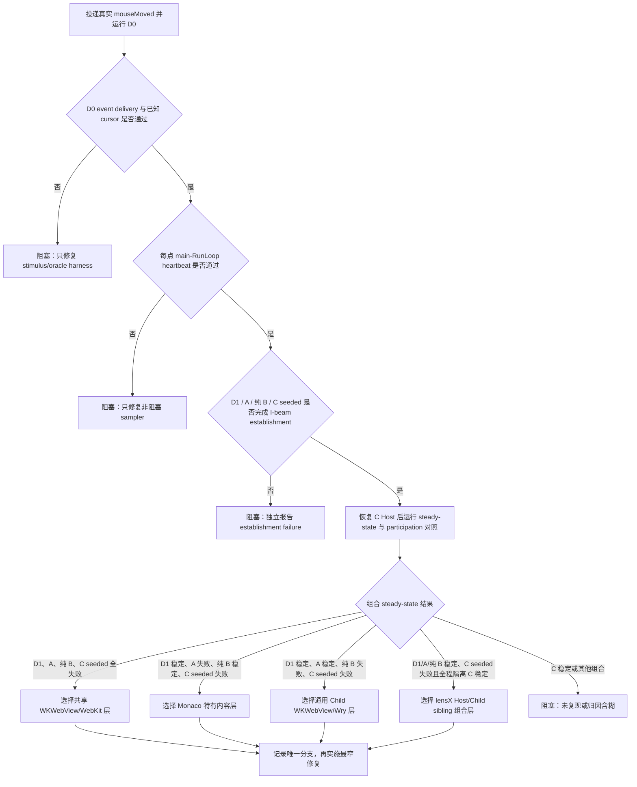

## Outcome

本 change 已于 2026-08-18 重划为完成的诊断 spike。`0.7.0` 矩阵已经可靠选择 `shared_wkwebview_webkit`，但当前公开 Wry/WebKit 边界没有符合既定 non-goals 的 repo-local 产品修复；用户可见 cursor fallback 因而仍然存在，后续产品工作转交 GitHub Issue [#1](https://github.com/dizzrt/lensx/issues/1)。

本归档保留诊断 harness、聚合测试、受控 evidence、最终归因和恢复实施门槛。它不声明产品修复完成，不把两份未交付 delta spec 同步到 stable specs，也不把诊断验证描述为 release candidate 已通过。

## Context

ConfigLens 已经通过公开 `0.4.0` WebView contract 在生产 macOS Child WKWebView 中运行，编辑区只有一个 Monaco model。当前可见故障是：鼠标在同一段可编辑文本区域内持续移动时，原生指针会在文本 I-beam 与默认箭头之间短暂往返。现有源码与测试没有显示由 `mousemove` 触发的 React 重挂载、editor/model 重建、Worker 重建或 native bounds 更新，因此这些机制不能在没有新证据时被当作根因。

现有门禁也存在明确盲区：DOM/视觉测试可以验证布局和 CSS，但不会移动真实 macOS 指针；WKWebView lifecycle/performance harness 可以验证 create、bounds、focus、hide/restore 和 teardown，但没有对 AppKit 最终呈现的 cursor 形态做连续采样。仅检查 DOM `cursor` computed style 不能证明用户实际看到的 native cursor 稳定。

首轮三组矩阵已经完成，但 A、B、C 的 computed cursor 均为 `text`，程序化移动后 `NSCursor::currentCursor()` 却全部返回 `arrow`。该组合同时可能表示共享 WKWebView/AppKit 行为，也可能表示仅改变指针位置没有投递真实 `mouseMoved`、导致 oracle 没有观察到用户可见 cursor。现有三格矩阵缺少纯 AppKit 基准和顶层普通 WKWebView，因此不得据此选择产品修复层。下一轮必须先验证观测链，再区分共享 WKWebView/WebKit、Monaco 特有内容、通用 Child WKWebView/Wry 与 lensX Host/Child native-sibling 四层候选边界。

约束如下：

- ConfigLens 仍是普通公共边界插件，不获得官方专属 Runtime、原生 cursor API 或 Host 权限。
- Rust 继续拥有 native Child WebView、窗口层级、bounds、focus 和 lifecycle；React 只拥有 Host presentation state，插件页面只拥有普通 Web 内容。
- 诊断不得读取、记录或提交用户配置内容；测试 fixture 必须是仓库维护的非敏感常量。
- 真实指针自动化不得与用户输入并发执行。持续鼠标轨迹优先在专用 macOS 自动化账户、VM 或 self-hosted runner 中运行；若用户明确批准当前桌面并承诺在有界运行期间不操作鼠标、键盘或窗口，则该 operator-approved quiescent desktop 也可作为批准的图形执行上下文。该模式仍是自动化 native evidence，不是人工观察或 manual-only 证据。
- 不新增产品运行时依赖。若归因指向 Tauri/Wry，上游升级或 vendored patch 必须有准确版本、最小 diff 和 drift gate。

## Goals / Non-Goals

**Goals:**

- 用已知 AppKit cursor 区域先验证真实 event stimulus 与 native observation，再用相同口径稳定区分四层候选根因。
- 证明 WebKit cursor 响应期间 AppKit 主 RunLoop 可继续执行，并把首次 I-beam establishment latency 与 establishment 后 steady-state fallback 严格分开。
- 通过重复 D0/D1/A/纯 B/production normal-isolated-seeded 矩阵唯一判别责任层，并记录被排除层。
- 保留合法 cursor 转换、Runtime identity/lifecycle 和有界 cleanup 证据，供未来候选修复复用。
- 在没有安全修复时给出可审计的停止结论和恢复实施条件，而不是扩大产品权限或长期保持 active change。

**Non-Goals:**

- 不改变 Monaco 的单 editor/model、格式化、Compact、Worker 或撤销语义。
- 不改变 Launcher/Page 尺寸策略、Manifest、SDK、Host API、包格式或安装/发布信任模型。
- 不以全局 `cursor: text`、隐藏鼠标、降低采样率、扩大命中区或回退 iframe 掩盖故障。
- 不在归因前同时修改 Monaco、Wry 与 Host presentation，也不承诺修复没有被本矩阵复现的上游平台问题。
- 不把屏幕录制或人工肉眼判断作为唯一完成证据。
- 重划后的 change 不交付 cursor 产品修复、production release gate、英中维护文档或 stable spec 修改；这些工作只有在 Issue #1 的恢复条件满足后才能进入新的实施范围。

## Decisions

### 1. 使用 D0/D1/A/B/C 五格矩阵，而不是直接在生产 ConfigLens 试补丁

五个 case 使用同一批准图形会话、真实 mouse-move event 节奏、采样时长和有界 native classification 合同；D1/A/B/C 额外固定窗口尺寸、DPR、指针轨迹和静止 Web fixture。每次运行记录版本、case、event delivery、main-RunLoop heartbeat、目标区域、预期 cursor、establishment timeline、steady-state native 观测结果、非语义 fallback 次数和实际语义边界转换次数。Case C 还在相同 Child、document、bounds、focus 与轨迹下运行 Host WKWebView 正常参与和 test-only 隔离 Host cursor participation 的对照；该对照不进入产品 Runtime。

| Case | 保留 | 排除 | 用途 |
| --- | --- | --- | --- |
| D0：纯 AppKit 已知 cursor 面 | AppKit window、公开 mouse event、已知 text/arrow/link/resize 区域 | WKWebView、Wry、Monaco、lensX Runtime | 证明 stimulus 会投递 `mouseMoved` 且 oracle 能区分已知 cursor |
| D1：顶层 WKWebView + 普通文本面 | WKWebView、普通 `cursor: text`、相同几何与轨迹 | Child/Wry、Monaco、lensX Host presentation | 判断共享 WKWebView/WebKit 基线 |
| A：顶层 WKWebView + Monaco | WKWebView、Monaco、相同 editor CSS/fixture | Child/sibling、lensX Host presentation | 判断 Monaco/WebKit 基线是否自身闪烁 |
| B：纯原生窗口 + Child WKWebView + 普通文本面 | 无底层 Host WKWebView 的原生窗口、唯一 Child WKWebView/Wry、`cursor: text`、相同几何与轨迹 | Monaco、任何第二个 WKWebView sibling、生产 Host presentation | 判断通用 Child 容器是否闪烁 |
| C：生产 Runtime + Monaco | Host/Child native sibling、Resource Service、Session、ConfigLens candidate | 无；这是最终产品路径 | 判断 lensX 组合层并提供回归证据 |

不采用“只对比 DOM computed style”，因为它无法观测 AppKit 最终 cursor；不采用“先升级 Monaco/Wry 看是否消失”，因为版本变化会同时改变多个变量且不能说明责任层。

### 2. 先证明真实 event delivery，再绑定 Web 命中语义与 native cursor 结果

D0 不再只调用窗口的 cursor-position setter；test-only Rust harness 使用公开 CoreGraphics event source 创建并通过 `CGEventPost` 投递逐步 `mouseMoved`，同时用 AppKit local event monitor 记录有界 delivery sequence。每个 D0 点都绑定已知 AppKit text/arrow/link/resize 区域；只有 delivery 已确认且 `NSCursor::currentCursor()` 返回对应公开 cursor identity，oracle 才通过。若 D0 失败，A/B/C 的历史 `arrow` 证据只说明旧 oracle 无效或含糊，不得触发产品改动。

D1/A/B/C 的测试轨迹在同一文本 glyph/空白编辑区内连续移动，期间不得跨越 gutter、滚动条、链接、footer、窗口 resize 边缘或 overlay。Web 侧以测试专用、无内容 payload 报告当前语义区域、computed cursor、editor/model identity、document identity 和 bounds revision；native 侧仅在对应 mouse event delivery 后记录 cursor 分类与时间顺序。证据只提交聚合 JSON 与失败诊断，不提交原始屏幕帧、用户文本或完整 DOM。

旧 `0.5.0` harness 在投递后用线程 sleep 等待；D0 能证明本地 AppKit event/cursor rect，却不能单独证明 WebKit 跨进程 cursor 响应期间主 RunLoop 没有被阻塞。新合同在每个 Web event 后先调度一个 main-thread heartbeat，并要求它在 native sample 前完成；实现必须使用不会阻塞 AppKit 主 RunLoop 的定时/worker 状态机。heartbeat 缺失属于 harness failure，不能归因产品。

每个 Web case 分两阶段。**Establishment** 在固定 text 区域最多投递 12 个点，每点记录 delivery、heartbeat、Web semantic、native cursor 与相对时间；连续 3 点的终态 native cursor 都为 I-beam 才算建立成功，并记录首次 I-beam 与建立完成延迟。establishment 样本不进入稳态 fallback count；12 点内未建立则报告 `establishment_failed`，不得直接选择 steady-state 产品层。**Steady-state** 只在建立成功后运行原 12 点 text 轨迹，每个事件在 5/20/35 ms 取得三个不会阻塞主 RunLoop 的 native snapshot；语义、identity 与 revision 必须不变，任何 snapshot 为 arrow/unknown 都算稳态失败。随后仍运行 gutter、控件、link、scrollbar、overlay 和 resize edge 反向轨迹，防止 blanket cursor override 得到假阳性。

Production C 额外运行三个 participation mode：Host 全程正常参与、Host 全程 test-only 隔离，以及 **seeded** 对照。Seeded 对照只允许在 establishment 期间隐藏 Host；建立成功后必须恢复同一个 Host，并在第一条 steady-state event 前证明 Child/document/editor/Session/attempt/bounds/focus identity 未变化、main-RunLoop heartbeat 通过且 Host 已重新收到 move delivery。只有 Host 恢复后的 steady-state snapshot 才能代表 production participation；隐藏期间的样本不能用作产品通过证据。普通 B 必须由原生 `Window` 直接承载唯一 Child WKWebView，静态门禁证明不存在第二个 Host WKWebView。

自动化轨迹和 native 观测必须在批准的 macOS 图形执行上下文中运行：优先使用专用自动化会话，也允许用户明确授权且运行期间无人操作的当前桌面。两种模式都必须使用临时 profile/fixture、不得连接现有 browser session、不得读取或截取桌面内容、必须恢复初始指针状态并正常关闭所有 harness 进程。开发者本机的录屏可以帮助定位，但不替代门禁。

### 3. 归因门是实施修复的硬前置条件

D0 每轮必须最先运行且不能被 Web case 冒充。D0、heartbeat 与 D1/A/纯 B/隔离 C/seeded C establishment 都通过后，steady-state 每轮都必须运行，不能因前一个 case 已失败而短路。Production normal C 的 establishment failure 必须保留为 sibling-participation 证据，但在 seeded C 保持同一 production identity、于 steady-state 前恢复 Host 并证明 Host delivery 后，不再单独阻止 steady-state 归因。只有图中四种完整组合分别选择共享 WKWebView/WebKit、Monaco 特有内容、通用 Child/Wry 和 Host/Child sibling 层；如果 seeded C steady-state 稳定、seeded establishment/Host 恢复/heartbeat 失败、Web case 组合不匹配、Host 对照不支持 sibling 因果或重复运行改变组合，则归因含糊。上述情况都必须停在归因阶段，不能勾选产品修复与完成项。归因结果、环境和被排除层必须回写本设计的“Open Questions”并在产品实现 diff 前接受审阅。

不采用“每层各加一个防御补丁”，因为它会隐藏最早故障、扩大维护面并破坏上游 drift 判断。

### 4. 选中责任层不等于存在可交付修复

`0.7.0` 已选择共享 WKWebView/WebKit 层，但当前锁定 Wry `0.55.1` 没有公开 cursor rect/update API，公开 `invalidateCursorRectsForView` 试验也没有改善结果。因而本 change 在归因后停止，不实施产品 cursor patch。以下分支约束保留为 Issue #1 将来恢复时的决策边界：

- **共享 WKWebView/WebKit 分支**：只在 D0 稳定且 D1/A/B/C 同样失败时成立；先验证公开 WebKit/Wry 配置或已知上游修复，禁止私有 WebKit API与全局 cursor override。
- **Monaco 特有内容分支**：先验证 package-owned Monaco CSS、overlay/widget 命中和已知上游修复；优先配置或最小版本修复。禁止把整个页面强制为 text cursor。
- **通用 Child WKWebView/Wry 分支**：优先当前公共 API 可表达的 child construction/cursor rect 修正；如必须升级或 patch vendored Tauri/Wry，只修改最小上游边界并增加版本与 patch drift 校验。禁止使用私有 WebKit API。
- **Host/Child sibling 分支**：只修正 native slot、z-order、hit-test、cursor rect invalidation 或 bounds/focus 协调中被证实的错误；保持 one-current-child、source/generation/attempt/freshness 检查及 destroy 语义不变。

任何分支都不得为 `official` Publisher、ConfigLens plugin id 或仓库内包创建特例。Case B 的普通公共插件面和 Case C 的 ConfigLens 必须通过同一 Runtime 规则。

### 5. 未来产品候选必须复用生产路径（未在本 change 交付）

A/B harness 用于归因；若 Issue #1 将来恢复产品实施，最终合格证据必须重新打包当时的不可变 ConfigLens `.lxp`，经生产 Resource Service、bridge、SDK 与 Child WebView 打开。门禁至少覆盖首次打开、持续文本区轨迹、合法边界轨迹、用户 resize 后、Launcher hide/shortcut restore 后、close/reopen、replacement/disable/uninstall teardown。它同时断言相同 child/session/editor 在语义等价 refresh 中被保留，实际 teardown 后旧观测器与 test hooks 不再产生事件。

诊断 hook 只能在 test/harness 构建启用，使用版本化且有界的 payload，并在生产包/Host 中静态证明不可达。普通插件不获得新的 Host 方法。

### 6. 未交付的规范与文档不进入稳定能力

原 delta specs 和文档计划描述的是尚未交付的 cursor 稳定性与 release gate，不是本次诊断 harness 的已发布 capability。本 change 归档时跳过 spec sync，canonical English/Chinese 维护文档保持不变；Issue #1 恢复实施后再由新的 change 同步更新稳定 specs 与双语文档。

## Risks / Trade-offs

- **[Risk] 真实 native cursor 自动化依赖 macOS 图形会话，普通无 GUI CI 可能无法执行** → 将其作为目标 macOS 专用 gate，优先在专用自动化会话运行；当前桌面仅可在 operator 明确批准且全程 quiescent 时使用。普通单元测试仍验证轨迹协议、聚合与决策表，但不能冒充 native 证据。
- **[Risk] 合成指针轨迹本身改变时间或命中行为** → 固定速度、采样间隔、DPR 与路径，保留重复次数和原生时间戳，并用一次显式 operator-run 仅作交叉诊断。
- **[Risk] CoreGraphics event injection 未抵达目标窗口或被系统权限阻止** → D0 同时记录 local AppKit event delivery；缺失 delivery 按 harness/environment failure 处理，不运行产品归因。
- **[Risk] `NSCursor::currentCursor()` 即使在已送达事件后仍不能代表可见 cursor** → D0 fail closed；若需要独立视觉 oracle，只能在空白专用 macOS 自动化会话使用公开 ScreenCaptureKit `showsCursor`，在内存中裁剪和分类后立即丢弃 frame，当前桌面和用户内容不得进入该路径。
- **[Risk] native cursor 分类 API 在 macOS/WebKit 版本间漂移** → 记录 OS/WebKit/Tauri/Wry 版本，使用公开测试边界并维护失败为 fail-closed；不得因无法分类而按稳定通过。
- **[Risk] seeded establishment 改变了 production state，使恢复后的 steady-state 不再可比较** → 仅隐藏和恢复同一个 Host WebView；在首个计分事件前重新确认 Host delivery、Child/document/editor/Session/attempt/bounds/focus identity 与 main-RunLoop heartbeat，任一漂移都 fail closed。
- **[Risk] 强制 cursor 的修复会压掉合法交互反馈** → 把 gutter、footer、link/控件、滚动条与 resize 边缘转换设为同一门禁中的反向断言。
- **[Risk] 上游升级扩大变更面** → 只有 Wry 分支允许升级/patch；锁定准确版本、检查 patch drift，并重跑完整 Child WebView 安全/lifecycle/performance 矩阵。
- **[Trade-off] 三组 spike 会增加前置工作** → 它换取可审计归因，避免长期维护多层猜测补丁；没有可重复归因时本变更宁可保持未完成。

## Migration Plan

1. 保留已实现的无用户内容 fixture、轨迹协议和 A/B/C 历史证据；新增 D0、D1 和 event-delivery 字段，不修改产品行为。
2. 将 Web evidence 升级为非阻塞 main-RunLoop heartbeat、establishment timeline、steady-state multi-snapshot 与 Host participation 对照；旧 `0.5.0` 只保留为诊断历史。
3. 在批准的 macOS 图形执行上下文中先运行 D0；再运行 D1/A/纯原生 B，以及 production C 的 normal/isolated/seeded participation。Seeded C 必须在 Host 恢复且 identity 不变后才计 steady-state。记录执行模式、operator approval、所选分支、被排除层和环境；若 production steady-state 未复现或不能唯一归因，停止实施。
4. 记录 `shared_wkwebview_webkit` 最终归因、无安全 repo-local fix 的结论，以及禁止采用的伪修复。
5. 创建 GitHub Issue [#1](https://github.com/dizzrt/lensx/issues/1)，保存公开上游链接、恢复条件和未来 acceptance；产品修复、release gate、文档和 stable spec 更新全部转交该 Issue 下的新 change。
6. 对诊断资产运行 focused 与仓库层验证；确认没有产品 cursor patch 后，以 `--skip-specs` 归档并核对 stable specs 内容哈希不变。

回滚时撤销所选层修复及其产品专用回归期望，但保留不改变产品行为的 A/B harness 和失败诊断，以便继续追踪。若涉及上游版本或 vendored patch，恢复原锁定版本并重跑原有 Child WebView 全量门禁。任何回滚都不得恢复 iframe 或引入 ConfigLens 特例。

## Open Questions

- **后续跟踪：** 产品修复不再是本 change 的 open task；GitHub Issue [#1](https://github.com/dizzrt/lensx/issues/1) 是唯一恢复入口。只有公开 WebKit/Wry candidate、可窄版本 gate 的上游 patch，或经单独审阅的约束变化出现时，才创建新的实施 change。
- **有效实测方法（2026-08-17）：** 在用户明确批准且全程无人操作的 `operator_approved_quiescent_desktop` 上先重复 D0，再完整重复 D1/A/B/C。D0 和所有 Web case 都用公开 `CGEventSource`/`CGEventPost` 投递真实 `mouseMoved`，以 AppKit local event monitor 逐点证明 delivery，再读取公开 `NSCursor::currentCursor()` identity；Web case 额外用固定的三点 text entry-prime 隔离首次进入的 cursor 建立时间，随后才计分原 18 点轨迹。harness 使用临时 profile/data store，未连接用户 browser session，不读取或保存用户内容、desktop frame 或完整 DOM；每轮均移除 monitor、恢复初始指针并正常关闭。
- **Oracle 与环境：** `fixtures/plugin-pointer-cursor/evidence/macos.json` 的 evidence `0.5.0` 来自 macOS `26.6`、AppleWebKit `605.1.15`、Tauri `2.11.5`、Wry `0.55.1`、DPR `2`、Web viewport `800×568`。D0 两轮共 10/10 事件送达，已知 text、arrow、link、column resize、row resize cursor 共 10/10 匹配，且 monitor/cursor rect/窗口/指针 cleanup 全部通过，因此 native stimulus 与 observation oracle 在当前环境有效。
- **完整五格组合：** D1/A/B/C 每组两轮；每轮三点 entry-prime 均 3/3 送达，随后 18/18 计分事件均送达且 0 个 unknown。D1 顶层普通文本与 A 顶层 Monaco 的 text 区每轮均为 10/12 I-beam、2/12 arrow fallback；B 通用 Child 普通文本分别为 2/12 与 1/12 I-beam；C production ConfigLens 每轮均为 10/12 I-beam。四个 Web case 都保留合法非文本 cursor 转换，但按“任何 text fallback 都失败”的稳定性合同，组合是 **D1 失败 / A 失败 / B 失败 / C 失败**。
- **旧合同下的阶段性归因已重新打开：** `0.5.0` 按“任何计分 text fallback 都失败”的旧合同机械选择了 `shared_wkwebview_webkit`，但 D1、A 与 production C 都只在最初两点 fallback，之后连续 10 点 I-beam；三点 prime 只证明 event delivery，没有证明 native I-beam 已建立，也没有证明 WebKit 响应期间 main RunLoop 未被 sampler 阻塞。因此该结果现在只说明需要区分 establishment 与 steady-state，不再授权任务 4 产品修改。
- **无效历史证据：** evidence `0.2.0`–`0.4.0` 不能用于产品决策：早期版本曾用 position setter，之后虽然切换到真实事件，但 entry-prime 合同尚未稳定，且 Web 点位绑定没有显式遵循 AppKit content view 的 `isFlipped` 坐标语义。`0.5.0` 在每轮记录 `content_view_flipped` 并按实际坐标系绑定 Web 点位，是唯一当前归因证据；更早的计数只保留为 harness 调试历史。
- **已否决的产品候选：** 锁定的 Wry `0.55.1` 没有公开 WKWebView cursor 配置；相关的 Wry [#1333](https://github.com/tauri-apps/wry/issues/1333) 与 [#1763](https://github.com/tauri-apps/wry/issues/1763) 仍为 open。曾在通用 macOS `didFinishNavigation` 路径试验公开 `NSWindow::invalidateCursorRectsForView`，矩阵没有改善，补丁已完整撤回且未写入基线 fixture。新归因完成前不得恢复该候选或尝试产品 cursor patch。
- **`0.6.0` 非阻塞合同与环境（2026-08-17）：** `fixtures/plugin-pointer-cursor/evidence/macos.json` 已在同一 `operator_approved_quiescent_desktop` 上重复两轮，环境仍为 macOS `26.6`、AppleWebKit `605.1.15`、Tauri `2.11.5`、Wry `0.55.1`、DPR `2`、viewport `800×568`。首次执行因应用尚未完成前台激活而使 D0 local monitor 收不到事件；harness 随后在 main thread 使用公开 `NSApplication.activate()`，并由 worker 做有界激活等待。修正后的 D0 两轮仍为 10/10 delivery 与 10/10 已知 cursor 匹配。全部 186 个 Web event 都在 native sample 前完成 main-RunLoop heartbeat，delivery failure、heartbeat failure 与 bounded cleanup failure 均为 0。
- **Establishment 与 steady-state 实测：** D1 顶层普通文本和 A 顶层 Monaco 每轮都以 `arrow, arrow, ibeam, ibeam, ibeam` 在第 5 个事件建立 I-beam；首次 I-beam 分别约为 `145–146 ms` 与 `153–154 ms`，建立完成约为 `232–235 ms` 与 `241 ms`。两者随后各自 36 个 text steady-state snapshot 中仍有 6 个 arrow。B 通用 Child 普通文本两轮的 12 个 establishment 终态全部为 arrow，未进入 steady-state。production C 在 Host 正常参与时也两轮 12/12 全为 arrow，未进入 steady-state。
- **Host participation 对照：** production normal 每轮 Host/Child move delivery 都为 `12/12`；在同一 document、editor、Child、Session、attempt、bounds 与 focus 下，通过公开 WebView visibility 隐藏 Host 后，Host/Child delivery 分别为 `1/23` 与 `1/22`。隔离 Host 后两轮都在第 5 个事件完成 establishment（首次 I-beam 约 `142–147 ms`，完成约 `229–236 ms`），但随后每轮 36 个 text snapshot 仍有 6 个 arrow。该对照说明 Host participation 会改变 production establishment，却尚不能证明用户报告的 establishment 后持续 fallback 唯一属于 sibling 层。
- **`0.6.0` 历史 blocker：** 该版本最终归因为 `blocked_establishment_failed`。B 和 production normal 没有完成必需 establishment，production C 因而没有可计分 steady-state；即使 Host 隔离能恢复 establishment，也没有满足当时的 production steady-state 前提。该结果已被 `0.7.0` 的纯 B 与 seeded C 控制替代，不再是当前归因。
- **`0.7.0` 下一轮诊断约束：** 源码复核发现 `0.6.0` 的 B 用 `WebviewWindowBuilder` 创建承载窗口，因此所谓“通用 Child”仍有一个底层 Host WKWebView，不能排除 sibling participation。下一轮必须改为纯原生 `WindowBuilder` + 唯一 Child WKWebView，并新增 seeded C：只在 establishment 隐藏 Host，随后恢复同一个 Host，在 identity/focus/bounds 未漂移且 Host 重新收到 move delivery 后计 steady-state。该控制修复证据结构而非产品行为；只有新组合唯一选层后才可进入 4.1。
- **`0.7.0` 最终矩阵（2026-08-17）：** 新证据仍来自相同批准桌面和锁定环境；D0 两轮继续为 10/10 delivery、10/10 已知 cursor 匹配与完整 cleanup。D1、A、纯原生 B、production normal、isolated C 和 seeded C 每种两轮都以 `arrow, arrow, ibeam, ibeam, ibeam` 在第 5 个 establishment event 建立成功；共 276 个 Web event 的 delivery、main-RunLoop heartbeat 与 cleanup failure 均为 0。每轮随后 36 个 text steady-state snapshot 都在前两个 event 出现 6 个 arrow，其余 30 个为 I-beam，故所有 WebView 组合稳定地失败。
- **Host 分段 delivery 与 identity：** production normal 每轮 Host/Child establishment 为 `6/6`、steady-state 为 `18/17`；isolated C 为 `0/6`、`0/17`；seeded C 在隐藏 Host 时为 `0/6`，恢复同一个 Host 后为 `19/18`。Seeded 两轮都在第一个 steady-state event 前通过 Host 恢复 heartbeat，且 Child/document/editor/Session/attempt/bounds/focus identity 未漂移；normal、isolated 与 seeded 的 native cursor 结果完全相同。因此 Host participation 不是 steady-state fallback 的必要条件，Host/Child sibling 层被排除。
- **最终归因与产品结论：** `0.7.0` 唯一选择 `shared_wkwebview_webkit`：普通顶层 WKWebView、Monaco 顶层 WKWebView、没有第二个 WKWebView 的纯 Child、production ConfigLens，以及 Host 全程隔离/恢复控制都复现同一结果。Monaco、通用 Child/Wry construction 与 lensX sibling presentation 均被排除。锁定 Wry `0.55.1` 的公开 `WebViewBuilder`/`WebView` API 没有 cursor rect/update 配置，相关 macOS cursor issue [#1333](https://github.com/tauri-apps/wry/issues/1333) 与 sibling 假说 issue [#1763](https://github.com/tauri-apps/wry/issues/1763) 仍 open 且没有关联修复。因此当前约束内没有可验证的 repo-local 产品修复：不得以私有 WebKit API、blanket cursor override、ConfigLens 特例或已失败的 cursor-rect invalidation 冒充解决。4.1 保持未完成，等待可复核的 WebKit/Wry 上游修复或另行批准改变 non-goal 后再继续。
