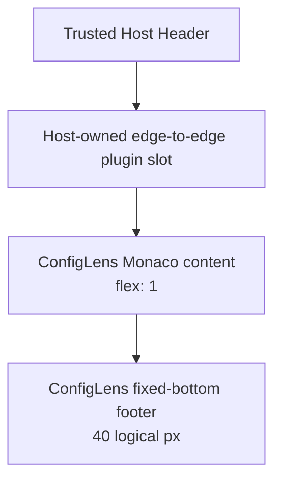

## Context

ConfigLens 当前已经满足单一 Monaco model、`content` 后接 semantic `footer`、双语、主题、Worker 边界和普通 Child WebView Runtime 等产品约束，但布局所有权分散在两个层级：Host 的 `launcher-body` 与 Runtime container 决定 Child WebView slot 在 Host Header 下方占据什么矩形，ConfigLens 自身的 Less 决定 Monaco 与 Footer 如何划分该矩形。

现状在两个层级都保留了卡片式间距：Host Page body 有左右和底部内缩，Runtime container 有圆角；ConfigLens 根节点又有 page padding、content/footer gap 和 Monaco 卡片圆角。Footer 主行使用底部对齐，正常态也没有一个明确的紧凑行高。单独修改 ConfigLens 只能减少 Child WebView 内部留白，无法得到 Host Header 以下完整的 edge-to-edge 工作区；为官方插件增加 Host 特例又会破坏官方/外部插件共用公开平台边界的原则。实现后的界面复核进一步确认，诊断计数和错误详情会扩张 Footer 并向上占用 Monaco 空间，因此最终布局不再在 Footer 中重复诊断 UI。

维护验证目前只允许确定性的 Rstest、Cargo、静态检查、构建、包检查和纯 CLI consumer 检查。截图、像素基线、Chrome、真实 WebView、GUI 或目标环境性能验证均不属于可维护路径。

## Goals / Non-Goals

**Goals:**

- 让普通插件 Page 的 Host content slot 无左右、底部或区域间 gap 地占满 Header 以下剩余区域，同时仍由 Host 测量并由 Rust 接受 revisioned physical bounds。
- 让 ConfigLens Monaco 无外层 page padding、content/footer gap、卡片边框或圆角地占满 Footer 以上区域。
- 将初始及较大 viewport 的 Footer 主行固定为 40 logical px，并让语言选择、状态和操作按钮按共同中心线垂直对齐。
- 让 Footer 始终贴住 viewport 底边，不显示诊断计数或错误详情；诊断仅保留为 Monaco 内部 marker，不能改变 Footer 高度或位置。
- 保留受限 viewport 的可操作固定高度响应式降级，不恢复根节点 padding 或 content/footer gap。
- 通过现有稳定 Gate 和确定性 DOM、样式契约、构建产物检查证明上述结构，不引入环境型验证。

**Non-Goals:**

- 不增加标签页、图标工具条、过滤器、粘贴转换或其他 JSON 工具能力。
- 不重构 Host Header、PageContextBar 或 Launcher Home/Search/Host Page 布局。
- 不修改 Manifest presentation、窗口初始尺寸、用户 resize、Runtime Session、Worker 或语言处理语义。
- 不给 ConfigLens 增加按 plugin ID、Publisher、官方来源或发布元数据选择的 Host 布局例外。
- 不新增依赖、root script、Change 专属 Gate、Generate 目标或任何视觉/浏览器/真实 WebView 验证。

## Decisions

### 1. Host 以 provider kind 选择通用插件 Page edge-to-edge 布局

`App` 在当前 Page provider 为 `plugin` 时，为 `launcher-body` 暴露稳定的语义 data attribute；Host Less 以该状态把 body 的 inline/bottom padding 和区域 gap 归零。Home、Search、Host Page 继续使用现有内缩。`plugin-runtime-container` 移除重复圆角，由最外层 `launcher-surface` 继续负责原生窗口内的裁切和圆角。

选择 provider kind 而不是 ConfigLens identity，确保官方与外部插件获得相同的 content slot。替代方案“只修改 ConfigLens 内部样式”无法移除 Host 外层留白；“为 ConfigLens 增加 Host class/分支”会形成官方插件特权，因此均不采用。

### 2. slot 变化只走既有 Host-owned bounds 收敛路径

React 仍只声明并测量 `.plugin-runtime-slot`。移除 inset 后，现有 `ResizeObserver`、scale conversion、latest-wins revision 和 Rust bounds validation 接收新的最终矩形；不增加新的 payload、Tauri command、插件消息或 native setter。布局变化不改变 Child WebView 的 authority、identity、lifecycle 或 Session。

替代方案“由插件请求更大 slot”会让不可信 Runtime 参与 native bounds 输入，不采用。

### 3. ConfigLens 使用连续两段式 viewport，不再使用卡片式 editor

`.config-lens` 保持 column flex 和完整 viewport，但 page padding 与 content/footer gap 归零并隐藏文档溢出。`.config-lens__content` 继续 `flex: 1` 和 `min-height: 0`；`.config-lens-editor` 填满 content，移除独立卡片边框与圆角。Footer 以顶部分隔线与 Monaco 相接，而不是用空白隔开。

Footer 正常主行高度为 40 logical px，包含紧凑的水平内边距和 32px Semi controls；主行、语言选择、状态和 toolbar 都垂直居中。Footer 使用固定 flex basis 和 `margin-top: auto` 留在 viewport 底边。状态区域允许水平收缩和省略，但只显示 empty、processing 或 ready 等非诊断状态，不能显示诊断计数或错误摘要，也不能推挤操作按钮出界。

替代方案“Footer 覆盖在 Monaco 上方”会遮挡编辑内容和 Monaco 交互；继续保留卡片 gap 又不符合连续工作区目标，因此不采用。

### 4. 诊断留在 Monaco，Footer 不再动态扩张

语言 controller 仍产生有界诊断并交给 Monaco marker 路径，但 `ConfigLensPage` 不再渲染诊断 `<ul>`，Footer status 也不再渲染诊断数量或错误摘要。诊断出现、更新或清除时，Footer 的 DOM 子树、高度和底边位置保持不变，Monaco 只通过既有 marker 更新反映错误。

宽度不超过 520px 或高度不超过 260px 时，语言/操作与状态可以使用固定 72px 的两行 grid；该高度只由响应式断点决定，不由内容或诊断决定。根节点和 content/footer 之间仍不得恢复外层 padding 或 gap。替代方案“把诊断移到第三个区域、弹层或 Footer 外侧”仍会重复错误 UI 或改变工作区几何，因此不采用。

### 5. 验证采用 DOM 状态、样式契约和构建产物检查

- ConfigLens component tests 继续证明恰好两个顶层区域、editor-before-footer 和控件归属，证明 invalid 状态不会渲染 Footer 诊断计数或错误列表，同时诊断仍传给 editor surface。
- ConfigLens 确定性样式检查验证根节点无外层 padding/gap、editor 无卡片圆角、正常 Footer 固定 40px 并 center-aligned、受限 Footer 固定 72px、Footer 贴底且不存在 diagnostics selector；构建产物检查确保最终 CSS 保留这些契约。
- Host React tests 证明只有 plugin provider 进入 edge-to-edge body 状态，Home/Search/Host Page 不进入；Host 样式契约检查证明该状态清除 inset/gap 且 Runtime container 不叠加圆角。
- 复用稳定 `gate` 能力以及既有 `test`、`typecheck`、`check`、`build`、Rust 和 OpenSpec strict 验证；不新增 root alias 或环境型验证。

仅依赖 DOM 或 CSS source/compiled-output 的确定性断言不能证明真实像素渲染，这是当前验证治理接受的边界，完成结论不得扩张为真实浏览器或 macOS 视觉证据。

## Risks / Trade-offs

- [外部插件 Page 的可用 viewport 增大，可能暴露其自身响应式缺陷] → 将 edge-to-edge 定义为所有普通插件 Page 的一致 Host 语义，并用示例/页面投影测试覆盖，而不是仅给 ConfigLens 例外；插件仍只观察普通 Web viewport。
- [Footer 固定主行在长中文或 hard-min 下可能拥挤] → 正常 viewport 保持 40px 单行，受限 viewport 使用确定性的两行 grid，状态优先收缩且操作按钮保持可达。
- [移除 Footer 错误详情后，错误不会在编辑器外重复显示] → 保留 controller 诊断与 Monaco marker；明确接受 Footer 不再提供诊断数量、错误文案或额外 live region，以换取稳定贴底几何。
- [移除 Runtime container 圆角可能影响 loading 状态外观] → 外层 Launcher surface 保持裁切；loading overlay 使用同一 edge-to-edge slot，Host feedback 的可访问语义不变。
- [静态样式断言可能与无关重构耦合] → 只断言规范要求的 selector/state 与关键布局值，并同时保留 DOM/构建产物检查，避免锁定生成的类名顺序或完整 CSS 文本。

## Migration Plan

1. 先补齐 Host plugin-page 状态和 ConfigLens layout 的确定性失败断言。
2. 调整 Host Page body/Runtime container，再调整 ConfigLens 根节点、editor 与固定贴底 Footer；删除 Footer diagnostics DOM/CSS 和诊断 status 分支。
3. 更新 canonical English 文档及 Simplified Chinese mirror，说明诊断仅保留为 Monaco marker，并保持稳定 Gate 名称和确定性验证边界。
4. 运行 focused Gate、完整 frontend/shared、Rust、OpenSpec strict 和 diff 检查；修复后重跑失败项与完整最终集合。

该变化不迁移数据、Manifest 或持久状态。若实现阶段发现普通外部插件 Page 出现无法通过确定性契约修复的回归，回滚 Host edge-to-edge 状态和 ConfigLens 样式，同时保留测试失败证据并重新修订 change；不得用 ConfigLens identity 特例作为回滚替代。

## Open Questions

无。已确定采用通用 plugin-provider edge-to-edge Host slot、无 Footer 诊断提示的固定贴底 Footer 和确定性验证边界。
