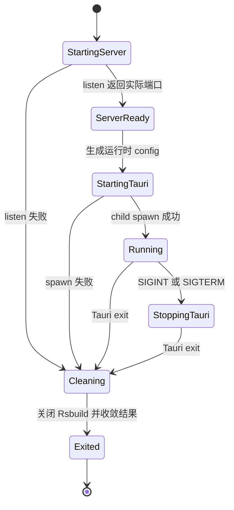

## Context

当前 `pnpm run dev` 由 Rsbuild 启动 Host 前端开发服务器，首选端口为 `40755`；`pnpm exec tauri dev` 再通过 `beforeDevCommand` 启动它，并从静态 `build.devUrl` 加载相同端口。Rsbuild 默认会在首选端口被占用时递增寻找可用端口，但 Tauri 配置、开发态插件 CSP 和相关漂移测试不会随之更新。

普通桌面开发与 `dev:plugin-development-mode` 还存在两条编排路径。后者负责设置前端构建能力、Rust feature 和 Host-private 启动根目录，然后再委托 `tauri dev`。新的启动器需要统一它们，但不能把插件开发能力带入普通开发进程，也不能改变独立 `pnpm run dev`、发布构建或插件 Runtime 安全边界。

仓库只维护确定性验证。启动器本身会在开发时启动真实进程，但其 maintained Gate 只能验证纯函数、受控 fake child/server、Rust 策略和静态配置，不能启动 Tauri GUI、浏览器或真实 WebView。

## Goals / Non-Goals

**Goals:**

- 为完整桌面开发提供一个统一的父进程，在 Rsbuild 实际监听后再启动 Tauri。
- 把 Rsbuild 返回的实际 loopback origin 作为本次运行的单一事实源，精确同步到 Tauri、原生导航策略和插件 Runtime CSP。
- 让普通模式和插件开发模式复用端口、Tauri 配置、信号、退出码和清理逻辑，同时保持模式特有的 feature、环境和参数。
- 在服务器启动失败、Tauri spawn/exit、终端信号和清理失败时确定性收敛，不留下由启动器拥有的孤儿进程。
- 使用现有 Node、Rsbuild、Tauri、Rstest、Rust 和 typed Gate 基础设施，不增加运行时依赖。

**Non-Goals:**

- 不改变发布版 `tauri://localhost`，也不为发布应用创建本地 HTTP listener。
- 不改变前端独立 `pnpm run dev` 的用途、HMR 协议、插件资源 origin、数据存储或公开插件 API。
- 不开放 LAN 地址、任意 Host、远程开发服务器、自定义证书或用户可配置端口。
- 不让普通开发自动启用 Plugin Development Mode，不改变 `--plugins-root` 的发现、快照或 Runtime 语义。
- 不通过先绑定再释放的端口探测、临时配置文件、浏览器/真实 WebView/GUI harness 或环境证据完成交付。

## Decisions

### 1. 统一启动器是完整桌面开发的唯一维护编排入口

新增 Host-private Node 启动器，并提供与现有 root lifecycle 命名一致的普通桌面入口 `pnpm run app:dev`。`pnpm run dev` 继续只运行前端服务器；稳定的 `pnpm run dev:plugin-development-mode [-- --plugins-root <path>]` 命令保留，但改为选择统一启动器的插件开发模式。维护文档不再要求开发者直接运行 `pnpm exec tauri dev`。

启动器内部使用有界、可测试的 mode 配置，而不是复制两套 spawn 实现：

| 模式 | Rsbuild 环境 | Tauri 参数与环境 |
|---|---|---|
| ordinary | 不设置插件开发能力 | 普通 `tauri dev` |
| plugin-development | 在创建 Rsbuild 配置前设置 `LENSX_PLUGIN_DEVELOPMENT_MODE=1` | 增加 `--features plugin-development-mode`，并传递规范化的 `LENSX_PLUGIN_DEVELOPMENT_STARTUP_ROOT` |

替代方案是继续让 `beforeDevCommand` 启动 Rsbuild，再从其日志或文件发现端口；这会让 Tauri 在端口确定前就解析 `devUrl`，还引入脆弱的日志协议或临时写入，因此不采用。

### 2. 先启动并持有 Rsbuild 服务器，再用实际端口启动 Tauri

启动器通过现有 Rsbuild JavaScript API 加载项目配置、启动开发服务器，并读取 API 返回的实际 `port`。`40755` 可以继续作为易于调试的首选起点；占用时使用 Rsbuild 已解析并正在持有的下一个可用端口。只有 server listen 成功后才允许启动 Tauri，因此不存在“探测空闲端口后释放，再被其他进程抢占”的窗口。

启动器以 Tauri `--config` 的内存 JSON merge 覆盖本次运行的 `build.devUrl`，并将 `build.beforeDevCommand` 置空，防止 Tauri 再启动第二个 Rsbuild。它不写入临时或 committed 配置文件。Tauri 子进程继承同一 mode 环境；端口不会通过第二个环境变量或前端 define 重复传递。

替代方案包括直接使用 OS `listen(0)` 和自建 HTTP/HMR Server，或只给 Rsbuild 配置 `port: 0`。前者需要接管 middleware、WebSocket 和 Server 生命周期，后者不是当前 Rsbuild 配置契约明确保证的路径；两者都比复用 Rsbuild 已有的端口解析增加复杂度，因此本期不采用。

### 3. Tauri runtime config 是 Rust 安全策略的唯一可信 App origin

运行时覆盖后的 `app.config().build.dev_url` 是 Rust 的唯一输入。开发态只接受结构明确的 `http://localhost:<port>/`：必须是小写 scheme/host、显式有效端口、根路径，且没有用户名、密码、query 或 fragment。缺失、无法解析或非 loopback 精确目标会在创建可信 Host/Plugin Runtime 服务前使启动失败。

`frame_aware_navigation_setup` 已从该配置构造精确主文档目标，继续复用这一路径。插件安全策略改为由同一可信 App target 构造 owned CSP，只替换生产策略中的 `frame-ancestors tauri://localhost`，其他 directive 保持逐字节相同。`PluginResourceService` 持有不可变 owned policy，而不是依赖开发端口静态常量。Manifest、插件请求、HTTP header、前端消息和独立环境变量都不能影响该 origin。

生产编译仍直接使用静态 `tauri://localhost` 插件 CSP，且不读取 `devUrl`。这保持既有 production drift test 和 Host-private 边界。

### 4. 父启动器拥有一条显式终端生命周期

启动器只安装一次信号与 child 终端处理，保证 cleanup 幂等。服务器失败时不 spawn Tauri；Tauri spawn 失败或退出时关闭 Rsbuild；收到 `SIGINT`/`SIGTERM` 时先向仍存活的 Tauri child 转发一次信号，再等待 child 终端并关闭服务器。最终保留 Tauri 的非零退出码或信号语义；cleanup 自身失败在没有更具体失败时产生稳定非零结果，但不会覆盖更早的主要故障。日志只包含稳定阶段/错误码与所选本地 origin，不输出插件根目录、原始 spawn 异常栈或私有 Host 状态。

替代方案是沿用插件启动器当前对父进程自发 signal 的处理方式；统一父进程还拥有 Rsbuild，必须先协调两个资源，因此改为显式 teardown 状态机。

### 5. 使用稳定 Gate 验证契约，不执行真实开发环境

在 typed Gate registry 中显式注册 `development-launcher`，不经过 legacy root-script baseline，也不增加 Change 名称或测试子集 root alias。Gate 组合：

- Rstest：mode/参数解析、Rsbuild listen 结果、Tauri config merge、spawn 顺序、端口占用模型、信号/退出码与幂等 cleanup；
- Rust：动态开发 App target、CSP 精确替换、无效 origin fail-closed、production policy 不变和 Resource Service owned policy；
- 静态/文档检查：维护入口、无静态开发 CSP 端口、双语镜像、Gate ID 与禁止环境命令。

Gate 可以依赖现有 `frame-aware-webview-navigation-policy` 与 `plugin-development-mode`，并复用 `plugin-child-webview-runtime` 已有的安全生命周期覆盖；它自身不得包含 `tauri dev`、Rsbuild listen、浏览器、WebView、GUI、截图或 target-environment 性能步骤。

## Risks / Trade-offs

- **[直接执行 `tauri dev` 绕过统一编排]** → 文档和 root scripts 只维护 `app:dev`/`dev:plugin-development-mode`；配置与测试明确 direct CLI 不提供完整 server lifecycle，避免两套受支持路径。
- **[Rsbuild 已启动但 Tauri 编译或 spawn 很慢/失败]** → 父进程持续持有 server，并在所有终端路径关闭；不使用端口预留文件或超时猜测。
- **[信号竞态触发重复 close 或覆盖退出结果]** → 使用单调终端状态和单一 cleanup promise，对 late event 保持幂等。
- **[动态 origin 放宽插件 CSP]** → 只从已验证的 Tauri runtime config 生成精确 `http://localhost:<port>` ancestor，其他 directive 不变，生产仍是静态 `tauri://localhost`。
- **[插件开发模式环境设置太晚]** → mode 环境必须在创建 Rsbuild config/instance 和 spawn Tauri 之前确定，并通过 Rstest 覆盖 enabled/disabled composition。
- **[新增 root operational script 与验证治理冲突]** → `app:dev` 被登记为稳定 operational lifecycle；所有断言仍由 Rstest 和 `development-launcher` Gate 承载，不增加 `test:*`/`check:*` alias。

## Migration Plan

1. 建立可测试的统一 launcher core，并让普通与插件开发入口委托它；保留现有 `dev` 前端入口。
2. 将实际端口写入 Tauri runtime config merge，关闭 `beforeDevCommand` 的重复 server ownership，并更新 root script policy。
3. 将开发态插件 CSP 改为从已验证 App target 构造 owned policy，补齐 Resource Service 与导航/CSP 测试。
4. 注册稳定 `development-launcher` Gate，更新 English 文档和逐路径 Simplified Chinese 镜像，移除维护文档中的旧完整桌面启动指令。
5. 若实现验证失败，可先回滚 root operational entry 和 launcher，再回滚 owned CSP 构造；生产配置、数据和公开契约无迁移，因此无需数据回滚。

## Open Questions

无。端口策略采用“保留 `40755` 为首选、由 Rsbuild 返回并持有实际可用端口”，不使用本期范围外的 OS 随机临时端口或自建 HTTP Server。
